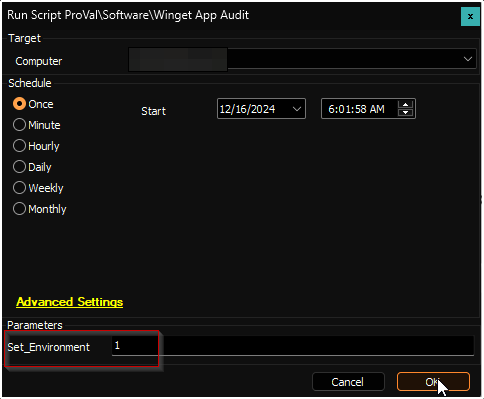
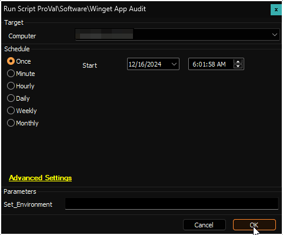

## Summary

The script conducts an audit of the computer for applications supported by Winget and stores the information in a custom table called [pvl_winget_audit](<../tables/pvl_winget_audit.md>). It retrieves data for both system-level and user-level applications. However, user-level application data will not be retrieved if there are no logged-in users on the computer.

## File Hash

**File Path:** `C:/ProgramData/_Automation/script/Get-WingetReport/Get-WingetReport.ps1`  
**File Hash (Sha256):** `C1FF0B60EADF1DDA382493A4841F57F2F25CC8517BE9E496AE4DA5B4B2ADF1DF`  
**File Hash (MD5):** `719B8BAC2066247536A5AE4DD27F9C0F`  

**File Path:** `C:/ProgramData/_Automation/script/Get-WingetReport/Manage-OverFlowedVariable.ps1`  
**File Hash (Sha256):** `79B76E6780B61ED657C7FC07C5C0D9A0662165066D5BAD95D9D672513BADD674`  
**File Hash (MD5):** `12B41CDBC04010E638D3FFB8A4BDB1D6`  

## Sample Run

**First Run:** Run the script with the `Set_Environment` parameter set to `1` for the first run to create the [pvl_winget_audit](<../tables/pvl_winget_audit.md>) table used by the solution.  

**Regular Execution:**  

## Dependencies

- [SWM - Software Update - Internal Monitor - Execute Script - Winget App Audit](<../monitors/Execute Script - Winget App Audit.md>)
- [CWM - Automate - Script - OverFlowedVariable - SQL Insert - Execute](<./OverFlowedVariable - SQL Insert - Execute.md>)

## Variables

| Name              | Description                       |
|-------------------|-----------------------------------|
| projectName       | Get-WingetReport                  |
| workingDirectory   | C:/ProgramData/_automation/script/Get-WingetReport |
| scriptPath        | C:/ProgramData/_automation/script/Get-WingetReport/Get-WingetReport.ps1 |
| jsonPath          | C:/ProgramData/_automation/script/Get-WingetReport/Get-WingetReport.json |
| tableName         | [pvl_winget_audit](<../tables/pvl_winget_audit.md>) |

## User Parameters

| Name              | Example | Required                      | Description                                                                                          |
|-------------------|---------|-------------------------------|------------------------------------------------------------------------------------------------------|
| Set_Environment    | 1       | True (for first execution)    | Run the script with the `Set_Environment` parameter set to `1` for the first run to create the [pvl_winget_audit](<../tables/pvl_winget_audit.md>) table used by the solution. |

## Output

- Script log
- Custom table
- Dataview
