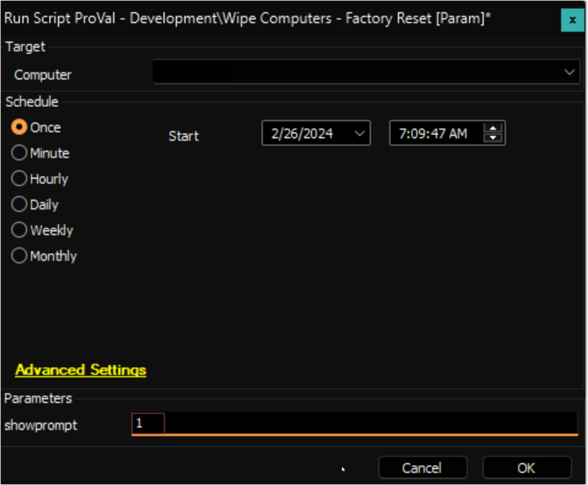
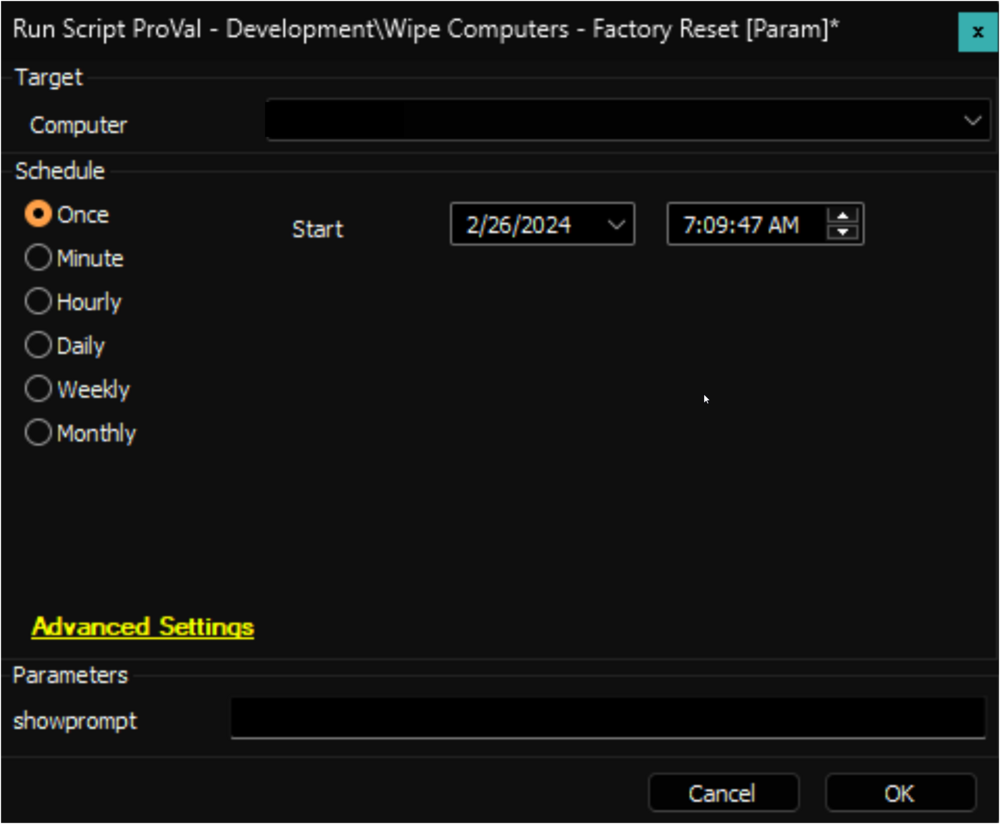

## Summary

The script includes an option to initiate a factory reset, which will erase all data on the computer. Please use this script with extreme caution.

## Sample Run

- To ask the logged-in user before performing the factory reset:  
    

- To forcefully perform the factory reset:  
    

## Variables

| Name              | Description                                     |
|-------------------|-------------------------------------------------|
| ProjectName       | FactoryReset                                    |
| WorkingDirectory   | C:/ProgramData/_Automation/FactoryReset        |

#### User Parameters

| Name        | Example | Required | Description                                                                                                                                                                                                                                         |
|-------------|---------|----------|-----------------------------------------------------------------------------------------------------------------------------------------------------------------------------------------------------------------------------------------------------|
| showprompt  | 1       | False    | If the user parameter is set to 1, the script will prompt the user with the message: `A Factory Reset has been issued to your machine. Would you like to perform Factory Reset Now?` If the parameter is left blank, the script will initiate the factory reset without prompting the user. |

## Output

- Script log

