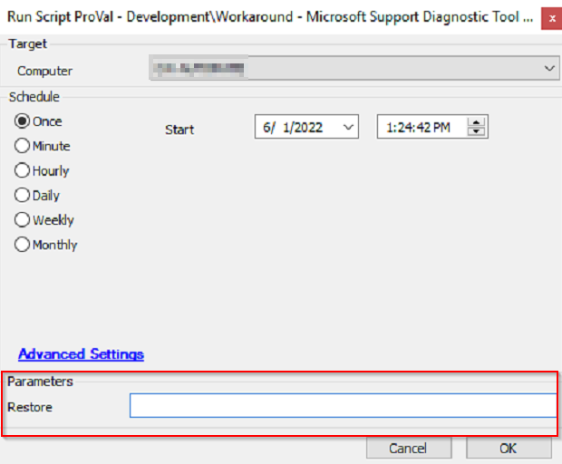
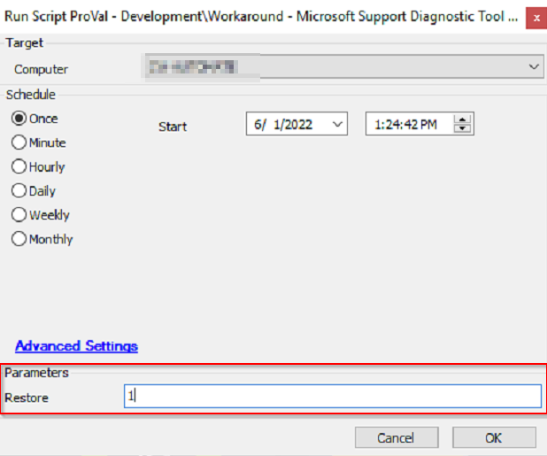

## Summary

This script backs up and removes or restores the following registry key:  
**HKEY_CLASSES_ROOT/ms-msdt**  
Key backup location:  
**"C:/Windows/LTSvc/Packages/MSDTRegBackup"**

This script is automatically executed by the ["ProVal - Development - Workaround - Microsoft Support Diagnostic Tool Vulnerability [G]"](/docs/74e11590-49e4-445b-a380-18d2914f9f3f) monitor.  

This script can also be run manually. It will give you the option to pass the value for the parameter "Restore" if you run it manually. The "HKEY_CLASSES_ROOT/ms-msdt" key will be restored if the argument is set to 1.  

The script's default behavior is to attempt to export and delete the registry file. The script can create a ticket for failure as well, but to enable the ticketing feature, you need to update the value of the Global Variable Ticket to 1. The script's default behavior is to not generate any ticket.  

This script saves the final result to a script state, "MS-MSDT Registry Status," to display the data in the "Microsoft Support Diagnostic Tool Registry Key Audit[Script][Role]" dataview.  

Additionally, the script will import all the contents of the solution for its first run.  

With the recent update, the script will attempt to restore the key if the recommended patches are installed. [CVE-2022-30190](https://msrc.microsoft.com/update-guide/en-US/vulnerability/CVE-2022-30190)  
It is also called by the ["ProVal - Development - Restore MS-MSDT Registry Key [G]"](/docs/e711d3f6-7a23-42da-8d60-400318c8b725) monitor set and restores the key when called from this new monitor set.

## Sample Run

Leave the Restore field blank to remove the registry key:  
  

Set the Restore to 1 for restoring the registry keys:  
  

## Dependencies

- [MS-MSDT Registry Key](/docs/174939f4-d7d5-4c92-9813-308db2c2b0c3)
- [ProVal - Development - Workaround - Microsoft Support Diagnostic Tool Vulnerability [G]](/docs/74e11590-49e4-445b-a380-18d2914f9f3f)
- [ProVal - Development - Restore MS-MSDT Registry Key [G]](/docs/e711d3f6-7a23-42da-8d60-400318c8b725)
- [CVE-2022-30190 MSDT - Workarounds](/docs/7736f421-bfd6-41c0-ba75-5eba3bc82f78)

## Variables

| Name    | Description                                                                 |
|---------|-----------------------------------------------------------------------------|
| OutCome | Store the output of the PowerShell scripts being executed to perform the necessary action. |
| Tickid  | Variable for retrieving and storing the ticket ID of an existing failure ticket. |

### Global Parameters

| Name     | Example | Required | Description                                          |
|----------|---------|----------|------------------------------------------------------|
| Ticketid | 1 or 0  | False    | Set it to 1 to make the script create tickets for failures. |

### User Parameters

| Name     | Example               | Required | Description                          |
|----------|-----------------------|----------|--------------------------------------|
| Restore  | 1 or leave it blank   | False    | 1 to use the script to restore the key |

### Script States

| Name                        | Example                                     | Description                          |
|-----------------------------|---------------------------------------------|--------------------------------------|
| MS-MSDT Registry Status     | BackedUp And Removed, Failed to Remove, Restored, Failed to Restore | Outcome of the recent operation performed |

## Process

Step 1: Import all the parts of the solution.  
Step 2: Check if it is called to restore or to remove the registry key.  

For Backup and Restore:

Step 1: Clear the script state, "MS-MSDT Registry Status."  
Step 2: Execute the PowerShell script to take the backup of the registry key and remove the key.  
Step 3: Verify the outcome of the PowerShell and proceed accordingly.  
Step 4: For success, set the script state as "BackedUp And Removed," and exit.  
Step 5: For failure, set the script state as "Failed to Remove," and check whether ticket creation is enabled or not.  
Step 6: If ticket creation is enabled, look for the already existing ticket and add a comment; otherwise, create a ticket if it does not exist.  
Step 7: Exit with success for success and exit with failures for any failures.  

For Restore:

Step 1: Clear the script state, "MS-MSDT Registry Status."  
Step 2: Execute the PowerShell script to restore the key.  
Step 3: Verify the outcome of the PowerShell and proceed accordingly.  
Step 4: For success, set the script state as "Restored" and exit.  
Step 5: For failure, set the script state as "Failed to Restore," and check whether ticket creation is enabled or not.  
Step 6: If ticket creation is enabled, look for the already existing ticket and add a comment; otherwise, create a ticket if it does not exist.  
Step 7: Exit with success for success and exit with failures for any failures.  

## Output

- Script log
- Script state
- Ticket
- Dataview