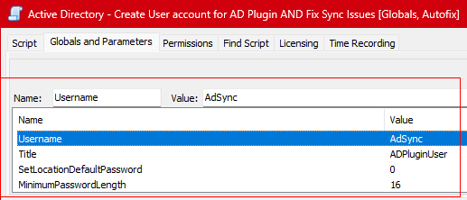
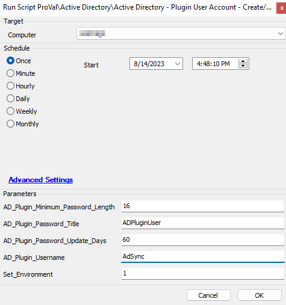
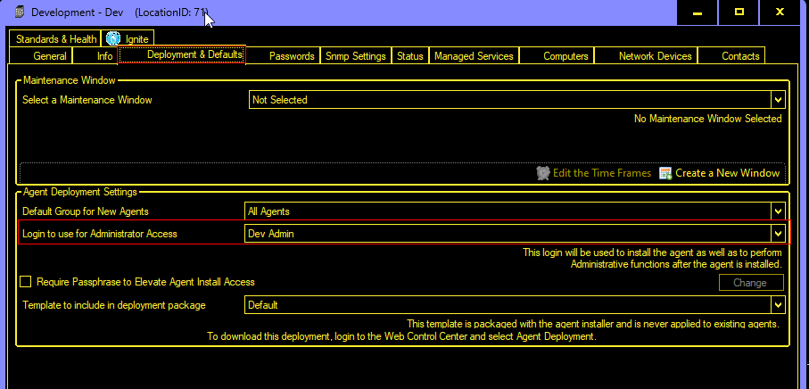

## Summary

This script will create or update a domain admin account to be used with the AD plugin with a random password. It will set the password for the AD plugin on the domain controller as well; in case of failure, it will attempt basic troubleshooting to fix the AD plugin issues.

Additionally, there is an option available in the script to set the password as the deployment and default password for the location. This option can be controlled by the system property `AD_Plugin_Set_Location_Default_Password`.

**Intended Target**: Domain Controllers detected in the `Active Directory Domains` plugin. The script is called by the [CWM - Automate - Internal Monitor - Active Directory - ADPluginUser - Create/Update](/docs/49c050b4-5319-4ffe-929a-d59429bdd3ba) monitor as an autofix.

### Notes
- This script will no longer function on any end-of-life systems, including 2003 Servers, 2008 Servers, 2011 SBS Servers, and 2012 Servers (both regular and R2 editions). Manual management of AD Plugin User Accounts will be necessary for these machines.
- The `AD_Plugin_Username` must be distinct and cannot match the name of any existing group or user, as Windows cannot create a new user if a group or user with the same name already exists on the computer/domain. The default username is `ADPluginUser`.

## File Hash

**File Path**: `C:/ProgramData/_Automation/Script/Set-DomainAdmin/Set-DomainAdmin.ps1`  
**SHA256**: `393870CF414220D4113EBD90A273666427A9A7C85441A46DFC51F3938EACAADD`  
**MD5**: `A92D15A5A2B09A826134BA5DEBC6E8C5`  

## Sample Run

## Implementation

**The implementation steps must be followed to import/update the script after 2023-08-02**

**For Updating the Current Script:**
- **If this script is still in use** - Take note of the values of the global variables `Username`, `Title`, `SetLocationDefaultPassword`, and `MinimumPasswordLength` before importing the new version of the script.  

- Import the replacement Monitor, Script, and alert template using the ProSync plugin.
  - [CWM - Automate - Internal Monitor - Active Directory - ADPluginUser - Create/Update](/docs/49c050b4-5319-4ffe-929a-d59429bdd3ba) 
  - `△ Custom - Autofix - AD Plugin User - Create/Update`
  - This script 'should' be imported after importing the alert template. Verify it is in the system.

- If you correctly documented the global variables in the old script, you can **deprecate the old script AND alert template**.

- Run the new script against any online computer with the `Set_Environment` parameter set to `1`. **Use the values stored from the Global Parameters** in the first step for the rest of the user parameters.  

- The script creates the `AD_Plugin_Set_Location_Default_Password` property as well. Set this value to the desired value (1 or 0).
  - Default value is Disabled (0).

**For New Implementation:**
- Import the New Monitor, Script, and alert template using the ProSync plugin.
  - [CWM - Automate - Internal Monitor - Active Directory - ADPluginUser - Create/Update](/docs/49c050b4-5319-4ffe-929a-d59429bdd3ba) 
  - `△ Custom - Autofix - AD Plugin User - Create/Update`
  - This script 'should' be imported after importing the alert template. Verify it is in the system.

- Run the script against any online computer with the `Set Environment` parameter set to `1`. Set the required values for the rest of the user parameters.  

- The script creates the `AD_Plugin_Set_Location_Default_Password` property as well. Set this value to the desired value (1 or 0).

**Notes:**
- The user parameters are required for the **first run only** (First run of the updated script).
- The values set for the user parameters will be used to create system properties used by the script and the [CWM - Automate - Internal Monitor - Active Directory - ADPluginUser - Create/Update](/docs/49c050b4-5319-4ffe-929a-d59429bdd3ba) monitor set.
- **If values are not provided** to the user parameters for the first run of the script, the script and the monitor set will then use the default values.
  - Default Password Title: ADPluginUser
  - Default Username: ADPluginUser
  - Default Password Update Days: 60
  - Default Minimum Password Length: 16

- The Domain Name will be added to the end of the password title for clients with multiple domains.  
  e.g.,  
  ADPluginUser - [Domain.local](http://domain.local)  
  ADPluginUser - [Dmn.local](http://dmn.local)

- Apart from the system properties controlled by the user parameters, the script creates the `AD_Plugin_Set_Location_Default_Password` property as well. This property can be used to set the generated credentials as the location's default password.  
  Use `1` and `0` to toggle setting the generated password as the default and deployment password of the Domain Controller's location. The default is `0`. The property can be generated by the script with a default value of `0`; any required changes should be made manually.  

## Dependencies

[CWM - Automate - RMM+ Plugin Configuration](/docs/f99ddaae-0cb3-4941-b2aa-dc93671dd246)

## Variables

| Name                  | Description                                                                                     |
|-----------------------|-------------------------------------------------------------------------------------------------|
| STATUS                | Status returned by the monitor set, if the script is executed by the monitor set.             |
| psout                 | Output of the PowerShell script creating/updating the user.                                   |
| ScriptLog             | Content of the log file generated by the script.                                              |
| Label                 | Status of the credentials in the AD Domains plugin post setting.                               |
| Command               | Command used to reset the AD Plugin on the computer.                                          |
| Status                | Status of the credentials in the AD Domains plugin post troubleshooting.                       |
| MaximumPasswordLength  | Maximum length to create the random password.                                                 |

## Global Variables

| Name                        | Default | Required | Description                                                                                       |
|-----------------------------|---------|----------|---------------------------------------------------------------------------------------------------|
| ScriptEngineEnableLogger     | 0       | True     | Disabling the logging to hide the generated password from the script logs.                       |

## User Parameters

| Name                          | Example       | Required | Description                                                                                          |
|-------------------------------|---------------|----------|------------------------------------------------------------------------------------------------------|
| Set_Environment               | 1             | False    | Required for the first run only to set the system properties used by the solution.                 |
| AD_Plugin_Password_Title      | ADPluginUser   | False    | To set the value for the system property `AD_Plugin_Password_Title` during the first run of the script. The `Set_Environment` parameter must be set to `1` to use this parameter. Leaving it blank will set the default value for the system property. |
| AD_Plugin_Username            | ADPluginUser   | False    | To set the value for the system property `AD_Plugin_Username` during the first run of the script. The `Set_Environment` parameter must be set to `1` to use this parameter. Leaving it blank will set the default value for the system property. |
| AD_Plugin_Password_Update_Days | 60           | False    | To set the value for the system property `AD_Plugin_Password_Update_Days` during the first run of the script. The `Set_Environment` parameter must be set to `1` to use this parameter. Leaving it blank will set the default value for the system property. |
| AD_Plugin_Password_Minimum_Length | 16       | False    | To set the value for the system property `AD_Plugin_Minimum_Password_Length` during the first run of the script. The `Set_Environment` parameter must be set to `1` to use this parameter. Leaving it blank will set the default value for the system property. |

**Note:** The user parameters can only be used to create the system properties. If required, changes to the system properties should be made manually from the **`Dashboard > Config > Configuration > Properties`**.

## System Properties

| Name                          | Example       | Required | Description                                                                                          |
|-------------------------------|---------------|----------|------------------------------------------------------------------------------------------------------|
| AD_Plugin_Password_Title      | ADPluginUser   | False    | Title of the password entry to use to store the credentials for the Active Directory plugin. The solution will use the default title `ADPluginUser` if the system property is missing. |
| AD_Plugin_Username            | ADPluginUser   | False    | Username of the password entry to use to create the credentials for the Active Directory plugin. The solution will use the default username `ADPluginUser` if the system property is missing. |
| AD_Plugin_Password_Update_Days | 60           | False    | Age of the password in days. The solution will use the default age `60` days if the system property is missing. |
| AD_Plugin_Password_Minimum_Length | 16       | False    | Minimum length of the random password to generate for the AD Plugin user. The default value is `16`. |
| AD_Plugin_Set_Location_Default_Password | 0   | False    | `1` and `0` to toggle setting the generated password as the default and deployment password of the Domain Controller's location. The default is `0`. The property can be generated by the script with a default value of `0`; any required changes should be made manually. |
| AD_Plugin_Account_Make_Admin | 1             | False    | `1` and `0` to toggle adding the user to the "domain admins" group. The default value is `1`. |

## Output

- Script Logs

