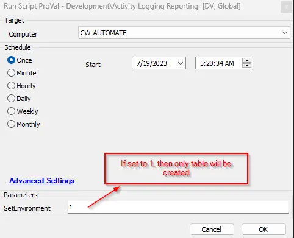

## Summary

This script is used to perform an audit of the login/logout activities of users.

## Sample Run

## Dependencies

[pvl_login_logout_audit](/docs/c62e7bbf-226d-4269-9d12-536e43af5589)

## Variables

Document the various variables in the script. Delete any section that is not relevant to your script.

| Name           | Description                                                                                                                                                                |
|----------------|----------------------------------------------------------------------------------------------------------------------------------------------------------------------------|
| Threshold      | This stores data from the property 'ProVal_UserLogIn_Out_Threshold_Days' to set the data deletion threshold for data older than the provided value.                     |
| Retention      | Indicates whether the threshold system properties value was provided or not, and based on that, data deletion will proceed.                                             |

#### Global Parameters

| Name                | Example                     | Required | Description                                                                                                                                                                                                                                           |
|---------------------|-----------------------------|----------|-------------------------------------------------------------------------------------------------------------------------------------------------------------------------------------------------------------------------------------------------------|
| TableName           | pvl_login_logout_audit      | True     | This denotes the name of the table created to store the activity login/logout data. Note: It should not be changed without notifying the ProVal DevOps team; otherwise, the data view and solution will break.                                     |
| Hours               | 24                          | True     | Required to trace user activity over the past hour. Note: The value can be changed and should correlate with the monitor interval to get appropriate data.                                                                                         |
| Data_Deletion       | 1                           | False    | If set to 1, the older data in the table pvl_login_logout_audit will start getting truncated based on the system property 'ProVal_UserLogIn_Out_Threshold_Days' value. If set to 0, no data deletion will be performed.                          |
| AuditEvent_Enable   | 1                           | False    | If set to 1, the script will enable the Audit login/logout local policy on the agent for data collection in the event logs. If set to 0, the Audit local policy will not be enabled by the script. Note: By default, the policy is not enabled in the agent. |
| DataRetention_Threshold | 90                     | False    | The value is set in days. If the value is provided and Data_Deletion is set to 1, then older data in the table [vl_login_logout_audit](/docs/c62e7bbf-226d-4269-9d12-536e43af5589) will be deleted based on the provided value of this parameter.          |

#### User Parameters

| Name              | Example | Required | Description                                                                                                                                                                                                                   |
|-------------------|---------|----------|-------------------------------------------------------------------------------------------------------------------------------------------------------------------------------------------------------------------------------|
| SetEnvironment     | 1       | False    | If set to 1, only the table will be created. If set to 0, the script will execute completely and will collect the user login/logout audit data.                                                                             |

#### System Properties

| Name                                    | Example | Required | Description                                                                                                 |
|-----------------------------------------|---------|----------|-------------------------------------------------------------------------------------------------------------|
| ProVal_UserLogIn_Out_Threshold_Days    | 365     | True     | This value helps to delete data older than the number of days specified in this property.                    |

## Output

- Script log
- Data view
