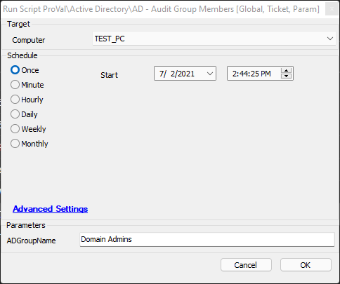

## Summary

This script audits the target Active Directory (AD) group for changes since the last time it was run. It can send an optional ticket after detecting changes in the target group.

**Time Saved by Automation:** 5 Minutes

## Sample Run

## Dependencies

[Compare-ADGroupMembers](/docs/d05c42d1-0984-4ce7-9b1e-7f144871fe1e)

## Variables

### Global Parameters

| Name                     | Example | Required          | Description                                                                                      |
|--------------------------|---------|-------------------|--------------------------------------------------------------------------------------------------|
| TicketCreationCategory    | 178     | False (Default 0) | Sets the ticket category for ticketing. If set to 0, ticketing will be skipped.                |

### User Parameters

| Name          | Example        | Required | Description                                                |
|---------------|----------------|----------|------------------------------------------------------------|
| ADGroupName   | Domain Admins  | True     | The name of the AD group to check for changes against.     |

## Process

See [Compare-ADGroupMembers](/docs/d05c42d1-0984-4ce7-9b1e-7f144871fe1e) for details on the underlying script logic.

If [Compare-ADGroupMembers](/docs/d05c42d1-0984-4ce7-9b1e-7f144871fe1e) returns `1` in the `@datalogcontent@` variable, then a ticket will be created if the `@TicketCreationCategory@` variable is set.

## Output

- Script Log
- Log Files
- Ticketing

