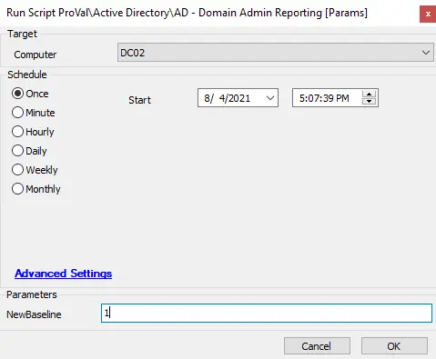

## Summary

The script provides auditing for members of Admin groups in Active Directory and optionally sends an alert about changes to those groups.

**Time Saved by Automation:** 5 Minutes

## Sample Run

## Dependencies

- Must be a Domain Controller (and part of the Domain Controllers' Group)

## Variables

- `@NewBaseline@` -> Updates the comparison list of Domain Admins
- `@DomAdminsFresh@` -> The list of new Domain Admins
- `@EntAdminsFresh@` -> List of Enterprise Admins
- `@SchemaAdminsFresh@` -> List of Domain Schema Admins

#### User Parameters

| Name         | Example | Required | Description                                           |
|--------------|---------|----------|-------------------------------------------------------|
| NewBaseLine  | 1       | False    | Setting this to 1 will set the baseline with the new members. |

#### Script States

| Name                   | Example          | Description                                         |
|------------------------|------------------|-----------------------------------------------------|
| DomAdminsMember         | User1, User2     | Shows the current Domain Admins since the script ran last |
| EntAdminsMembers       | User1, User2     | Shows the current Enterprise Admins since the script ran last |
| SchemaAdminsMembers    | User1, User2     | Shows the current Domain Schema Admins since the script ran last |

## Process

1. This script prompts you to refresh the baseline for the Domain Controller.
2. It runs several shell commands to pull the new lists and stores the corresponding information in the script states.
3. At each section of Domain, Schema, and Enterprise admin checks, it compares the original list to the new baseline check and optionally creates tickets for any changes.
   - If no changes are detected, it logs the information in Automate's script logs.

## Output

- Script log
- Script state
- Ticket (optional)