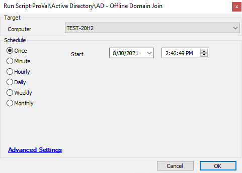

## Summary

This script joins a machine to a domain while it is not connected to the same network as the DC.

**Time Saved by Automation:** 10 Minutes

## Sample Run

## Variables

| Variable              | Description                                           |
|-----------------------|-------------------------------------------------------|
| DomainName            | Stores the domain name of the discovered DC.         |
| DomainControllerID    | The DC Computer ID.                                  |
| TargetComputerID      | Stores the Computer ID of the target machine.        |
| TargetName            | Stores the computer name of the target machine.      |

## Process

This script joins a machine to a domain while it is not connected to the same network as the DC. It first checks if the computer has a DC server in its environment. DSJOIN is then used to gather the configuration data from the domain and import it to the target. The target is then checked for success in the offline domain join.

## Output

- Script log

