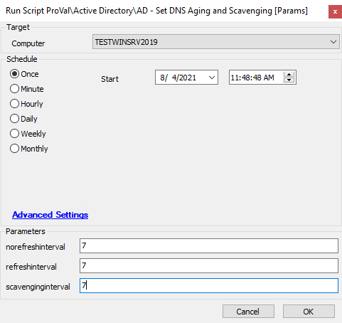

## Summary

Old content piece to compare to: [Set-DNSServerScavengingSettings](/docs/6942d20e-8606-4af2-bae5-7525935a2bfd)  
Enables DNS scavenging and optionally allows you to set the interval for scavenging, 'no refresh', and refresh.

**Time Saved by Automation:** 5 Minutes

## Sample Run

## Dependencies

- Must be run on a Windows DNS server with the applicable DNS server cmdlets (generally 2012+).

## Variables

- `@PS1Log@` -> Log file location  
- `@PS1Path@` -> Location of the PS1 file.  
- `%executeresult%` -> Output from the PowerShell script  
- `@LogContent@` -> This is the same content from the PS1 log locally on the machine but within Automate's script logs  

#### User Parameters

| Name                | Example | Required | Description                                                                                                           |
|---------------------|---------|----------|-----------------------------------------------------------------------------------------------------------------------|
| norefreshinterval    | 7       | True     | This setting controls when the DNS server rejects refresh requests from hosts and the DHCP service.                 |
| refreshinterval      | 7       | True     | This option determines when a DDNS record can be flagged for scavenging (deletion). The default value is seven days. |
| scavenginginterval    | 7       | True     | The scavenging process runs after X days.                                                                             |

## Process

The script validates that the server is a DNS server with the `Get-DNSServer` cmdlet. After validation, it will attempt to enable DNS scavenging. If one or more arguments are passed to the script, it will process changes on the respective intervals.

## Output

- Script log
- Local file on the computer

