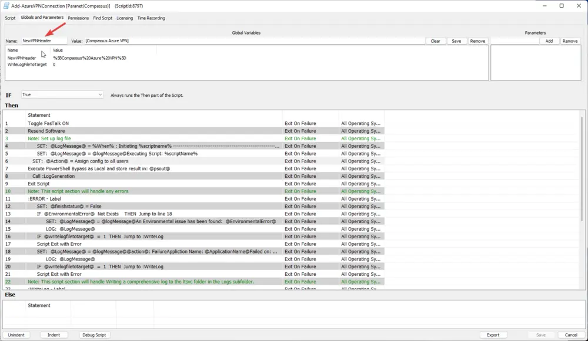
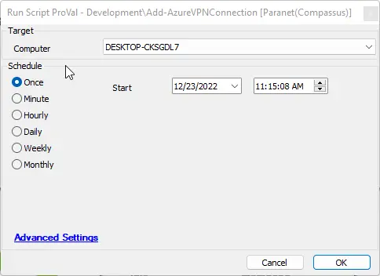
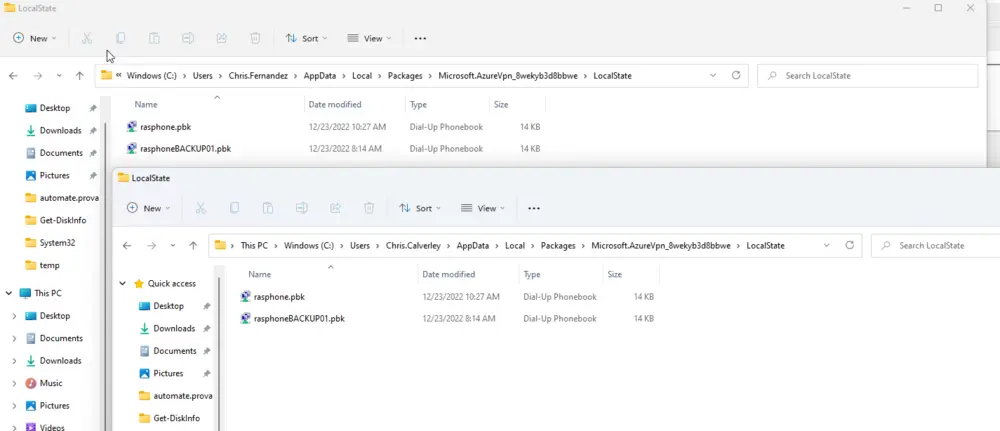

## Summary

This script will set up Compassus's Azure VPN connection for all users.

## Sample Run

This script will be called from a remote monitor to target only machines missing the configuration file or if the configuration file does not contain the required header.

In the event that the configuration file must change, you will need to reset the global parameter and run this script manually on each machine.

Manual run.

On a single manual run, you can expect to see the following files in every registered user's profile.

## Variables

Document the various variables in the script. Delete any section that is not relevant to your script.

| Name                  | Description                                                                                                                                                  |
|-----------------------|--------------------------------------------------------------------------------------------------------------------------------------------------------------|
| LogMessage            | A running log variable storing actions being taken for logging.                                                                                            |
| Action                | The current action being executed.                                                                                                                         |
| FinishStatus          | The finish status of this script.                                                                                                                          |
| EnvironmentalError    | This variable is pushed into this script via the PowerShell all responses check script. It will alert on common PowerShell issues, such as improper versions, etc. |

#### Global Parameters

| Name                   | Example                | Required | Description                                                                                                                                         |
|------------------------|------------------------|----------|-----------------------------------------------------------------------------------------------------------------------------------------------------|
| NewVPNHeader           | [Compassus Azure VPN]  | True     | This value must be set. When updating any property of the VPN setting, you will need to change this name to add a new VPN to the list. You must change the monitor to reflect this change when updating properties in the configuration file. |
| WriteLogFileToTarget   | 1                      | False    | Setting this to 1 will write a log file named script[scriptID]_Log.txt to the LTSVC/Logs directory for this script.                              |

## Process

1. Set up a log file.
2. Execute the new and improved script.
3. Check for any errors.
4. Exit.

## Output

- Script log
- File in LTSVC/Logs (optional)
