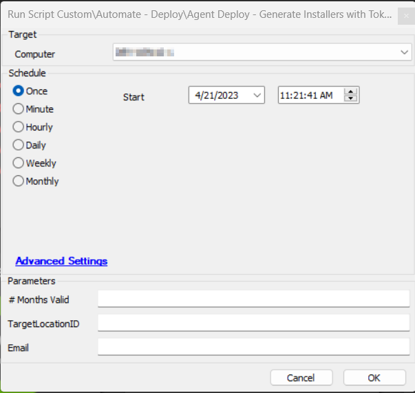
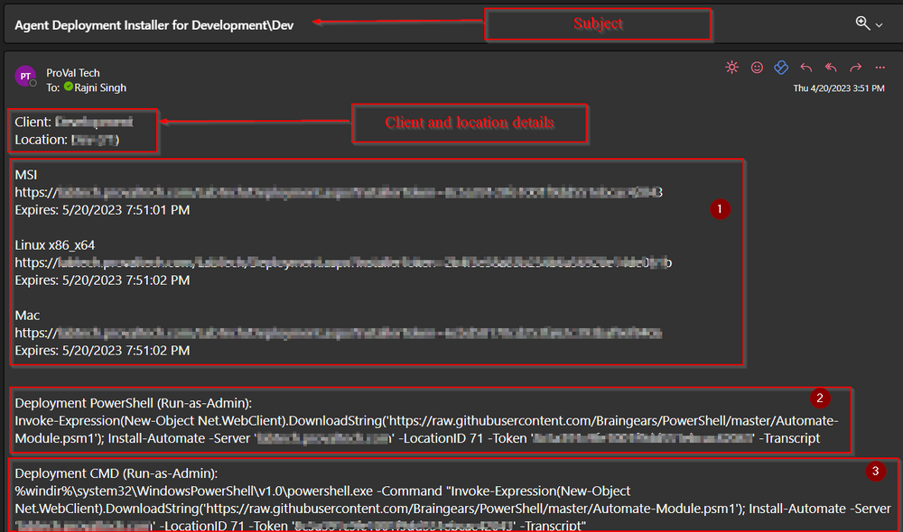
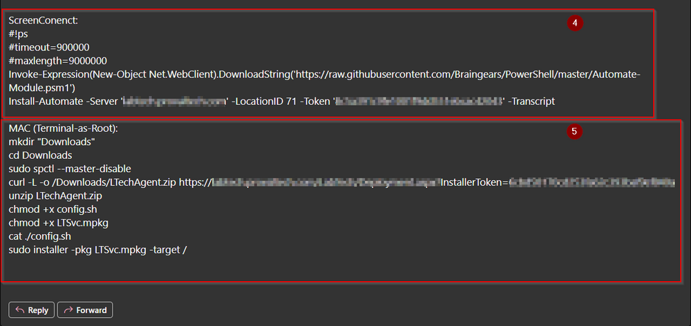
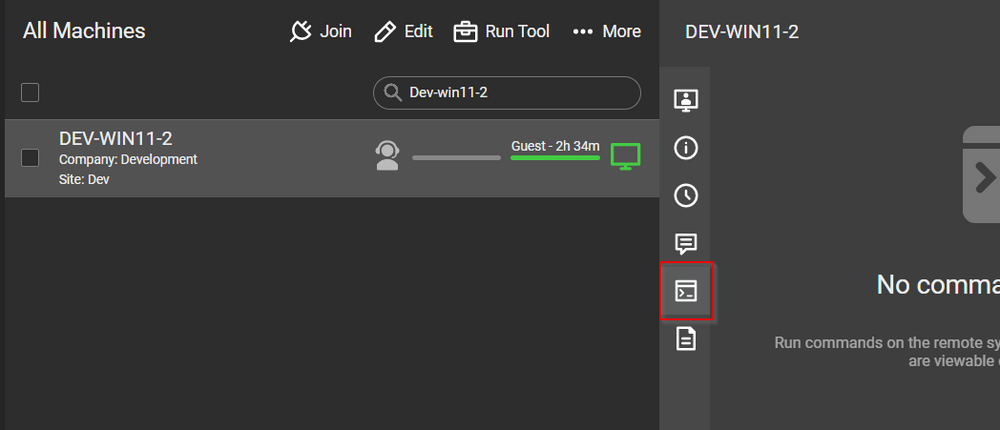

## Summary

A special thanks to Chuck Fowler for creating the script!

This script is designed to create a URL for operating systems like Windows MSI, MAC, and Linux for the Automate Agent installer with Tokens. The URL will be location-specific and includes expiration and emailing features. The script will send the details of the installer along with installation commands for Windows MSI, MAC, and other details. This takes input for Location, the count of months for which this token will be valid, and an email address.

## Sample Run

#### User Parameters

| Name               | Example                          | Required | Description                                                                                   |
|--------------------|----------------------------------|----------|-----------------------------------------------------------------------------------------------|
| # Months Valid     | 2                                | False    | The number of months for which the token should be valid. If left blank, the default is 1.  |
| TargetLocationID   | 34                               | False    | Enter an alternative LocationID. If left blank, it will be the default Location where the script was executed from. |
| Email              | [abc@domain.com](mailto:abc@domain.com) | True     | The email address on which you want to receive the Token and URL.                            |

## Output

- Script log
- Email

## Sample Email:

## How to Use the Installation Commands

The email will contain MSI, Linux, and MAC installer URLs along with the details of the expiration date of the token.

1. **To install the Agent manually:**
   - Copy the required installer URL shown in Box 1 from the email you received.
   - Paste it in your browser and download the file.
   - Run the file manually using admin rights.

2. **To install the Agent using PowerShell:**
   - Open PowerShell with Administrative Rights.
   - Copy the command mentioned under the headline "Deployment PowerShell (Run-as-Admin)" (Command mentioned in Box 2) from the email you received.
   - Press enter. The deployment process will start. Wait for the command to finish.
   - You will receive a message saying: "The Automate Agent Has Been Successfully Installed."

3. **To install the Agent using Command Prompt:**
   - Open Command Prompt with Administrative Rights.
   - Copy the command mentioned under the headline "Deployment CMD (Run-as-Admin)" (Command mentioned in Box 3) from the email you received.
   - Press enter. The deployment process will start. Wait for the command to finish.
   - You will receive a message saying: "The Automate Agent Has Been Successfully Installed."

4. **To install the Agent through ScreenConnect:**
   - This option can be used only when the machine is online in the ScreenConnect portal.
   - Search for the machine and navigate to the Commands tab as shown in the screenshot below:
     
   - Copy the command mentioned under the headline "ScreenConnect" (Command mentioned in Box 4) from the email you received.
   - Click on the "Run Command" icon. The deployment process will start. Wait for the command to finish.
   - You will receive a message saying: "The Automate Agent Has Been Successfully Installed."

5. **To install the Agent on MAC:**
   - Open Terminal as Root.
   - Copy the command mentioned under the headline "Deployment PowerShell (Run-as-Admin)" (Command mentioned in Box 5) from the email you received.
   - Press enter. The deployment process will start. Wait for the command to finish.
   - You will receive a message saying: "The Automate Agent Has Been Successfully Installed."

