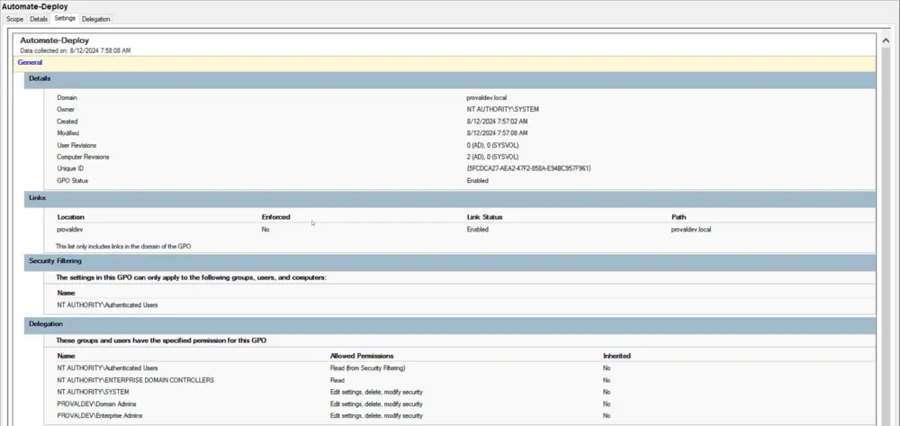
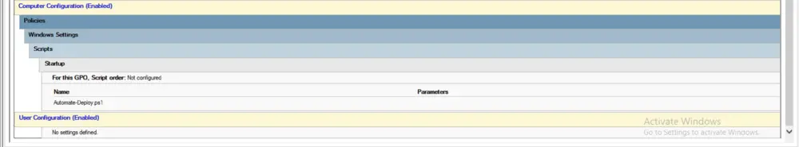
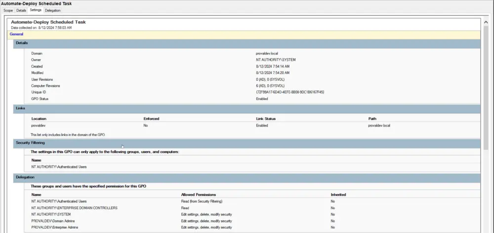
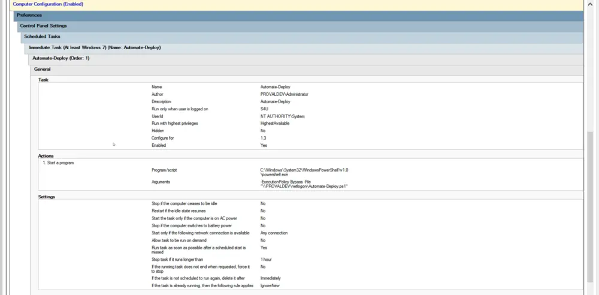
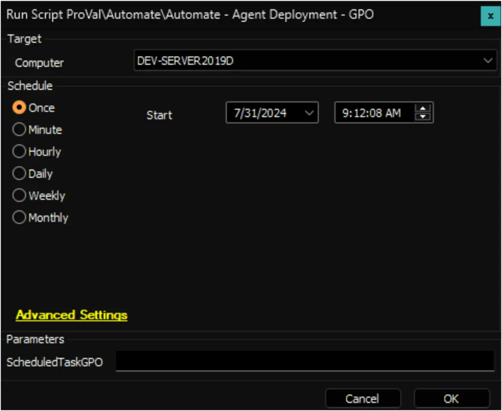
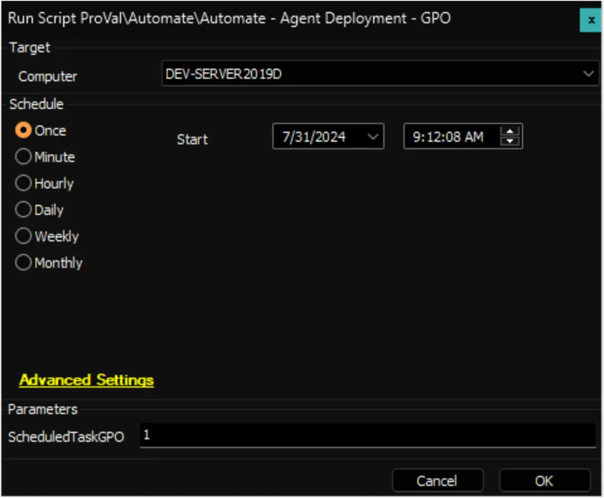

## Summary

This document outlines the implementation of the [Install-AutomateAgentGPO.ps1](/docs/0163e7d2-d72d-4b31-b0fe-294df333d125) agnostic script. The script can create a ConnectWise Automate Agent Deployment Group Policy Object that will generate a startup script (or a Scheduled Task) policy and apply that policy to the root forest in Group Policy Management.

**Name of the Startup Script GPO:** `Automate-Deploy`

**Name of the Scheduled Task GPO:** `Automate-Deploy Scheduled Task`

The startup script GPO executes a PowerShell script on startup (after the computer restarts). In contrast, the scheduled task GPO will immediately execute the PowerShell script to install or fix the Automate agent as soon as the policy is applied on the computer.

## Automate-Deploy GPO

## Automate-Deploy Scheduled Task GPO

## Sample Run

**To Create a Startup Script GPO:**

**To Create a Scheduled Task GPO:**

## Implementation

1. Import the Automate - Agent Deployment - GPO.
2. Schedule the script to run on all primary domain controllers (PDC Emulator Role) once every 11 months. (Using 11 months on a 12-month token lease will ensure that broken agents are never installed or attempted).

## User Parameters

| Name                | Example | Required | Description                                                                                   |
|---------------------|---------|----------|-----------------------------------------------------------------------------------------------|
| ScheduledTaskGPO    | 1       | False    | Set it to 1 to create a Scheduled Task GPO instead of a startup script GPO.                  |

## Dependencies

[CWM - Automate - Agnostic - Install-AutomateAgentGPO.ps1](/docs/0163e7d2-d72d-4b31-b0fe-294df333d125)

## Output

- Script log

## FAQ

**Q.** The script was working, but now it has stopped working. Why?  
**A.** The most likely cause of this situation is that the token has expired, and the script is not scheduled to run at the recommended 11-month interval.

**Q.** I have followed the steps above, and I am not seeing any change in the number of devices at my client.  
**A.** For a Group Policy Object to take effect on a target machine, that target must receive a group policy update. Additionally, because it's a startup script, the computer must restart. If either of these conditions is not met, then the group policy will not be enforced.

**Q.** Does installing the Scheduled Task GPO remove the existing Startup Script GPO?  
**A.** No, both `Automate-Deploy` and `Automate-Deploy Scheduled Task` are individual GPOs and do not remove or update each other while being created.
