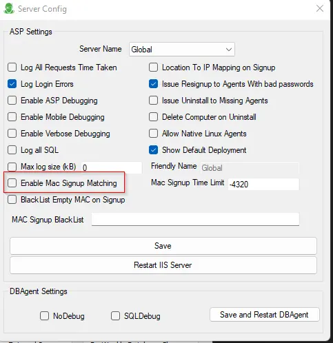
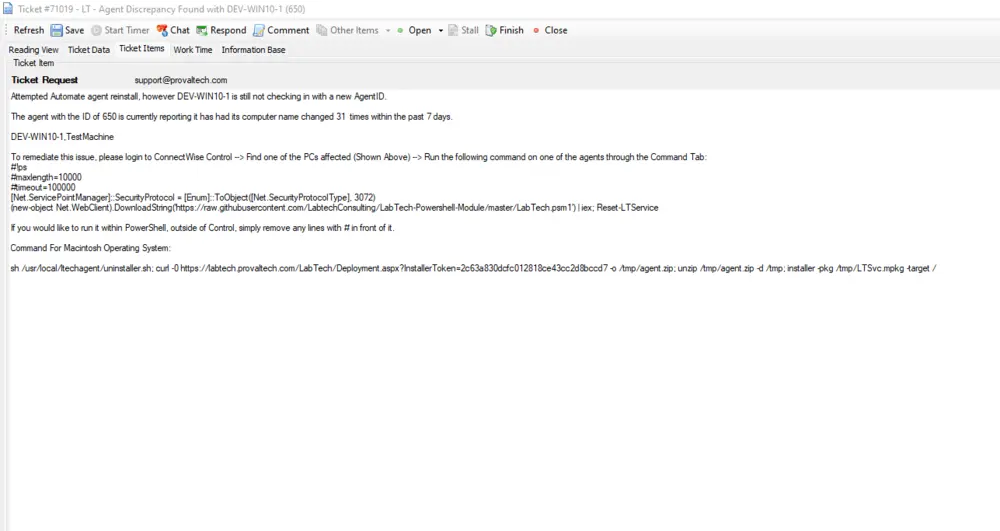

## Summary

This script will reinstall the Automate agent for machines that are checking into Automate with the same agent ID as another agent. It will create a ticket if it fails to reinstall the agents with a new agent ID.

Additionally, it will work reliably only for customers where Mac Signup Matching is not enabled.

Sample Ticket:  

## How To Use

- Import the script.
- Create an alert template, such as ~Autofix - Agent ID assignment discrepancy.
- Assign that alert template to the [CWM - Automate - Internal Monitor - ProVal - Development - Agent ID assignment discrepancy](/docs/9e0a1ae1-c888-496b-b161-c154fc48466e) monitor set.
- Import the monitor set if it has not already been imported.

## Dependencies

- [CWM - Automate - Internal Monitor - ProVal - Development - Agent ID assignment discrepancy](/docs/9e0a1ae1-c888-496b-b161-c154fc48466e)
- [CWM - Control - Script - CW Control RMM+ API - Is Online [Properties]*](/docs/18562eaa-d162-4362-98d3-4bbaa2922458)
- [CWM - Control - Script - CW Control RMM+ API - Execute Command*](/docs/b713bbc8-a1d9-4e08-ac77-d02b634569f6)
- [SWM - Software Install - Script - CW Control RMM+ API - LTPosh Redo-LTService*](/docs/567b8db7-a87a-45c1-a81a-b3178090fb52)
- LTPoSH Community Module ([https://bit.ly/LTPoSH](https://bit.ly/LTPoSH))
- RMM+ Plugin configured in the CW Control portal

## Variables

| Name              | Description                                                    |
|-------------------|---------------------------------------------------------------|
| Online            | Indicates if the agent is online in CW Control               |
| Command           | The command to issue to the endpoint to perform the reinstall |
| Cid               | Current Computer ID                                          |
| CName             | Current Name of the Computer                                 |
| CLocalAddress     | Local IP Address                                            |
| CRouterAddress    | Router/Public Address                                        |
| AnotherAgent      | Distinct Names of the agents checking into the same Computer ID |
| NewAgentID        | New Agent ID of the machine after successful reinstall       |
| Comment           | Comment to add to the ticket                                 |
| Subject           | Ticket Subject                                              |
| Ticid             | Ticket ID                                                  |

## Process

1. Determine whether the computer is offline or online in Control.
2. Attempt to reinstall the agent.
3. Determine whether the installation was successful by verifying the presence of a new Computer ID for the same machine.
4. Create or comment on a ticket for failure and finish any open ticket for success.

## Output

- Ticket
- Script logs

