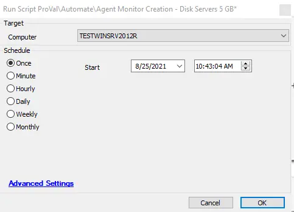

## Summary

This script creates remote monitors for detected hard drives at the agent level and sets the script state to note that the SensorID already has a monitor assigned to it.

**Time Saved by Automation:** 5 Minutes

## Sample Run

## Dependencies

Agent Monitor Creation - Disk* - WRAPPER Globals

## Variables

| Variable Name  | Description                                                                                       |
| -------------- | ------------------------------------------------------------------------------------------------- |
| interval       | Sets the interval, and as per ProVal standard, it is set to 300                                   |
| MinMBytesFree  | Threshold set for the monitor. In this case, it is 5000 MB                                        |
| MinSizeMB      | The minimum size of the drive should be at least 16 GB                                            |
| reportcategory | The report category for the alerts.                                                               |
| ticketcategory | The ticket category will be set on the monitor so the tickets/alerts will go to the defined board |
| alerttemplate  | The alert template will be set on the remote monitor.                                             |

#### Script States

| Name                            | Example | Description                                                    |
| ------------------------------- | ------- | -------------------------------------------------------------- |
| MonitorIDDiskSpace-@sqldriveid@ |         | To note that the SensorID already has a monitor assigned to it |

## Process

This script runs some SQL commands to create remote monitors for detected hard drives at the agent level and sets the script state to indicate that the SensorID already has a monitor assigned to it. To adjust the thresholds, we need to modify line 7 to the desired MB free and adjust line 5 to match that (in GB). The script runs as a subscript inside the "Agent Monitor Creation - Disk* - WRAPPER [Globals]" script.

## Output

Creates Disk Space Remote Monitors on the internal drives of a server.
