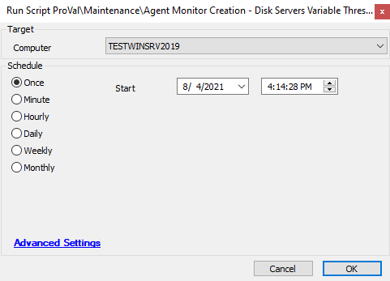

## Summary

*(written for servers only)*  
This script builds out the remote drive space monitors. It is easily adjustable based on the drives in the server.

**Time Saved by Automation:** 5 Minutes

## Sample Run

This should be run only as a subscript to the `@Agent Monitor Creation - Disk* - WRAPPER [Globals]` (script), but you can run it manually:  

## Dependencies

- `@Agent Monitors - Disk - Remove and Rebuild - ProVal*` (script)
- Similar to: `@Agent Monitor Creation - Disk Servers 5 GB*` (script)
- `@Agent Monitor Creation - Disk* - WRAPPER [Globals]` (script)
- `@Agent Monitor Creation*` (default script)

## Variables

- `@clientname@` -> Grabs the client name for the remote monitor build
- `@locationaname@` -> Grabs the location name for the remote monitor build
- `@message@` -> Sets the ticket subject creation
- `@interval@` -> Sets how often the remote monitor runs
- `@MinMBytesFreeGT1TB@` -> Sets the threshold for drives >1TB
- `@MinMBytesFreeGT1TBSecThresh@` -> Sets the second threshold for drives >1TB
- `@MinMBytesFreeGT100GB@` -> Sets the threshold for drives >100GB
- `@MinMBytesFreeLT100GB@` -> Sets the threshold for drives \<100GB
- `@MinSizeMB@` -> Sets the threshold requirement for building the monitor
- `@reportcategory@` -> Used for report center report generation
- `@ticketcategory@` -> Sets the ticket category mapping

## Process

This script is run as a subscript from the Daily Maintenance of Automate's disk creation monitor.

1. The `@Agent Monitors - Disk - Remove and Rebuild - ProVal*` will remove the current monitors and, if set to use this subscript, will generate based on the settings here.
2. The script sets several variables and generates a remote monitor on all drives detected that meet the `MinSizeMB`.

## Output

- Script log

