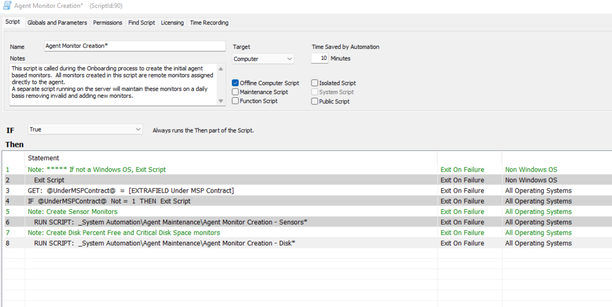
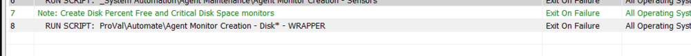

## Summary

This script **must** be called by the Agent Monitor Creation script and/or the Remove and Rebuild script to create disk monitors for machines.

On a default setup, change the Agent Monitor Creation Script (around line 8) to use the ProVal Disk Wrapper instead.

**Before**  
  

**After**  
  

**Time Saved by Automation:** 10 Minutes

## Sample Run

This script cannot be run manually.

## Dependencies

- [Agent Monitor Creation - Disk Workstations 5 GB*](/docs/5e473149-73a6-4e38-b61e-fd200d9af020)  
- [Agent Monitor Creation - Disk Servers 5 GB*](/docs/9ce297f7-cc65-4fd8-b05b-b25e6088c6fe)  

#### Global Parameters

| Name        | Example        | Required | Description                                                                 |
|-------------|----------------|----------|-----------------------------------------------------------------------------|
| ExcludeIDs  | 445,334,345    | False    | A list of comma-separated computer IDs to exclude from monitor creation.   |

## Process

This script **must** be called by the Agent Monitor Creation script and the Remove and Rebuild script to create disk monitors for machines. It checks the `computerid` against the provided exclude list IDs. If any agent is found in that list, then this script will not run on that agent, and no monitors will be created.

## Output

- Script log

