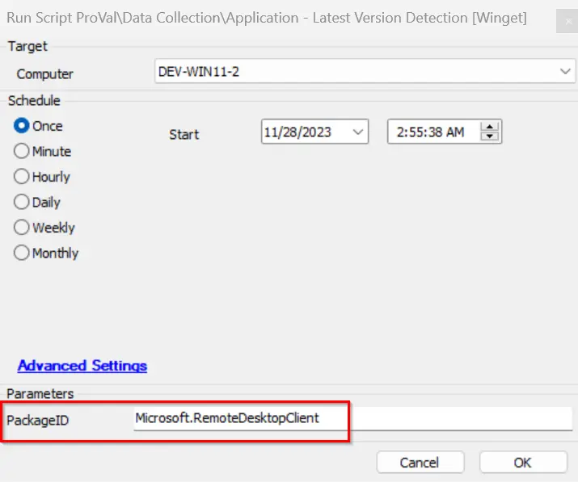

## Summary

This script is designed to gather the latest version of applications supported by Winget and store them in the system properties created with the name of the PackageID.

## File Hash

**File Path:** `C:\ProgramData\_automation\Script\Get-WingetPackageLatestVersion\Get-WingetPackageLatestVersion.ps1`  
**File Hash (Sha256):** `88C430DB16D0CD9E76C3B3650E76F6D7B06C79F42678F2C65138687EA9C546E7`  
**File Hash (MD5):** `885A601D6A2A0EA69C8073C165FBAB54`  

## Sample Run

## Variables

| Name                        | Value                                                                                                    | Description                                                                                      |
|-----------------------------|-------------------------------------------------------------------------------------------------------------------|--------------------------------------------------------------------------------------------------|
| ProjectName                 | Get-WingetPackageLatestVersion                                                                                    | Script project name                                                                              |
| WorkingDirectory            | C:\ProgramData\_Automation\Script\Get-WingetPackageLatestVersion                                                  | Script working directory                                                                         |
| PS1Path                     | C:\ProgramData\_Automation\Script\Get-WingetPackageLatestVersion\Get-WingetPackageLatestVersion.ps1               | Script file path                                                                                 |
| appName                     | winget                                                                                                            | Application name                                                                                 |
| appDirectory                | C:\ProgramData\_Automation\app\winget                                                                             | Directory for app files                                                                          |
| extractPath                 | C:\ProgramData\_Automation\app\winget\Extract                                                                     | Path for extracted files                                                                         |
| executablePath              | C:\ProgramData\_Automation\app\winget\Executable                                                                  | Path for executables                                                                             |
| appPath                     | C:\ProgramData\_Automation\app\winget\Executable\winget.exe                                                       | Full path to winget.exe                                                                          |
| installerPath               | C:\ProgramData\_Automation\app\winget\Installers                                                                  | Path for installer files                                                                         |
| msixBundle                  | Microsoft.DesktopAppInstaller_8wekyb3d8bbwe.msixbundle                                                            | MSIX bundle filename                                                                             |
| msixBundlePath              | C:\ProgramData\_Automation\app\winget\Installers\Microsoft.DesktopAppInstaller_8wekyb3d8bbwe.msixbundle           | Full path to MSIX bundle                                                                         |
| msixBundleDownloadUrl       | https://github.com/microsoft/winget-cli/releases/latest/download/Microsoft.DesktopAppInstaller_8wekyb3d8bbwe.msixbundle | Download URL for MSIX bundle                                                                     |
| 7zrExePath                  | C:\ProgramData\_Automation\app\winget\Installers\7zr.exe                                                          | Path to 7zr.exe                                                                                  |
| 7zrExtra7zPath              | C:\ProgramData\_Automation\app\winget\Installers\7z.7z                                                            | Path to 7z.7z archive                                                                            |
| 7zaPath                     | C:\ProgramData\_Automation\app\winget\Installers\7za.exe                                                          | Path to 7za.exe                                                                                  |
| 7zrExeDownloadUrl           | https://www.7-zip.org/a/7zr.exe                                                                                   | Download URL for 7zr.exe                                                                         |
| 7zrExtra7zDownloadUrl       | https://www.7-zip.org/a/7z2201-extra.7z                                                                           | Download URL for 7z extra archive                                                                |
| appInstallerX64Path         | C:\ProgramData\_Automation\app\winget\Extract\AppInstaller_x64.msix                                               | Path to extracted AppInstaller x64                                                               |
| appInstallerX86Path         | C:\ProgramData\_Automation\app\winget\Extract\AppInstaller_x86.msix                                               | Path to extracted AppInstaller x86                                                               |
| vcRunTimePackage            | C:\ProgramData\_Automation\app\winget\Installers\Microsoft.VCLibs.x64.14.00.Desktop.appx                          | Path to VC runtime package                                                                       |
| vcRunTimePackageDownloadUrl | https://aka.ms/Microsoft.VCLibs.x64.14.00.Desktop.appx                                                            | Download URL for VC runtime package                                                              |
| visual2019Redir             | Microsoft Visual C++ 2015-2019 Redistributable                                                                    | Name of Visual C++ 2015-2019 Redistributable                                                     |
| visual2022Redir             | Microsoft Visual C++ 2015-2022 Redistributable                                                                    | Name of Visual C++ 2015-2022 Redistributable                                                     |
| vcRedistExecutable          | VC_redist.x64.exe or VC_redist.x86.exe (depends on OS architecture)                                               | Visual C++ Redistributable installer filename                                                    |
| vcRedistExecutablePath      | C:\ProgramData\_Automation\app\winget\Installers\VC_redist.x64.exe (or .x86.exe)                                  | Path to Visual C++ Redistributable installer                                                     |
| vcRedistExecutableDownloadUrl | https://aka.ms/vs/17/release/VC_redist.x64.exe (or .x86.exe)                                                    | Download URL for Visual C++ Redistributable installer                                            |

### User Parameters

| Name       | Example                       | Required | Description                                                                                     |
|------------|-------------------------------|----------|-------------------------------------------------------------------------------------------------|
| PackageID  | Microsoft.RemoteDesktopClient  | False    | The parameter passes the value to the script for the PackageID application version detection    |

### System Properties

| Name         | Example                       | Required | Description                                                                                     |
|--------------|-------------------------------|----------|-------------------------------------------------------------------------------------------------|
| @PackageID@  | Microsoft.RemoteDesktopClient  | False    | This automatically gets created by the script once the PackageID version is detected with the PackageID name |

## Output

- Script log