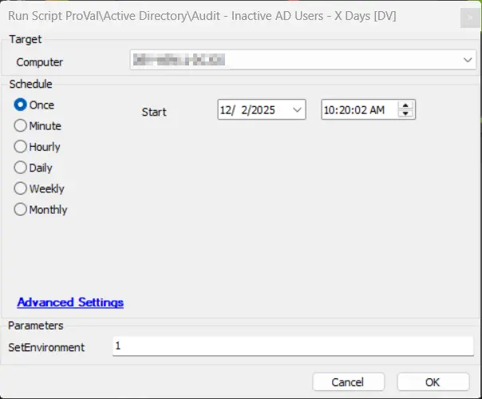
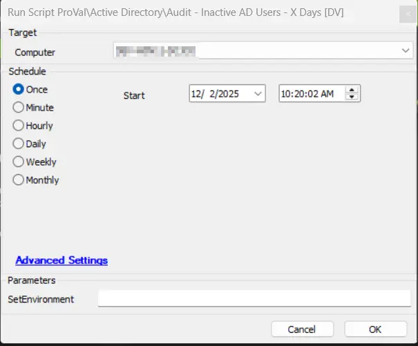
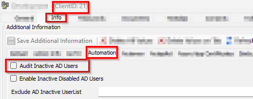

## Summary

This script detects the inactive users over X days and records the data into the [Table - pvl_ad_inactive_users](/docs/2b118df6-1fef-4530-9303-0bb56c478361) so that it can be represented in a [Dataview - AD Inactive Users Audit](/docs/9c9888a7-678a-497f-8f61-11e21e020999).

## Sample Run

- It is needed to run this script initially with a value of 1 to create the [Table - pvl_ad_inactive_users](/docs/2b118df6-1fef-4530-9303-0bb56c478361) and import the required EDFs. 

- Run normally to fetch the inactive AD users over threshold   

## File Hash

| Path | Algorithm | Hash |
| --- | --- | --- |
| `C:\ProgramData\_automation\script\Inactive_ADUsers\Activate_DisabledADUser.ps1` | MD5 | `43E7E6233A50EF110928128B74864B17` |
| `C:\ProgramData\_automation\script\Inactive_ADUsers\Activate_DisabledADUser.ps1` | SHA256 | `6C50479A488EC55984441A24580AA82CBC6311CEB02A3D025FF14E188116A93B` |

## EDFs

| Name           | Level  | Type  | Tab | Description             |
|-----------------|--------|--------|----------|-----------------------------------------------------------------------|
| Exclude AD Inactive UserList | Client | Text | Automation | This accepts the user list that is required to be excluded from the disabling of inactive AD users of the client domain.  |
| Enable Inactive Disabled AD Users | Client | Checkbox | Automation | This will enable the inactive disabled users of the clients domain.  |
| Audit Inactive AD Users | Client | Checkbox | Automation | This enable the auditing of the Inactive AD Users of the client domain.  |

## Dependencies

[Solution- Inactive AD Users Disable/Enable](/docs/d93ff68b-9515-4d4c-bfa4-ff551b3eac37)

### User Parameters

| **Name**    | **Example**                | **Required** | **Description**                                                                                                                                                                                                 |
|-------------|----------------------------|--------------|-----------------------------------------------------------------------------------------------------------------------------------------------------------------------------------------------------------------|
| `SetEnvironment` | 1 | False | It is needed to run this script initially with a value of 1 to create the [Table - pvl_ad_inactive_users](/docs/2b118df6-1fef-4530-9303-0bb56c478361) and import the required EDFs. |

## Global Parameters

| Name          | Example                                                                                   | Required | Description                                                       |
|---------------|-------------------------------------------------------------------------------------------|----------|-------------------------------------------------------------------|
| Threshold_Days     | 90 | True     |  It defines the number of days since the user wasn't logged in to the domain environment.                                             |
| ExcludeList     | demo,test,testuser | False     |  This will exclude the users from being included in the list to get disabled. The user's list should be provided in a comma-separated format. e.g., John,Kevin,demo.                                             |

## Process

This script audits the AD inactive users that are not logged in for over X days.

## Output

- [Table - pvl_ad_inactive_users](/docs/2b118df6-1fef-4530-9303-0bb56c478361)
- [Dataview - AD Inactive Users Audit](/docs/9c9888a7-678a-497f-8f61-11e21e020999)
- Output