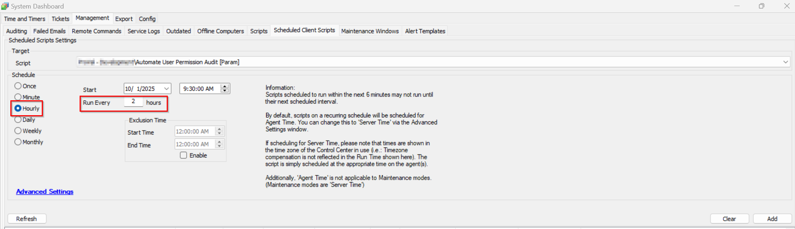

## Summary
This script creates a custom table [user_class_mapping](\docs\6c97beaa-f30e-4529-8251-2ecbd01e2221) at the very first stage and then runs at every 2 hour interval and compare the Automate user's permission change by storing it to the temporary table and match with the stored custom table data.  

If the changes found then it creates the ticket with the details.  

**Note:** It is mandatory to run the script with `SetEnvironment` set to 1 during the initial script import stage so that it allows to create the custom table [user_class_mapping](\docs\6c97beaa-f30e-4529-8251-2ecbd01e2221) and system property `pvl_parentclientid`.

## Sample Run

## Dependencies

- System Property `pvl_parentclientid` 
   - By default it is set to 1 which is reserved for the primary client in most environment.
- Custom table [user_class_mapping](\docs\6c97beaa-f30e-4529-8251-2ecbd01e2221)
   - It stores the Automate user's permission history.

## Variables

| Name                   | Description                                                                                                                                                                          |
|------------------------|--------------------------------------------------------------------------------------------------------------------------------------------------------------------------------------|
| Client_ID   | This stores the clientid that it fetched from the system property `pvl_parentclientid` |
| PermissionChangeAudit                  | It stores the record for the Automate users who permission changes detected in last script execution.                                                            |

#### User Parameters

| Name                     | Example               | Required             | Description                                                                                                                                                                                                                      |
|--------------------------|-----------------------|----------------------|----------------------------------------------------------------------------------------------------------------------------------------------------------------------------------------------------------------------------------|
| SetEnvironment               | 1    | False      | If the SetEnvironment = 1, it will create the custom table [user_class_mapping](\docs\6c97beaa-f30e-4529-8251-2ecbd01e2221) and system property `pvl_parentclientid`                                                                                      |

#### System Property

| Name | Default | Value |
| ------------------------------------- | ---------------- | ------------------------------------------------- |
|pvl_parentclientid |  1 | Set the `Client ID` in it so that it can create ticket respective to the clientid provided in the system property. **Note:** By default it is set to 1. |

## Output

- Ticket

## Ticketing
 
 It creates a one single ticket with the clientid referenced in the system property `pvl_parentclientid`.

 Ticketing:
   
   **Subject**:  
   Automate User(s) Permission Change Detected.  

   **Body**:  
   Automate User(s) Permission Change Detected. Refer to the below logs for the detail:
   
   @PermissionChangeAudit@