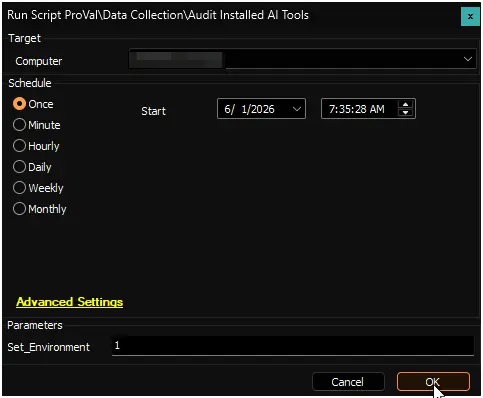
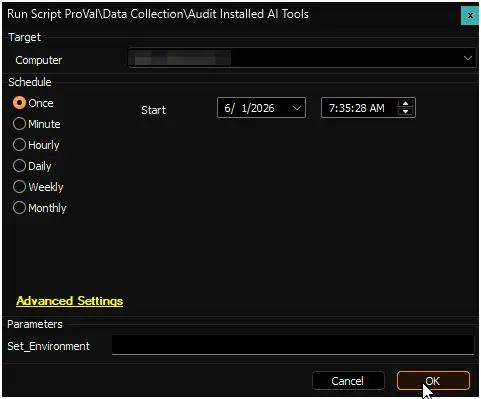

## Summary

This script scans Windows machines and identify if any Artificial Intelligence (AI) software, tools, or frameworks are currently installed. The automated process thoroughly checks system-level installations, user-level installations, and background app packages to compile a list of recognized AI applications.

Once the scan is complete, the data is fetched and displayed by the [Installed AI Tools Audit](/docs/1ca43737-1bb0-4adf-be79-a6b9c3eaec54). All information regarding installed AI applications can be retrieved directly from that dataview.

- **If the dataview displays applications:** These are the AI tools currently detected on the machine, along with version details and installation dates.
- **If the dataview is empty:** Assuming the script ran successfully, an empty dataview means there was no recognized AI application installed on the computer.
- **Troubleshooting:** Script logs can be checked to verify successful execution or to investigate any scanning issues.

## Currently Audited AI Applications

The audit actively looks for the following AI tools, grouped by category or parent company:

| Category | Targeted Applications & Keywords |
| --- | --- |
| **Microsoft & OpenAI** | `Copilot`, `ChatGPT`, `OpenAI`, `Codex`, `DALL-E`, `GitHub Copilot` |
| **Google** | `Gemini`, `Bard`, `Vertex AI`, `Google AI Studio` |
| **Anthropic** | `Claude`, `Anthropic` |
| **Meta & xAI** | `LLaMA`, `Meta AI`, `Grok` |
| **Local AI Desktop Apps** | `LM Studio`, `Ollama`, `GPT4All`, `Jan`, `AnythingLLM`, `NVIDIA ChatRTX`, `ChatRTX`, `Msty`, `Faraday` |
| **AI Coding Assistants** | `Cursor`, `Windsurf`, `Codeium`, `Cody`, `Supermaven`, `Tabnine`, `Replit AI` |
| **Image & Creative AI** | `Stable Diffusion`, `ComfyUI`, `InvokeAI`, `Fooocus`, `Automatic1111`, `DreamStudio`, `Midjourney`, `Leonardo AI`, `Clipdrop`, `Krea`, `Canva AI`, `Firefly`, `Adobe Sensei` |
| **Marketing & Copywriting** | `Jasper`, `Copy.ai`, `Writesonic`, `Rytr`, `Anyword` |
| **Search & Chatbots** | `Perplexity`, `You.com`, `YouChat`, `Phind`, `Character.AI`, `Poe`, `Pi`, `Inflection` |
| **Cloud & Enterprise AI** | `Amazon Q`, `SageMaker`, `Watson`, `Databricks`, `Dolly`, `AI21`, `Jurassic` |
| **Frameworks & Platforms** | `Vercel AI`, `Botpress`, `LangChain`, `Flowise`, `Hugging Face`, `Transformers`, `Replicate`, `Groq`, `EleutherAI`, `GPT-NeoX` |
| **Other Global AI Models** | `Ernie`, `Mistral`, `Codestral`, `Falcon`, `DeepSeek`, `Cohere`, `Runway`, `RunwayML` |

## Dependencies

- [Solution: Installed AI Tools Audit](/docs/e1783dde-9fda-4c89-80b3-0f5ecc73382c)

## Sample Run

### First Run

Run the script with the `Set_Environment` parameter set to `1` after import to create the custom table [pvl_installed_ai_applications_audit](/docs/fcd315e9-e261-4553-a9c3-8440f748cdc6).

### Regular Execution

## User Parameters

| Name     | Example | Required | Description                                                                                                                                                                                                                                         |
|----------|---------|----------|-----------------------------------------------------------------------------------------------------------------------------------------------------------------------------------------------------------------------------------------------------|
| `Set_Environment`            | `1`               | `First Run Only`      | If set to `1` it will create the custom table [pvl_installed_ai_applications_audit](/docs/fcd315e9-e261-4553-a9c3-8440f748cdc6).           |

## Output

- Script Logs
- [Custom Table: pvl_installed_ai_applications_audit](/docs/fcd315e9-e261-4553-a9c3-8440f748cdc6)
- [Dataview: Installed AI Tools Audit](/docs/1ca43737-1bb0-4adf-be79-a6b9c3eaec54)

## Changelog

### 2026-06-01

- Initial version of the document
