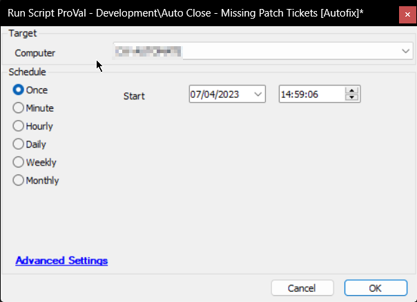

## Summary

The purpose of the script is to finish the new/open tickets created by the Missing Patches detection solution for machines missing fewer than three patches or none at all.

Affected Ticket Subject: `UPDATES - 3 Patches Missing on %ClientName%//%ComputerName%`

## Sample Run

## Dependencies

[CWM - Internal Monitor - ProVal - Client Specific - Auto Close - Missing Patch Tickets](/docs/7310b9b3-8209-4067-8b83-81ab9345e2f4)

## Variables

| Name        | Description                                      |
|-------------|--------------------------------------------------|
| STATUS      | Status returned by the monitor set (FAILED/SUCCESS) |
| Count       | Number of tickets to finish                       |
| SQLTicketid | Ticket ID to finish/close                         |

