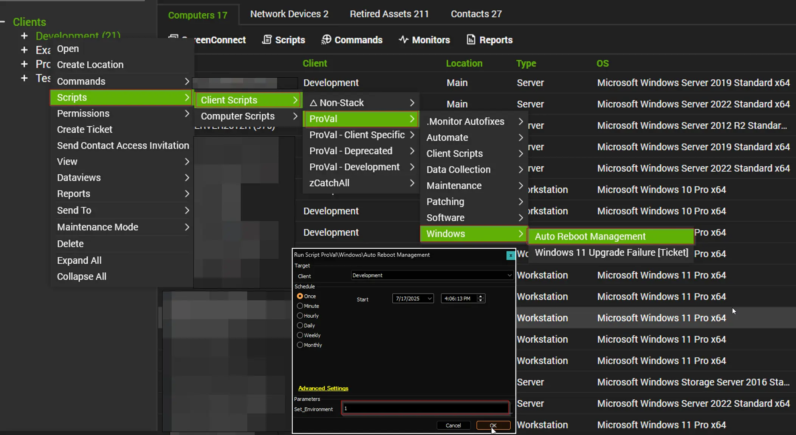
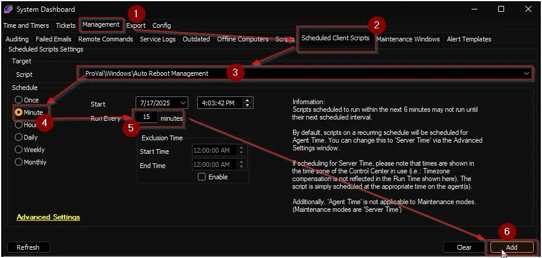
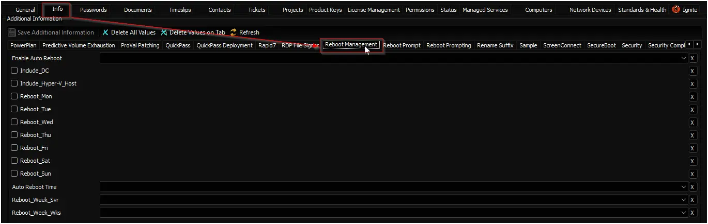
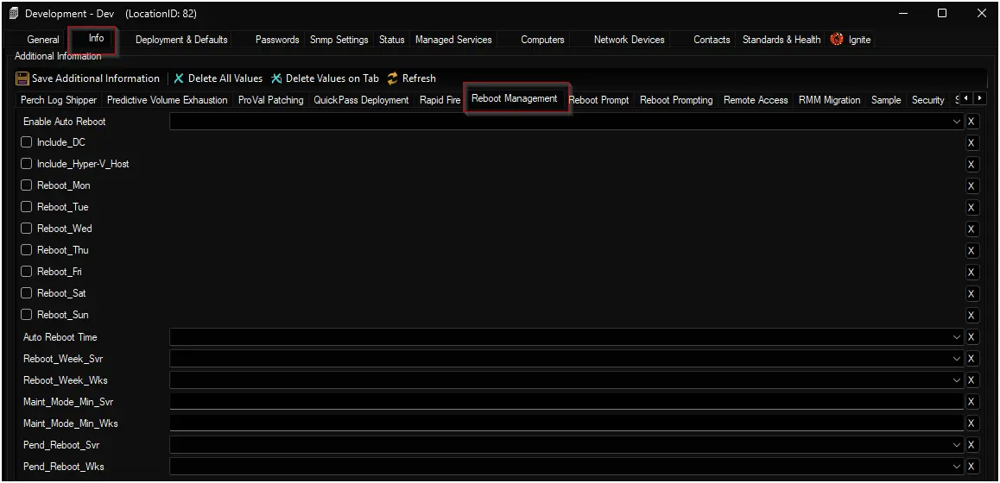
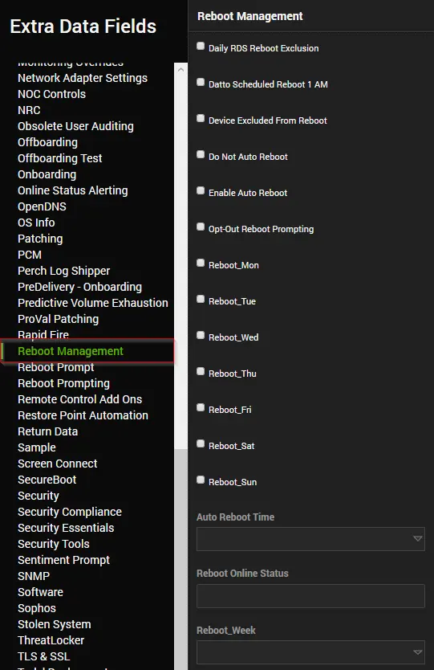
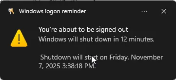

## Summary

The script restarts Windows machines according to the configuration specified in the client, location, and computer-level EDFs found in the "Reboot Management" EDF section, allowing for granular control over specific days and weeks of the month.

The solution also supports optional maintenance mode and optional pending-reboot validation. Maintenance mode can be applied automatically when a reboot command is scheduled, and pending-reboot checks can restrict reboots to machines that currently have a pending reboot flag.

:::note  
Reboots initiated by this solution are based on the server's time zone. For example, if a computer is in the PST timezone and the Automate server is in EST, selecting 20:00 as the reboot time will restart the machine at 20:00 EST.
:::

:::important  
Run or debug the script on any client if you are updating the script after 2026-08-03 with the `Set_Environment` parameter set to `1` to create the newly introduced EDFs.


:::

## Implementation

### Step 1

Import the script using the ProSync plugin.

### Step 2

Reload the System Cache by pressing Ctrl + R.

### Step 3

Run or debug the script on any client with the `Set_Environment` parameter set to `1` to generate the necessary EDFs.

This step is required for both:

- new deployments of the solution, and
- updates from a previous version, especially if updating after 2026-08-03, to create the newly introduced maintenance mode and pending reboot EDFs.


### Step 4

Reload the System Cache again (Ctrl + R).

### Step 5

Verify that the EDFs exist at the client, location, and computer levels as detailed later in this document.

For environments updated after 2026-08-03, also verify that the following new EDFs were created:

- `Maint_Mode_Min_Svr`
- `Maint_Mode_Min_Wks`
- `Pend_Reboot_Svr`
- `Pend_Reboot_Wks`
- `Maint_Mode_Min`
- `Pend_Reboot`

### Step 6

Schedule the script to execute every 15 minutes at XX:02:00 or XX:03:00 format. This will ensure the reboot is sent with a 12-13 minute delay and user will receive a prompt with a message that their computer will reboot in next 12-13 minutes.



## Dependencies

[Auto Reboot Audit](/docs/09e4ea2c-54d9-4e8f-bfa8-1707501d5a11)

## Client-Level EDF

| Name | Type | Section | Drop-down Options | Description |
| ---- | ---- | ------- | ----------------- | ----------- |
| Enable Auto Reboot | Drop-down | Reboot Management | <ul><li>Windows</li><li>Windows Workstations</li><li>Windows Servers</li><li>Disabled</li></ul> | Select the type of machines where auto reboot should be enabled. Options include specific OS types or all machines. Choose "Disabled" to turn off auto reboot. |
| Include_DC | Checkbox | Reboot Management | | Check to include Domain Controllers in the auto reboot schedule. By default, Domain Controllers are excluded from scheduled reboots for safety. Either `Windows` or `Windows Servers` option should be selected in the `Enable Auto Reboot` EDF to activate this EDF. |
| Include_Hyper-V_Host | Checkbox | Reboot Management | | Check to include Hyper-V host machines in the auto reboot schedule. By default, Hyper-V hosts are excluded from scheduled reboots to prevent disruption of virtual machines. Either `Windows` or `Windows Servers` option should be selected in the `Enable Auto Reboot` EDF to activate this EDF. |
| Reboot_Mon | Checkbox | Reboot Management | | Enable auto reboot on Mondays. |
| Reboot_Tue | Checkbox | Reboot Management | | Enable auto reboot on Tuesdays. |
| Reboot_Wed | Checkbox | Reboot Management | | Enable auto reboot on Wednesdays. |
| Reboot_Thu | Checkbox | Reboot Management | | Enable auto reboot on Thursdays. |
| Reboot_Fri | Checkbox | Reboot Management | | Enable auto reboot on Fridays. |
| Reboot_Sat | Checkbox | Reboot Management | | Enable auto reboot on Saturdays. |
| Reboot_Sun | Checkbox | Reboot Management | | Enable auto reboot on Sundays. |
| Auto Reboot Time | Drop-down | Reboot Management | <ul><li>00:00</li><li>00:15</li><li>00:30</li><li>01:00</li><li>**.........**</li><li>**.........**</li><li>**.........**</li><li>23:00</li><li>23:15</li><li>23:30</li><li>23:45</li></ul> | Select the time of day for the scheduled reboot. Time options are available in 15-minute intervals (00:00 to 23:45). |
| Reboot_Week_Svr | Drop-down | Reboot Management | <ul><li>0 (All Weeks)</li><li>1 (1st Week)</li><li>2 (2nd Week)</li><li>3 (3rd Week)</li><li>4 (4th Week)</li><li>5 (5th Week)</li></ul> | Reboot week for servers (0 = all weeks, 1-5 = specific week of the month). |
| Reboot_Week_Wks | Drop-down | Reboot Management | <ul><li>0 (All Weeks)</li><li>1 (1st Week)</li><li>2 (2nd Week)</li><li>3 (3rd Week)</li><li>4 (4th Week)</li><li>5 (5th Week)</li></ul> | Reboot week for workstations (0 = all weeks, 1-5 = specific week of the month). |
| Maint_Mode_Min_Svr | Text | Reboot Management | | Maintenance mode duration in minutes for servers. Leave blank to inherit/not set. Set to `0` to disable/exclude at this level. Values from `1` to `14` are enforced as `15` minutes. Values of `15` or higher use the configured value. |
| Maint_Mode_Min_Wks | Text | Reboot Management | | Maintenance mode duration in minutes for workstations. Leave blank to inherit/not set. Set to `0` to disable/exclude at this level. Values from `1` to `14` are enforced as `15` minutes. Values of `15` or higher use the configured value. |
| Pend_Reboot_Svr | Drop-down | Reboot Management | <ul><li>Enabled</li><li>Disabled</li></ul> | When set to `Enabled`, servers reboot only if a pending reboot flag is detected. When set to `Disabled`, the pending reboot check is bypassed. |
| Pend_Reboot_Wks | Drop-down | Reboot Management | <ul><li>Enabled</li><li>Disabled</li></ul> | When set to `Enabled`, workstations reboot only if a pending reboot flag is detected. When set to `Disabled`, the pending reboot check is bypassed. |



## Location-Level EDF

| Name | Type | Section | Drop-down Options | Description |
| ---- | ---- | ------- | ----------------- | ----------- |
| Enable Auto Reboot | Drop-down | Reboot Management | <ul><li>Windows</li><li>Windows Workstations</li><li>Windows Servers</li><li>Disabled</li></ul> | Select the type of machines where auto reboot should be enabled. Options include specific OS types or all machines. Choose "Disabled" to turn off auto reboot. |
| Include_DC | Checkbox | Reboot Management | | Check to include Domain Controllers in the auto reboot schedule. By default, Domain Controllers are excluded from scheduled reboots for safety. Either `Windows` or `Windows Servers` option should be selected in the `Enable Auto Reboot` EDF to activate this EDF. |
| Include_Hyper-V_Host | Checkbox | Reboot Management | | Check to include Hyper-V host machines in the auto reboot schedule. By default, Hyper-V hosts are excluded from scheduled reboots to prevent disruption of virtual machines. Either `Windows` or `Windows Servers` option should be selected in the `Enable Auto Reboot` EDF to activate this EDF. |
| Reboot_Mon | Checkbox | Reboot Management | | Enable auto reboot on Mondays. |
| Reboot_Tue | Checkbox | Reboot Management | | Enable auto reboot on Tuesdays. |
| Reboot_Wed | Checkbox | Reboot Management | | Enable auto reboot on Wednesdays. |
| Reboot_Thu | Checkbox | Reboot Management | | Enable auto reboot on Thursdays. |
| Reboot_Fri | Checkbox | Reboot Management | | Enable auto reboot on Fridays. |
| Reboot_Sat | Checkbox | Reboot Management | | Enable auto reboot on Saturdays. |
| Reboot_Sun | Checkbox | Reboot Management | | Enable auto reboot on Sundays. |
| Auto Reboot Time | Drop-down | Reboot Management | <ul><li>00:00</li><li>00:15</li><li>00:30</li><li>01:00</li><li>**.........**</li><li>**.........**</li><li>**.........**</li><li>23:00</li><li>23:15</li><li>23:30</li><li>23:45</li></ul> | Select the time of day for the scheduled reboot. Time options are available in 15-minute intervals (00:00 to 23:45). |
| Reboot_Week_Svr | Drop-down | Reboot Management | <ul><li>0 (All Weeks)</li><li>1 (1st Week)</li><li>2 (2nd Week)</li><li>3 (3rd Week)</li><li>4 (4th Week)</li><li>5 (5th Week)</li></ul> | Reboot week for servers (0 = all weeks, 1-5 = specific week of the month). |
| Reboot_Week_Wks | Drop-down | Reboot Management | <ul><li>0 (All Weeks)</li><li>1 (1st Week)</li><li>2 (2nd Week)</li><li>3 (3rd Week)</li><li>4 (4th Week)</li><li>5 (5th Week)</li></ul> | Reboot week for workstations (0 = all weeks, 1-5 = specific week of the month). |
| Maint_Mode_Min_Svr | Text | Reboot Management | | Maintenance mode duration in minutes for servers. Leave blank to inherit/not set. Set to `0` to disable/exclude at this level. Values from `1` to `14` are enforced as `15` minutes. Values of `15` or higher use the configured value. |
| Maint_Mode_Min_Wks | Text | Reboot Management | | Maintenance mode duration in minutes for workstations. Leave blank to inherit/not set. Set to `0` to disable/exclude at this level. Values from `1` to `14` are enforced as `15` minutes. Values of `15` or higher use the configured value. |
| Pend_Reboot_Svr | Drop-down | Reboot Management | <ul><li>Enabled</li><li>Disabled</li></ul> | When set to `Enabled`, servers reboot only if a pending reboot flag is detected. When set to `Disabled`, the pending reboot check is bypassed. |
| Pend_Reboot_Wks | Drop-down | Reboot Management | <ul><li>Enabled</li><li>Disabled</li></ul> | When set to `Enabled`, workstations reboot only if a pending reboot flag is detected. When set to `Disabled`, the pending reboot check is bypassed. |



## Computer-Level EDF

| Name | Type | Section | Drop-down Options | Description |
| ---- | ---- | ------- | ----------------- | ----------- |
| Do Not Auto Reboot | Checkbox | Reboot Management | | Check to exclude computer from auto reboot solution. |
| Enable Auto Reboot | Checkbox | Reboot Management | | Check to enable auto reboot for the individual computer. |
| Reboot_Mon | Checkbox | Reboot Management | | Enable auto reboot on Mondays. |
| Reboot_Tue | Checkbox | Reboot Management | | Enable auto reboot on Tuesdays. |
| Reboot_Wed | Checkbox | Reboot Management | | Enable auto reboot on Wednesdays. |
| Reboot_Thu | Checkbox | Reboot Management | | Enable auto reboot on Thursdays. |
| Reboot_Fri | Checkbox | Reboot Management | | Enable auto reboot on Fridays. |
| Reboot_Sat | Checkbox | Reboot Management | | Enable auto reboot on Saturdays. |
| Reboot_Sun | Checkbox | Reboot Management | | Enable auto reboot on Sundays. |
| Auto Reboot Time | Drop-down | Reboot Management | <ul><li>00:00</li><li>00:15</li><li>00:30</li><li>01:00</li><li>**.........**</li><li>**.........**</li><li>**.........**</li><li>23:00</li><li>23:15</li><li>23:30</li><li>23:45</li></ul> | Select the time of day for the scheduled reboot. Time options are available in 15-minute intervals (00:00 to 23:45). |
| Reboot Online Status | Text | Reboot Management | | Stores the outcome of the scheduled reboot check. This may include whether the computer was online or offline, whether a reboot was scheduled, whether maintenance mode was applied, or whether a reboot was skipped because no pending reboot flag was detected. |
| Reboot_Week | Drop-down | Reboot Management | <ul><li>0 (All Weeks)</li><li>1 (1st Week)</li><li>2 (2nd Week)</li><li>3 (3rd Week)</li><li>4 (4th Week)</li><li>5 (5th Week)</li></ul> | Reboot week for this computer (0 = all weeks, 1-5 = specific week of the month). Overrides location and client week settings. |
| Maint_Mode_Min | Text | Reboot Management | | Maintenance mode duration in minutes for this computer. Leave blank to inherit/not set. Set to `0` to exclude this computer from maintenance mode. Values from `1` to `14` are enforced as `15` minutes. Values of `15` or higher use the configured value. |
| Pend_Reboot | Drop-down | Reboot Management | <ul><li>Enabled</li><li>Disabled</li></ul> | When set to `Enabled`, this computer reboots only if a pending reboot flag is detected. When set to `Disabled`, the pending reboot check is bypassed. |



## Output

- EDF
- Dataview
- Maintenance Mode Queue

## Maintenance Mode Behavior

The solution can optionally place a machine into maintenance mode when a reboot command is scheduled.

Maintenance mode is applied only when:

- the computer is online,
- the reboot command is actually scheduled,
- and the effective maintenance mode duration is greater than `0`.

Maintenance mode entries are written to the `maintenancemodequeue` table. The active maintenance mode state is represented by the `maintenancemode` view.

### Maintenance Mode Precedence

Maintenance mode settings follow the same general precedence model used by the rest of the solution:

1. Computer-level `Maint_Mode_Min`
2. Location-level `Maint_Mode_Min_Svr` or `Maint_Mode_Min_Wks`
3. Client-level `Maint_Mode_Min_Svr` or `Maint_Mode_Min_Wks`

At the client and location levels, the script uses:

- `Maint_Mode_Min_Svr` for servers,
- `Maint_Mode_Min_Wks` for workstations.

At the computer level, `Maint_Mode_Min` applies directly to that computer.

### Maintenance Mode Value Handling

- Blank/unset: inherit from the next level.
- `0`: disable/exclude maintenance mode at that level.
- `1` to `14`: maintenance mode is applied for `15` minutes.
- `15` or higher: maintenance mode is applied for the configured number of minutes.
- Non-numeric values are treated as unset.

### Example

If the client has `Maint_Mode_Min_Svr = 60`, and the location is blank, servers in that location receive `60` minutes of maintenance mode.

If the computer has `Maint_Mode_Min = 0`, that computer is excluded from maintenance mode even if the client or location has a value configured.

If the location has `Maint_Mode_Min_Svr = 10`, the effective duration becomes `15` minutes because the minimum applied maintenance mode duration is `15` minutes.

## Pending Reboot Behavior

The solution can optionally restrict reboots to machines that have a pending reboot flag.

This is controlled by:

- Client-level: `Pend_Reboot_Svr`, `Pend_Reboot_Wks`
- Location-level: `Pend_Reboot_Svr`, `Pend_Reboot_Wks`
- Computer-level: `Pend_Reboot`

### Pending Reboot Options

| Value | Behavior |
| ----- | -------- |
| Enabled | Reboot only if the machine has a pending reboot flag. |
| Disabled | Reboot regardless of pending reboot flag. |

The pending reboot flag is checked using the `computers.flags` bit value:

```sql
computers.flags & 1024 <> 0
```

### Pending Reboot Precedence

The effective pending reboot setting is determined in this order:

1. Computer-level `Pend_Reboot`
2. Location-level `Pend_Reboot_Svr` or `Pend_Reboot_Wks`
3. Client-level `Pend_Reboot_Svr` or `Pend_Reboot_Wks`

If no value is configured at any level, the effective value is treated as `Disabled`.

### Pending Reboot Outcome

If the effective pending reboot setting is `Enabled` and the machine does not have a pending reboot flag, the script does not send the reboot command.

The `Reboot Online Status` EDF is updated to indicate that no reboot was scheduled because no pending reboot flag was detected.

## FAQ

**Q: How does the script determine which computers are eligible for auto reboot?**  
**A:** The script checks the "Enable Auto Reboot" EDF at the computer, location, and client levels. It only targets Windows machines that are not excluded by the "Do Not Auto Reboot" EDF. Additional checks are performed for Domain Controllers and Hyper-V hosts, which require the corresponding "Include_DC" or "Include_Hyper-V_Host" EDFs to be enabled. If the pending reboot check is enabled, the machine must also have a pending reboot flag for the reboot command to be sent.

**Q: What happens if different levels (client, location, computer) have conflicting EDF settings?**  
**A:** The script and SQL logic prioritize the most specific level: computer-level EDFs override location-level, which override client-level. For example, if a computer-level "Auto Reboot Time" is set, it takes precedence over location or client settings. The same precedence model applies to the new maintenance mode and pending reboot EDFs.

**Q: How is the scheduled reboot time determined?**  
**A:** The script uses the "Auto Reboot Time" EDF from the computer, location, or client level (in that order of precedence). The SQL query calculates the time left until the next scheduled reboot and only triggers a reboot if the current time is within 15 minutes of the scheduled time.

**Q: How does the script handle Domain Controllers and Hyper-V hosts?**  
**A:** By default, Domain Controllers and Hyper-V hosts are excluded from auto reboot. To include them, the "Include_DC" or "Include_Hyper-V_Host" EDFs must be enabled at the appropriate level (location or client), and the "Enable Auto Reboot" EDF must be set to "Windows" or "Windows Servers".

**Q: Can I schedule reboots for specific days of the week?**  
**A:** Yes. The EDFs "Reboot_Mon", "Reboot_Tue", ..., "Reboot_Sun" allow you to specify which days auto reboot should occur. The script checks these flags at the computer, location, and client levels to determine if a reboot should be scheduled for the current day.

**Q: How does precedence work for the reboot day EDFs (Reboot_Mon, Reboot_Tue, etc.)?**  
**A:** The script checks the reboot day EDFs in order of precedence: computer-level first, then location-level, and finally client-level. If any of the reboot day EDFs are enabled at the computer level, only those days set at the computer will be used for scheduling reboots, regardless of the settings at the location or client levels. If none are set at the computer level, the script checks the location-level EDFs, and if none are set there, it falls back to the client-level EDFs.

**Example**, if the client has Saturday and Wednesday enabled, but the location has Friday and Sunday enabled, then all computers in that location will be scheduled to reboot on Friday and Sunday (location-level settings take precedence over client-level).  
If a specific computer in that location has only Monday enabled, then only that computer will be scheduled to reboot on Monday, regardless of the location or client settings.

**Q: How can I track if a computer was online at the scheduled reboot time?**  
**A:** The "Reboot Online Status" EDF records whether the computer was online or offline at the scheduled reboot time, helping you monitor system availability during automated reboot events. It may also record whether maintenance mode was applied or whether a reboot was skipped because no pending reboot flag was detected.

**Q: How can I enable auto reboot for a specific location without enabling it for the entire client?**  
**A:** Set the "Enable Auto Reboot" EDF to the desired value (such as "Windows" or "Windows Servers") at the location level, and leave it unset at the client level. This will apply the auto reboot policy only to computers within that location.

**Q: How can I enable auto reboot for an individual computer without enabling it for the client or location?**  
**A:** Set the "Enable Auto Reboot" EDF to enabled at the computer level. This ensures that only the selected computer will follow the auto reboot schedule.

**Q: What happens if auto reboot is disabled at any level (client, location, or computer)?**  
**A:** If the "Enable Auto Reboot" EDF is set to "Disabled" at the client, location, or computer level, the auto reboot feature will be turned off for that scope. Disabling at any level takes precedence and will prevent scheduled reboots for all computers within that scope, regardless of other settings.

**Q: What is the recommended scheduling pattern and why?**  
**A:** Schedule the script to run every 15 minutes at :02 or :03 (for example, 00:02, 00:17, 00:32, 00:47). Reason: the script sends a shutdown command with a 12–13 minute delay, so running at :02/:03 ensures the reboot is queued shortly after the run and gives users time to save work.

**Example:** If the reboot time is 00:00 and the script runs at 00:02, the machine won't be detected during that run. Instead, it would have been detected at 23:47, and the command issued would be: `Shutdown /f /t 780 /r`. This gives users approximately 13 minutes to save their work.

**Q: How will users be notified about the reboot?**  
**A:** The script issues a Windows command (`shutdown /r /f /t <seconds>`), so Windows shows its built‑in notification/dialog (toast / shutdown prompt) that the system will restart in the specified timeout. Users see the standard Windows warning and can save work before the forced restart.  



**Q: Why does the prompt say “shutdown” instead of “restart”?**  
**A:** The Windows shutdown utility and UI use the same wording/flow for both shutdown and restart operations, so dialogs may show “shutdown” even when the operation is a restart. This is by design—the shutdown command governs both actions and the prompt text is not always different for reboot.

**Q: How can I schedule reboots for specific weeks of the month?**  
**A:** You can use the `Reboot_Week_Svr` and `Reboot_Week_Wks` EDFs at the client or location level, or the `Reboot_Week` EDF at the computer level. Setting the value to `0` means the reboot will occur every week (provided the day is selected). Setting it to `1` through `5` restricts the reboot to the 1st, 2nd, 3rd, 4th, or 5th week of the month, respectively.

**Q: How does precedence work for the week-specific EDFs?**  
**A:** Similar to other EDFs, computer-level settings take precedence over location-level, which take precedence over client-level. Additionally, at the client and location levels, the script uses `Reboot_Week_Svr` for servers and `Reboot_Week_Wks` for workstations. If a computer-level `Reboot_Week` is set, it overrides both the server and workstation week settings from the location and client levels.

**Q: What happens if the 5th week of the month doesn't exist (e.g., in February)?**  
**A:** If a schedule is set for the 5th week of the month, the reboot will only occur in months that actually have a 5th week. In months with only 4 weeks, the computer will not reboot on that scheduled day.

**Q: How does maintenance mode work?**  
**A:** When a reboot command is scheduled, the script can also insert a maintenance mode entry into the `maintenancemodequeue` table. This temporarily disables alerting in Automate so intentional reboots do not generate unnecessary offline alerts. Maintenance mode expires automatically after the configured duration.

**Q: When is maintenance mode applied?**  
**A:** Maintenance mode is applied only in the same script cycle where the reboot command is scheduled. If the reboot command is not scheduled, maintenance mode is not applied.

**Q: What is the minimum maintenance mode duration?**  
**A:** The minimum applied maintenance mode duration is 15 minutes. If the effective configured value is between 1 and 14, the script applies 15 minutes. If the effective configured value is 15 or higher, the configured value is used.

**Q: What does a maintenance mode value of 0 mean?**  
**A:** A value of `0` excludes that scope from maintenance mode. For example, if the computer-level `Maint_Mode_Min` is set to `0`, that computer will not be placed into maintenance mode even if the client or location has a maintenance mode duration configured.

**Q: Does the script remove maintenance mode after reboot?**  
**A:** No manual removal is required. Maintenance mode entries expire automatically after the configured duration.

**Q: How does the pending reboot check work?**  
**A:** When the effective pending reboot setting is `Enabled`, the script checks whether the machine has a pending reboot flag using `computers.flags & 1024`. If the flag is present, the reboot command can be sent. If the flag is not present, the reboot command is not sent.

**Q: What happens if pending reboot is enabled but the machine does not have a pending reboot flag?**  
**A:** The machine is not rebooted. The `Reboot Online Status` EDF is updated to indicate that no reboot was scheduled because no pending reboot flag was detected.

**Q: Does the pending reboot check hide machines from the dataview?**  
**A:** No. The dataview still reports eligible machines so you can review their effective settings and pending reboot status. The pending reboot check primarily affects whether the reboot command is sent.

**Q: How does precedence work for the pending reboot EDFs?**  
**A:** The computer-level `Pend_Reboot` setting overrides the location-level setting. The location-level setting overrides the client-level setting. At the client and location levels, `Pend_Reboot_Svr` applies to servers and `Pend_Reboot_Wks` applies to workstations.

**Q: How does precedence work for the maintenance mode EDFs?**  
**A:** The computer-level `Maint_Mode_Min` setting overrides the location-level setting. The location-level setting overrides the client-level setting. At the client and location levels, `Maint_Mode_Min_Svr` applies to servers and `Maint_Mode_Min_Wks` applies to workstations.

## Changelog

### 2026-08-03

- Added `Maint_Mode_Min_Svr` and `Maint_Mode_Min_Wks` EDFs at the client and location levels to support automatic maintenance mode for servers and workstations.
- Added `Maint_Mode_Min` EDF at the computer level to override maintenance mode settings for individual computers.
- Added `Pend_Reboot_Svr` and `Pend_Reboot_Wks` EDFs at the client and location levels to optionally require a pending reboot flag before rebooting servers or workstations.
- Added `Pend_Reboot` EDF at the computer level to override pending reboot behavior for individual computers.
- Updated the script to insert maintenance mode entries into `maintenancemodequeue` when a reboot command is scheduled.
- Updated the `Reboot Online Status` EDF to include maintenance mode and pending reboot outcome details.
- Updated the dataview logic to report effective pending reboot settings, pending reboot flag status, and effective maintenance mode duration.
- Updated documentation and FAQs accordingly.

### 2026-07-08

- Added `Reboot_Week_Svr` and `Reboot_Week_Wks` EDFs at the client and location levels, and `Reboot_Week` at the computer level to allow scheduling reboots for specific weeks of the month. Updated documentation and FAQs accordingly.

### 2025-11-11

- Updated the script to properly handle the '00:00' reboot schedule and updated the document with more information about the schedule. And also updated it to compare with 23:59 instead of 00:00 and add 60 seconds to the interval.

### 2025-09-08

- Updated the document to show the scheduling process and time.

### 2025-07-17

- Initial version of the document
