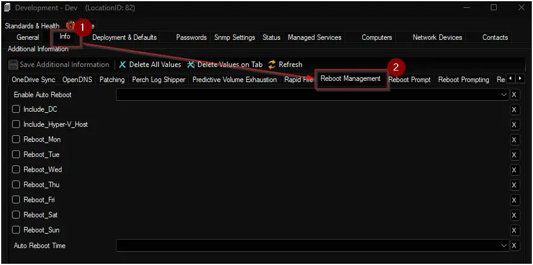

## Summary

The script restarts Windows machines according to the configuration specified in the client, location, and computer-level EDFs found in the "Reboot Management" EDF section.

**Note:**  
Reboots initiated by this solution are based on the server's time zone. For example, if a computer is in the PST timezone and the Automate server is in EST, selecting 20:00 as the reboot time will restart the machine at 20:00 EST.

## Implementation

### Step 1

Import the script using the ProSync plugin.

### Step 2

Reload the System Cache by pressing Ctrl + R.

### Step 3

Run or debug the script on any client with the `Set_Environment` parameter set to `1` to generate the necessary EDFs.

### Step 4

Reload the System Cache again (Ctrl + R).

### Step 5

Verify that the EDFs exist at the client, location, and computer levels as detailed later in this document.

### Step 6

Schedule the script to execute every 15 minutes at XX:02:00 or XX:03:00 format. This will ensure the reboot is sent with a 12-13 minute delay and user will receive a prompt with a message that their computer will reboot in next 12-13 minutes.

## Dependencies

[Auto Reboot Audit](/docs/09e4ea2c-54d9-4e8f-bfa8-1707501d5a11)

## Client-Level EDF

| Name | Type | Section | Drop-down Options | Description |
| ---- | ---- | ------- | ----------------- | ----------- |
| Enable Auto Reboot | Drop-down | Reboot Management | <ul><li>Windows</li><li>Windows Workstations</li><li>Windows Servers</li><li>Disabled</li></ul> | Select the type of machines where auto reboot should be enabled. Options include specific OS types or all machines. Choose "Disabled" to turn off auto reboot. |
| Include_DC | Checkbox | Reboot Management | | Check to include Domain Controllers in the auto reboot schedule. By default, Domain Controllers are excluded from scheduled reboots for safety. Either `Windows` or `Windows Servers` option should be selected in the `Enable Auto Reboot` EDF to activate this EDF. |
| Include_Hyper-V_Host | Checkbox | Reboot Management | | Check to include Hyper-V host machines in the auto reboot schedule. By default, Hyper-V hosts are excluded from scheduled reboots to prevent disruption of virtual machines. Either `Windows` or `Windows Servers` option should be selected in the `Enable Auto Reboot` EDF to activate this EDF. |
| Reboot_Mon | Checkbox | Reboot Management | | Enable auto reboot on Mondays. |
| Reboot_Tue | Checkbox | Reboot Management | | Enable auto reboot on Tuesdays. |
| Reboot_Wed | Checkbox | Reboot Management | | Enable auto reboot on Wednesdays. |
| Reboot_Thu | Checkbox | Reboot Management | | Enable auto reboot on Thursdays. |
| Reboot_Fri | Checkbox | Reboot Management | | Enable auto reboot on Fridays. |
| Reboot_Sat | Checkbox | Reboot Management | | Enable auto reboot on Saturdays. |
| Reboot_Sun | Checkbox | Reboot Management | | Enable auto reboot on Sundays. |
| Auto Reboot Time | Drop-down | Reboot Management | <ul><li>00:00</li><li>00:15</li><li>00:30</li><li>01:00</li><li>**.........**</li><li>**.........**</li><li>**.........**</li><li>23:00</li><li>23:15</li><li>23:30</li><li>23:45</li></ul> | Select the time of day for the scheduled reboot. Time options are available in 15-minute intervals (00:00 to 23:45). |

## Location-Level EDF

| Name | Type | Section | Drop-down Options | Description |
| ---- | ---- | ------- | ----------------- | ----------- |
| Enable Auto Reboot | Drop-down | Reboot Management | <ul><li>Windows</li><li>Windows Workstations</li><li>Windows Servers</li><li>Disabled</li></ul> | Select the type of machines where auto reboot should be enabled. Options include specific OS types or all machines. Choose "Disabled" to turn off auto reboot. |
| Include_DC | Checkbox | Reboot Management | | Check to include Domain Controllers in the auto reboot schedule. By default, Domain Controllers are excluded from scheduled reboots for safety. Either `Windows` or `Windows Servers` option should be selected in the `Enable Auto Reboot` EDF to activate this EDF. |
| Include_Hyper-V_Host | Checkbox | Reboot Management | | Check to include Hyper-V host machines in the auto reboot schedule. By default, Hyper-V hosts are excluded from scheduled reboots to prevent disruption of virtual machines. Either `Windows` or `Windows Servers` option should be selected in the `Enable Auto Reboot` EDF to activate this EDF. |
| Reboot_Mon | Checkbox | Reboot Management | | Enable auto reboot on Mondays. |
| Reboot_Tue | Checkbox | Reboot Management | | Enable auto reboot on Tuesdays. |
| Reboot_Wed | Checkbox | Reboot Management | | Enable auto reboot on Wednesdays. |
| Reboot_Thu | Checkbox | Reboot Management | | Enable auto reboot on Thursdays. |
| Reboot_Fri | Checkbox | Reboot Management | | Enable auto reboot on Fridays. |
| Reboot_Sat | Checkbox | Reboot Management | | Enable auto reboot on Saturdays. |
| Reboot_Sun | Checkbox | Reboot Management | | Enable auto reboot on Sundays. |
| Auto Reboot Time | Drop-down | Reboot Management | <ul><li>00:00</li><li>00:15</li><li>00:30</li><li>01:00</li><li>**.........**</li><li>**.........**</li><li>**.........**</li><li>23:00</li><li>23:15</li><li>23:30</li><li>23:45</li></ul> | Select the time of day for the scheduled reboot. Time options are available in 15-minute intervals (00:00 to 23:45). |

## Computer-Level EDF

| Name | Type | Section | Drop-down Options | Description |
| ---- | ---- | ------- | ----------------- | ----------- |
| Do Not Auto Reboot | Checkbox | Reboot Management | | Check to exclude computer from auto reboot solution. |
| Enable Auto Reboot | Checkbox | Reboot Management | | Check to enable auto reboot for the individual computer.. |
| Reboot_Mon | Checkbox | Reboot Management | | Enable auto reboot on Mondays. |
| Reboot_Tue | Checkbox | Reboot Management | | Enable auto reboot on Tuesdays. |
| Reboot_Wed | Checkbox | Reboot Management | | Enable auto reboot on Wednesdays. |
| Reboot_Thu | Checkbox | Reboot Management | | Enable auto reboot on Thursdays. |
| Reboot_Fri | Checkbox | Reboot Management | | Enable auto reboot on Fridays. |
| Reboot_Sat | Checkbox | Reboot Management | | Enable auto reboot on Saturdays. |
| Reboot_Sun | Checkbox | Reboot Management | | Enable auto reboot on Sundays. |
| Auto Reboot Time | Drop-down | Reboot Management | <ul><li>00:00</li><li>00:15</li><li>00:30</li><li>01:00</li><li>**.........**</li><li>**.........**</li><li>**.........**</li><li>23:00</li><li>23:15</li><li>23:30</li><li>23:45</li></ul> | Select the time of day for the scheduled reboot. Time options are available in 15-minute intervals (00:00 to 23:45). |
| Reboot Online Status | Text | Reboot Management | | Stores whether the computer was online or offline at the scheduled reboot time. Use this field to track system availability during automated reboot events. |

## Output

- EDF
- Dataview

## FAQ

**Q: How does the script determine which computers are eligible for auto reboot?**  
A: The script checks the "Enable Auto Reboot" EDF at the computer, location, and client levels. It only targets Windows machines that are not excluded by the "Do Not Auto Reboot" EDF. Additional checks are performed for Domain Controllers and Hyper-V hosts, which require the corresponding "Include_DC" or "Include_Hyper-V_Host" EDFs to be enabled.

**Q: What happens if different levels (client, location, computer) have conflicting EDF settings?**  
A: The script and SQL logic prioritize the most specific level: computer-level EDFs override location-level, which override client-level. For example, if a computer-level "Auto Reboot Time" is set, it takes precedence over location or client settings.

**Q: How is the scheduled reboot time determined?**  
A: The script uses the "Auto Reboot Time" EDF from the computer, location, or client level (in that order of precedence). The SQL query calculates the time left until the next scheduled reboot and only triggers a reboot if the current time is within 15 minutes of the scheduled time.

**Q: How does the script handle Domain Controllers and Hyper-V hosts?**  
A: By default, Domain Controllers and Hyper-V hosts are excluded from auto reboot. To include them, the "Include_DC" or "Include_Hyper-V_Host" EDFs must be enabled at the appropriate level (location or client), and the "Enable Auto Reboot" EDF must be set to "Windows" or "Windows Servers".

**Q: Can I schedule reboots for specific days of the week?**  
A: Yes. The EDFs "Reboot_Mon", "Reboot_Tue", ..., "Reboot_Sun" allow you to specify which days auto reboot should occur. The script checks these flags at the computer, location, and client levels to determine if a reboot should be scheduled for the current day.

**Q: How does precedence work for the reboot day EDFs (Reboot_Mon, Reboot_Tue, etc.)?**  
A: The script checks the reboot day EDFs in order of precedence: computer-level first, then location-level, and finally client-level. If any of the reboot day EDFs are enabled at the computer level, only those days set at the computer will be used for scheduling reboots, regardless of the settings at the location or client levels. If none are set at the computer level, the script checks the location-level EDFs, and if none are set there, it falls back to the client-level EDFs.

For example, if the client has Saturday and Wednesday enabled, but the location has Friday and Sunday enabled, then all computers in that location will be scheduled to reboot on Friday and Sunday (location-level settings take precedence over client-level).  
If a specific computer in that location has only Monday enabled, then only that computer will be scheduled to reboot on Monday, regardless of the location or client settings.

**Q: How can I track if a computer was online at the scheduled reboot time?**  
A: The "Reboot Online Status" EDF records whether the computer was online or offline at the scheduled reboot time, helping you monitor system availability during automated reboot events.

**Q: How can I enable auto reboot for a specific location without enabling it for the entire client?**  
A: Set the "Enable Auto Reboot" EDF to the desired value (such as "Windows" or "Windows Servers") at the location level, and leave it unset at the client level. This will apply the auto reboot policy only to computers within that location.

**Q: How can I enable auto reboot for an individual computer without enabling it for the client or location?**  
A: Set the "Enable Auto Reboot" EDF to enabled at the computer level. This ensures that only the selected computer will follow the auto reboot schedule.

**Q: What happens if auto reboot is disabled at any level (client, location, or computer)?**  
A: If the "Enable Auto Reboot" EDF is set to "Disabled" at the client, location, or computer level, the auto reboot feature will be turned off for that scope. Disabling at any level takes precedence and will prevent scheduled reboots for all computers within that scope, regardless of other settings.

**Q: What is the recommended scheduling pattern and why?**  
A: Schedule the script to run every 15 minutes at :02 or :03 (for example, 00:02, 00:17, 00:32, 00:47). Reason: the script sends a shutdown command with a 12–13 minute delay, so running at :02/:03 ensures the reboot is queued shortly after the run and gives users time to save work.

**Example:**  If the reboot time is 00:00 and the script runs at 00:02, the machine won't be detected during that run. Instead, it would have been detected at 23:47, and the command issued would be: `Shutdown /f /t 780 /r`. This gives users approximately 13 minutes to save their work.

**Q: How will users be notified about the reboot?**  
A: The script issues a Windows command (`shutdown /r /f /t <seconds>`), so Windows shows its built‑in notification/dialog (toast / shutdown prompt) that the system will restart in the specified timeout. Users see the standard Windows warning and can save work before the forced restart.  

**Q: Why does the prompt say “shutdown” instead of “restart”?**  
A: The Windows shutdown utility and UI use the same wording/flow for both shutdown and restart operations, so dialogs may show “shutdown” even when the operation is a restart. This is by design—the shutdown command governs both actions and the prompt text is not always different for reboot.
