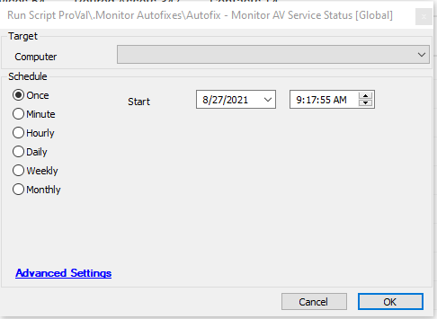

## Summary

This script helps to verify whether AV is running. If it's not running, it will attempt to start the AV process.

The intended target for this script is the "AV-Disabled" monitor.  
**Time Saved by Automation:** 5 Minutes

## Sample Run

## Variables

- `@svc@` - Shows the AV process name from the database
- `@ticketbody@` - Sets the body for the ticket
- `@powershell@` - Logs the output of the PowerShell command that attempted to restart the process
- `@TicketID@` - Indicates if there is an existing ticket for the agent

### Global Parameters

| Name           | Example | Required | Description                              |
|----------------|---------|----------|------------------------------------------|
| TicketCreation | 1       | False    | Setting this to 1 enables ticketing     |

### Script States

| Name           | Example | Description                                  |
|----------------|---------|----------------------------------------------|
| AVStatusCheck  | 56897   | Used to track if there is an existing ticket for the agent |

## Process

- Fetches the AV process from the database
- Verifies if it's running. If it's not running, it will attempt to start the AV process.
- If started, it will look for an existing ticket and close it.
- If not started, it will append to the existing ticket or create a new ticket.

## Output

- Script log
- Script state

