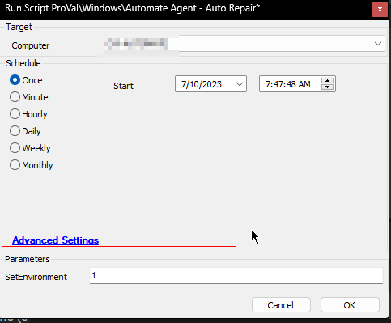
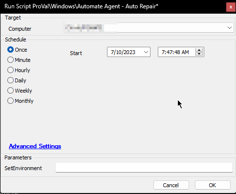
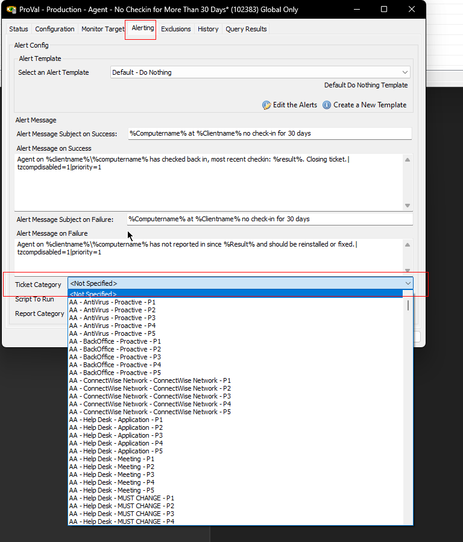
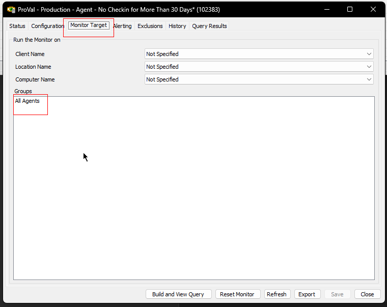
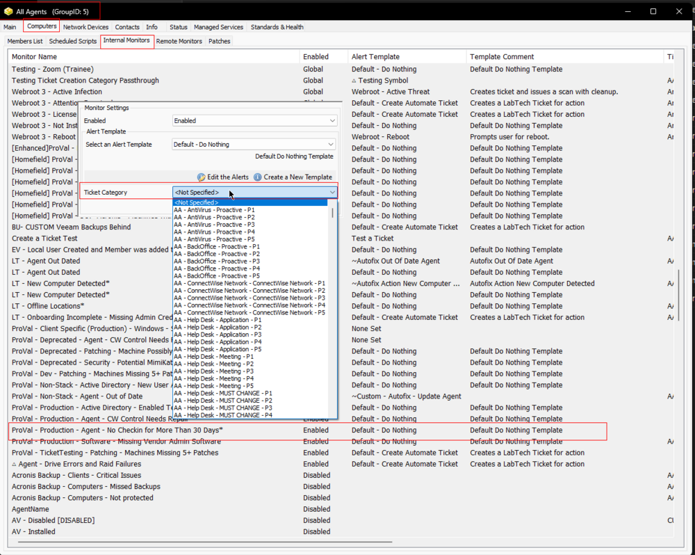

## Summary

This auto-fix script will check if a machine that has gone offline in Automate is online in Control. If found to be online in Control, it will look at whether it's a duplicate instance, and then an attempt to restart the Automate agent will be made through the RMM+ integration. The script sets a state to either Offline, Broken, or Undetermined to indicate status. If the agent is returned online, the script state will be cleared.

Set the System Property `Agent_Repair_Duplicate_Check_Enabled` to `1` to look for duplicate computers; by default, the script will not look for duplicate instances of the machine.

Set the System Property `Agent_Repair_Re_Install_Enabled` to `0` to disable the reinstall feature of the script; by default, the script will attempt to reinstall the Automate agent if necessary.

**Time Saved by Automation:** 30 Minutes

## Requirements

**[RMM+ solution](/docs/f99ddaae-0cb3-4941-b2aa-dc93671dd246)** should be properly configured in the environment.

## Sample Run

The script must be run with the `Set Environment = 1` setting for the first time after the update. This will create the system properties used by the script.



For Regular Execution:



By default, the script will be called by the **[Monitor - No Checkin for More Than 30 Days](/docs/4bc06cc4-3b78-452a-b602-063e57221234)**.

## Dependencies

- **[Monitor - No Checkin for More Than 30 Days](/docs/4bc06cc4-3b78-452a-b602-063e57221234)**
- **[CW RMM+ Plugin Configuration](/docs/f99ddaae-0cb3-4941-b2aa-dc93671dd246)**

## Sub Scripts

- **[Script - ScreenConnect Client - Connectivity - Audit](/docs/18562eaa-d162-4362-98d3-4bbaa2922458)**
- **[Script - ScreenConnect Client - Command - Execute](/docs/b713bbc8-a1d9-4e08-ac77-d02b634569f6)**
- **[Script - Automate Agent - Reinstall](/docs/567b8db7-a87a-45c1-a81a-b3178090fb52)**
- **[Script - Track Repaired Agents](/docs/1cfbe430-0cbd-4abf-861d-4884632b7705)**
- Agent - Generate Location Installer URL

## Variables

| Name                       | Description                                                                                           |
|----------------------------|-------------------------------------------------------------------------------------------------------|
| **STATUS**                 | SUCCESS/FAILED returned by the monitor set.                                                          |
| **DuplicateCheck**         | Value of the system property `Agent_Repair_Duplicate_Check_Enabled`.                                 |
| **Re-Install**             | Value of the system property `Agent_Repair_Re_Install_Enabled`.                                     |
| **TicketCreationCategory**  | Ticket category value for this script to use when creating a ticket. The script will not create any ticket for manual execution. Ticket category can be set in the monitor set's alerting tab or from the groups where the monitor set is enabled. Refer to the `Ticket Creation` section of this article for further information. |
| **SerialNumber**           | Serial Number of the computer.                                                                       |
| **RetireStatement**        | SQL Query used to retire the computers.                                                              |
| **Online**                 | Online status of the computer in ScreenConnect Portal returned by the **[Script - ScreenConnect Client - Connectivity - Audit](/docs/18562eaa-d162-4362-98d3-4bbaa2922458)**. 1: Online; 0: Offline; -2: Undetermined (RMM+ Solution is not configured properly), -3: Machine Error (Plugin results contain error type message), -4: Incorrect Agent Guid. |
| **AgentOnline**            | Status of the agent in ConnectWise Automate after attempting to fix the problem.                     |
| **Subject**                | Subject of the ticket to create on Script Failure. `Agent Reinstall Failed/Broken Agent - %clientname%//%computername%` |
| **Body**                   | Information to add to the ticket for script failure.                                                 |
| **Tickid**                 | ID of an existing new/open ticket to comment.                                                        |
| **ParsedLogs**             | The last 20 lines of the LTerrors.txt file to add to the ticket.                                    |
| **Command**                | Command to be executed on the machine from the ScreenConnect portal using the **[Script - ScreenConnect Client - Command - Execute](/docs/b713bbc8-a1d9-4e08-ac77-d02b634569f6)**. |

## User Properties

| Name            | Example | Required | Description                                                                                      |
|-----------------|---------|----------|--------------------------------------------------------------------------------------------------|
| **SetEnvironment** | 1       | Mandatory for the First run post update | It is mandatory to run the Script with `SetEnvironment` parameter set to 1 for the first run after updating the script. |

## System Properties

| Name                                   | Example                                   | Required       | Description                                                                                                   |
|----------------------------------------|-------------------------------------------|----------------|---------------------------------------------------------------------------------------------------------------|
| **RMMPlus_AccessKey**                  | ajw8fh2p93ufn;o31ifu2091j23oif           | True           | This is the key set up in the CW Control RMM+ Plugin so Automate can reach out to gain access to the API.   |
| **RMMPlus_Headers**                    | Origin:[site.site.com](http://site.site.com/) | True           | This is the URL (without http/https) for the CW Control server. This value needs to match the value in the RMM+ Plugin configuration in CW Control. |
| **RMMPlus_StaleAgentThreshold**        | 30                                        | True           | The number of days to indicate what a "stale" agent is to the scripts. 30 is the default.                    |
| **RMMPlus_Timeout**                    | 1000                                      | True           | The default timeout for commands run via RMM+ through Automate. 1000 is the default.                        |
| **Agent_Repair_Duplicate_Check_Enabled** | 0                                        | Partially      | Running the script with `SetEnvironment` parameter equals `1` will create this property with the default value of `0`. Set it to `1` to look for duplicate computers; by default, the script will not look for duplicate instances of the machine. |
| **Agent_Repair_Re_Install_Enabled**    | 1                                        | Partially      | Running the script with `SetEnvironment` parameter equals `1` will create this property with the default value of `1`. Set it to `0` to disable the reinstall feature of the script; by default, the script will attempt to reinstall the Automate agent if necessary. |

## Script States

| Name                                   | Example                                   | Description                                                                                                   |
|----------------------------------------|-------------------------------------------|---------------------------------------------------------------------------------------------------------------|
| **AgentStatus**                        | Broken | Offline | Undetermined                | This script state is used for the **[Dataview - Agent - Agent Check-in Health](/docs/72e598df-0fcf-471d-9ee8-030986141642)** and will display the results of this autofix. **Broken:** Indicates that the Computer is offline in Automate but online in ScreenConnect. **OR** If a computer remains offline in Automate for a duration two hours longer than in ScreenConnect, and it has connected to the ScreenConnect portal within the previous 14 days, it will be marked as **Broken**. **Offline:** Indicates that the computer is offline in both Automate and ScreenConnect. **Undetermined:** Indicates that the environment's RMM+ solution is either broken or not configured properly. |
| **ScriptRunTime**                     | 2023-07-10 08:40:20                      | Run time of the script to be used by the **[Dataview - Agent - Agent Check-in Health](/docs/72e598df-0fcf-471d-9ee8-030986141642)**. |
| **OnlineInScreenConnectSinceMinutes** | Session not found, 12234, -1213         | Outcome of the plugin result. Usually the time in minutes for which the computer is online in ScreenConnect. (-ve time indicates that the machine is offline for that many minutes). This state is further used as the "Command Result" column of the **[Dataview - Agent - Agent Check-in Health](/docs/72e598df-0fcf-471d-9ee8-030986141642)**. |

## Output

- Script Logs
- Script States
- Ticket (Only if executed from the monitor set)
- Dataview

## Ticketing

To enable ticketing on failure, the ticket category must be set in the alerting tab of the monitor set calling the script, or at the group level if the monitor set is enabled on the group. Also, the script will not create any tickets for manual executions.

From Monitor Set:  


From Group:  
  
  

**Ticket Subject:** `Agent Reinstall Failed/Broken Agent - \\<clientname>//\\<computername>`

**Ticket Body (Windows OS):**  
```
The agent <computername> was found to be offline in Automate and online in Control. An attempt was made to reinstall the agent; however, the Computer ID %computerid% is still not checking in. The last user according to Automate was <lastuser>. If this variable is blank, then Automate was unable to determine the last logged-in user.

Manual remediation is required. If you can access the machine, please download the lterrors.txt file typically located in the root Windows directory in the LTSvc folder. (Typical path is C:/Windows/LTSvc/lterrors.txt) This log file may help troubleshoot why the agent isn't able to check in. Most common errors are related to .NET or TLS issues.

The last 20 lines from the log file are as follows:
<ParsedLogs>
```

**Ticket Body (Non-Windows OS):**  
```
The agent <computername> was found to be offline in Automate and online in Control. An attempt was made to reinstall the agent; however, the Computer ID <computerid> is still not checking in. The last user according to Automate was <lastuser>. If this variable is blank, then Automate was unable to determine the last logged-in user.

Manual remediation is required.
```

**Example \<ParsedLogs>:**  
```
LTService  v230.222   - 7/10/2023 10:04:22 AM   - Background Worker: AccomplishPostWindowsUpdateSettingRestart: Resetting registry value for Windows Update service start type.:::
LTService  v230.222   - 7/10/2023 10:04:22 AM   - Background Worker: AccomplishPostWindowsUpdateSettingRestart: Trying to start the Windows Update service if it is not already running.:::
LTService  v230.222   - 7/10/2023 10:04:22 AM   - Background Worker: AccomplishPostWindowsUpdateSettingRestart: Windows Update service verified running. End of background worker.:::
LTService  v230.222   - 7/10/2023 10:11:49 AM   - WebRqst: [https://labtech.provaltech.com/LabTech](https://labtech.provaltech.com/LabTech) : ConnectFailure : Unable to connect to the remote server : inner: A connection attempt failed because the connected party did not properly respond after a period of time, or established connection failed because connected host has failed to respond 78.46.72.162:443 : :::
LTService  v230.222   - 7/10/2023 11:39:34 AM   - Heartbeat send Status already sending:::
LTService  v230.222   - 7/10/2023 11:51:29 AM   - Successfully synchronized monitors with database: Monitors are synchronized with database.:::
LTService  v230.222   - 7/10/2023 1:04:06 PM   - Test Server: [https://labtech.provaltech.com](https://labtech.provaltech.com) svrs:2:::
LTService  v230.222   - 7/10/2023 1:04:13 PM   - Setting Windows 10 Update service Auto-Update policy.:::
LTService  v230.222   - 7/10/2023 1:04:13 PM   - Setting Windows Update startup type to 'Disabled' so we can stop the service after applying the policy. This stops the service from downloading updates.:::
LTService  v230.222   - 7/10/2023 1:04:13 PM   - Running PowerShell command to have Windows Update service check for updates which will apply registry settings.:::
LTService  v230.222   - 7/10/2023 1:04:15 PM   - Stopping Windows Update service to block the download of updates after applying policy from registry settings.:::
LTService  v230.222   - 7/10/2023 1:04:16 PM   - Creating background worker to accomplish the post-windows update setting restart action.:::
LTService  v230.222   - 7/10/2023 1:04:16 PM   - Background Worker: AccomplishPostWindowsUpdateSettingRestart: Waiting 10 seconds to restart service.:::
LTService  v230.222   - 7/10/2023 1:04:26 PM   - Background Worker: AccomplishPostWindowsUpdateSettingRestart: Resetting registry value for Windows Update service start type.:::
LTService  v230.222   - 7/10/2023 1:04:26 PM   - Background Worker: AccomplishPostWindowsUpdateSettingRestart: Trying to start the Windows Update service if it is not already running.:::
LTService  v230.222   - 7/10/2023 1:04:27 PM   - Background Worker: AccomplishPostWindowsUpdateSettingRestart: Windows Update service verified running. End of background worker.:::
LTService  v230.222   - 7/10/2023 2:53:50 PM   - Heartbeat send Status already sending:::
LTService  v230.222   - 7/10/2023 3:37:46 PM   - Heartbeat send Status already sending:::
LTService  v230.222   - 7/10/2023 3:51:31 PM   - Successfully synchronized monitors with database: Monitors are synchronized with database.:::
LTService  v230.222   - 7/10/2023 3:55:48 PM   - Heartbeat send Status already sending:::
```

