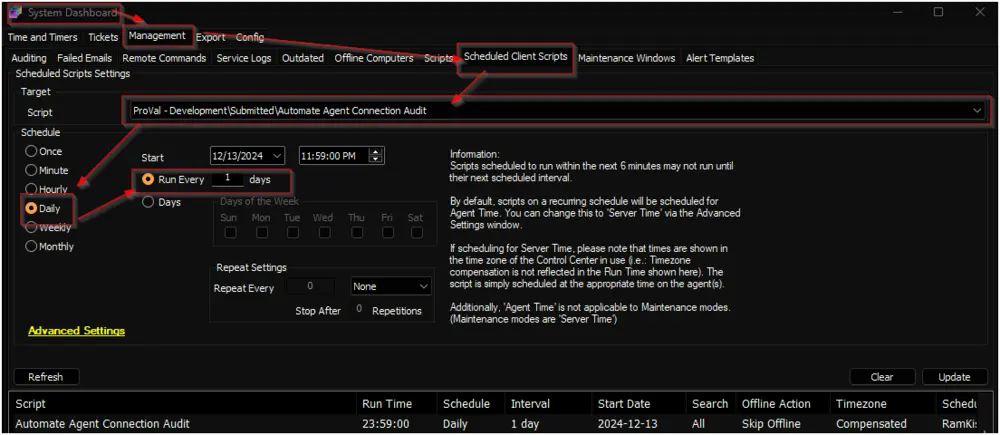

## Summary

The script generates two custom tables: [pvl_automate_connection_audit](/docs/ec679801-c86a-4127-9b62-46be10207909) and [pvl_automate_connection_audit_daily](/docs/da608773-1677-4247-a161-ea62b3b3ba23). It calculates and records the daily online and offline times of all machines in the [pvl_automate_connection_audit_daily](/docs/da608773-1677-4247-a161-ea62b3b3ba23) table, using the data stored in the [pvl_automate_connection_audit](/docs/ec679801-c86a-4127-9b62-46be10207909) table.

## Sample Run

- Debug the script against any random client to import the custom tables.  
- Schedule the script to run once per day around midnight:  
    

## Output

- Script Log
