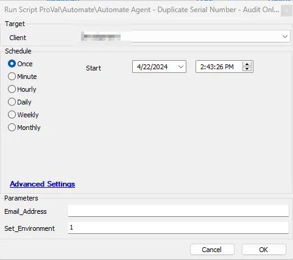
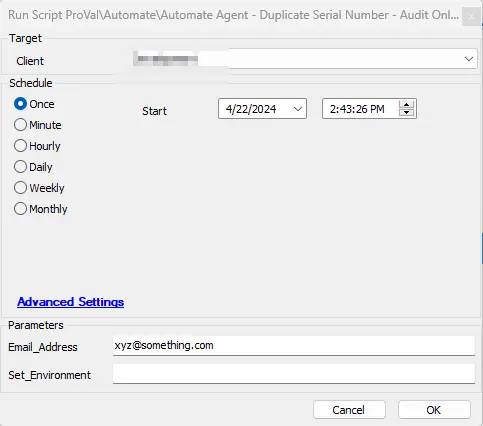

## Summary

This document is a duplicate of the [CWM - Automate - Script - Automate Agent - Duplicate Serial Number - Retire](/docs/0282785b-f740-490a-8e5c-75e2de10088a) script. However, instead of retiring agents, it will audit the duplicate agents in the Automate environment. Duplicate agents will be identified based on serial number, name, and client affiliation.

This is a client script and will work only for physical machines. Virtual machines are excluded to prevent any accidental deletion. It can be set up to email the results to any email address, or a ticket can also be generated with the list of duplicate agents.

## Sample Run

Set the parameter `Set_environment` for the first execution.

Specify the email address where you would like to receive the output of the results.

## System Properties

| Name                                           | Required | Example                                       | Description                                                                                                                                                                                                                                                                                  |
| ---------------------------------------------- | -------- | --------------------------------------------- | -------------------------------------------------------------------------------------------------------------------------------------------------------------------------------------------------------------------------------------------------------------------------------------------- |
| `_sysDuplicateAgentEmailAddress`               | False    | [xyz@something.com](mailto:xyz@something.com) | Universal email address where you would like to receive the list of duplicate agents.                                                                                                                                                                                                        |
| `_sysDuplicateAgentTicketingEnable`            | False    | 1                                             | Set to '1' to receive a ticket with a list of duplicate agents; otherwise, leave it blank or set to '0'.                                                                                                                                                                   |
| `_sysDuplicateAgentTicketCategory`             | False    | 234                                           | Mention the ticket creation category to direct the tickets to the right board in Manage. **Note:** If no ticket creation category is mentioned in this property, the script will use the universal ticket creation category mentioned in the global system property `MonitorTicketCategory`. |
| `_sysDuplicateAgent_NoDuplicate_Ticketing`     | False    | 0                                             | Set its value to '1' to receive tickets/emails when there are no duplicate agents. The default value is '0', meaning by default, the script will not generate tickets/emails if no duplicate agents are found.                                                                               |
| `_sysDuplicateAgent_Ticketing_DefaultClientid` | False    | 1                                             | Client ID of the client under which tickets should be generated. The default value is '1', meaning tickets will be generated under the client whose client ID is '1' in the environment.                                                                                                     |

## User Parameters

| Name              | Required                   | Example                                       | Description                                                                                                                                                                                                                                                                                                                                                                                                            |
| ----------------- | -------------------------- | --------------------------------------------- | ---------------------------------------------------------------------------------------------------------------------------------------------------------------------------------------------------------------------------------------------------------------------------------------------------------------------------------------------------------------------------------------------------------------------- |
| `Email_Address`   | False                      | [xyz@something.com](mailto:xyz@something.com) | Fill it with an email address where you would like to receive the result of the script. **Note:** If nothing is mentioned in this user parameter, the script will check the system property `_sysDuplicateAgentEmailAddress`. If any email address is mentioned there, it will send an email to it. If not, it will send the email to the user who ran the script at the email address used for that user in Automate. |
| `Set_Environment` | True (For First execution) | 1                                             | Set it to '1' to create the system properties if they are not already made in the environment. It must be set to '1' for the first execution.                                                                                                                                                                                                                                                                          |

## Output

- Script Logs
- Ticketing
- Email

## Ticketing/Email

Tickets will only be generated if the system property `_sysDuplicateAgentTicketingEnable` is set to '1'.

**Subject:** `Duplicate Agents Based on Serial Numbers`

**Body:** `Please review the following duplicates. These are instances where multiple Automate agent IDs have the same serial number. This usually happens when a computer is re-imaged and the old agent is not retired first. Typically, any agent IDs with the oldest Last Contact dates can be retired, but these should be verified first.`

Keeping this list clean prevents false positive alerts from generating from the old agent instance and frees up Automate agent licenses. If all of the older copies of the agents listed below are deemed safe for removal, you can run the script (ProVal Script - noted below) to retire them all at once. Please use the Audit Only version of the script first if you would like to see a report of what the automation would do first.

Script Name - Automate Agent - Duplicate Serial Number - Auto Retire [Email, Ticket]

Duplicate Agents are listed below:

`@DuplicateMachines@`

In case there is no duplicate serial number:

`No duplicate machines identified based on Serial Number.`