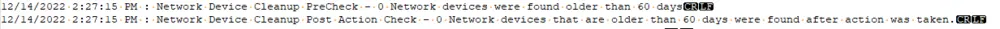

## Summary

This script is called from [CWM - Automate - Script - Automate Database Maintenance Solution](/docs/6436e6f3-e161-4b64-a4bf-1177cce2f968).

This script handles cleanup of the following table(s):

- **Networkdevices** - requires the [CWM - Automate - Script - Automate Database Maintenance Solution](/docs/6436e6f3-e161-4b64-a4bf-1177cce2f968) `NetWorkDevice_Cleanup_days` global variable to be set to a value other than 0.

## Sample Run

This script is a function script called from [CWM - Automate - Script - Automate Database Maintenance Solution](/docs/6436e6f3-e161-4b64-a4bf-1177cce2f968).

## Variables

| Name       | Description                                                                                                                                                                   |
|------------|-------------------------------------------------------------------------------------------------------------------------------------------------------------------------------|
| Verify     | This variable verifies both the starting count of targeted data and the after-action count of targeted data. We expect the starting count to be greater than 0, and the after-action value to be 0. |
| LogMessage | This variable holds the running log. Please note that this variable is always set the same way wherever it's used in the solution: `@logMessage@ = @LogMessage@[Linebreak]%when% : [Category] Cleanup [Stage] - Result`. Please continue to utilize this standard with this running log file. |

## Output

This script will add the following section to the log variable:

