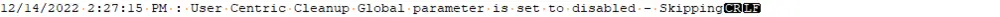

## Summary

This script is called from [CWM - Automate - Script - Automate Database Maintenance Solution](/docs/6436e6f3-e161-4b64-a4bf-1177cce2f968).

This script handles the cleanup of the following table(s):

- **Contacts** - Requires the [CWM - Automate - Script - Automate Database Maintenance Solution](/docs/6436e6f3-e161-4b64-a4bf-1177cce2f968) UserCentric_Force_Contacts_Managed global variable set to 1.

## Sample Run

This script is a function script called from [CWM - Automate - Script - Automate Database Maintenance Solution](/docs/6436e6f3-e161-4b64-a4bf-1177cce2f968).

## Variables

| Name        | Description                                                                                                                                                                                                                                         |
|-------------|-----------------------------------------------------------------------------------------------------------------------------------------------------------------------------------------------------------------------------------------------------|
| Verify      | This variable verifies both the starting count of targeted data, as well as the after-action count of targeted data. We expect the starting count to be a value greater than 0, and the after-action value to be 0.                                |
| LogMessage  | This is the running log holding variable. Please note this variable is always set the same everywhere it's used in the solution: `@logMessage@ = @LogMessage@[Linebreak]%when% : [Category] Cleanup [Stage] - Result`. Please continue to utilize this standard with this running log file. |

## Output

This script will add the following section to the log variable:

Or data if applicable.
