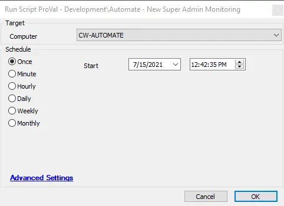

## Summary

This script will monitor for the creation of new super admins since the last run of the script.  
**Time Saved by Automation:** 5 Minutes

## Sample Run

## Dependencies

None

## Variables

`@userList@` - The list of new super admin users.

#### Global Parameters

| Name                     | Example | Required | Description                                               |
|--------------------------|---------|----------|-----------------------------------------------------------|
| TicketCreationCategory    | 123     | True     | The category to create the corresponding alert ticket under. |

## Process

A temporary custom table is referenced to determine the previous state of the super admins. The table is then compared to the existing super admins, and if there are any added super admins, a ticket is generated with the list of usernames of those users.

## Output

- Ticket
- Script Log