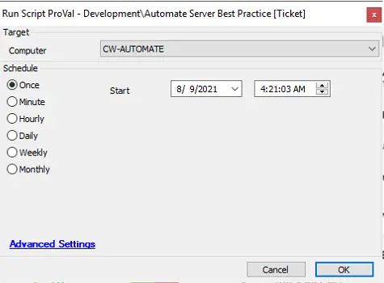

## Summary

This script goes through the process of auditing and setting up hardening rules and policies relating to the recently published CW document [Hardening Automate](/docs/b356a7ff-5336-480e-830c-476bee44cb98).

**Time Saved by Automation:** 30 Minutes

## Sample Run

## Variables

- `@Admins@`: Name of the local admins.
- `@PrivTicOutput@`: Output of the command `SecEdit /export /cfg $TemplateFilename /areas USER_RIGHTS`.
- `@OpenPorts@`: List of the open ports to be closed.
- `@LTSharePermissions@`: Output of the command `Get-SmbShareAccess -Name 'LTShare' | select-object accountname, accessright`.
- `@CperUsers@`: List of Automate users with permissions to the ConnectWise Control plugin.

## Process

> Get the names of users/groups added to the Administrators group and add them to the ticket.  
> Set the following GPOs:  
> - Do Not Allow Anonymous Enumeration of SAM accounts and Shares  
> - Disallow AutoPlay for non-volume devices  
> - Do not execute any autorun commands  
> - Turn off AutoPlay  
> - Always install with elevated privileges  
> Get the names of users/groups acting as Operating System and add them to the ticket.  
> Check the open ports on the Windows firewall for the following and add the port number to the ticket if open:  
> - Port 70 TCP  
> - Ports 70-74 UDP  
> - Port 8002 TCP/UDP  
> - Ports 40000-40050 TCP  
> - Ports 40000-41000 UDP  
> - Port 3389  
> The following ports are checked only if the server is placed in a Domain:  
> - Port 135: MSRPC  
> - Port 139: NetBios  
> - Port 445: Microsoft-ds  
> Disable TLS 1.0 and TLS 1.1.  
> Check the permissions assigned to the users/user classes for "LTSHARE" and add the permissions in the ticket for the client to review. Additionally, set the permissions for EVERYONE to read-only.  
> Disable HTTP Headers.  
> Disable HTTP Options.  
> Check and add the users to the ticket with the permissions of the ConnectWise Control plugin.  
> [Automate Comprehensive Best Practice Guide](https://university.connectwise.com/content/userdocs/business_knowledge/Automate_Comprehensive_Best_Practice_Guide.pdf)

## Output

- Ticket
- Script Log