## Summary

This document outlines the process for creating Remote Monitors for Average Disk Queue Length on Windows machines. The creation of these remote monitors is governed by system properties, as well as client-level, location-level, and computer-level Extra Data Fields (EDFs). These elements are further detailed within this document.

The script creates remote monitors that trigger an alert when the average of **X** samples collected over a period of time for **Avg. Disk Queue Length** on the target machine exceeds a certain threshold. The thresholds can be configured in the system properties, which are elaborated in the **System Properties** section of this document.

**Note of Caution**: The remote monitors created by this script utilize PowerShell for monitoring. Therefore, its functionality is not guaranteed on any computer running a version of PowerShell older than 5. Please ensure your systems are updated to at least PowerShell version 5 for optimal performance.

## Update Notice: 18-Sept-2024

A new Computer-Level EDF `ADQL - Physical Disk Count` has been introduced. Update the script from the Prosync plugin and execute or debug it against any client with the `Set_Environment` parameter set to `1`. This action will generate the necessary system properties and Extra Data Fields (EDFs) for managing the remote monitors.  
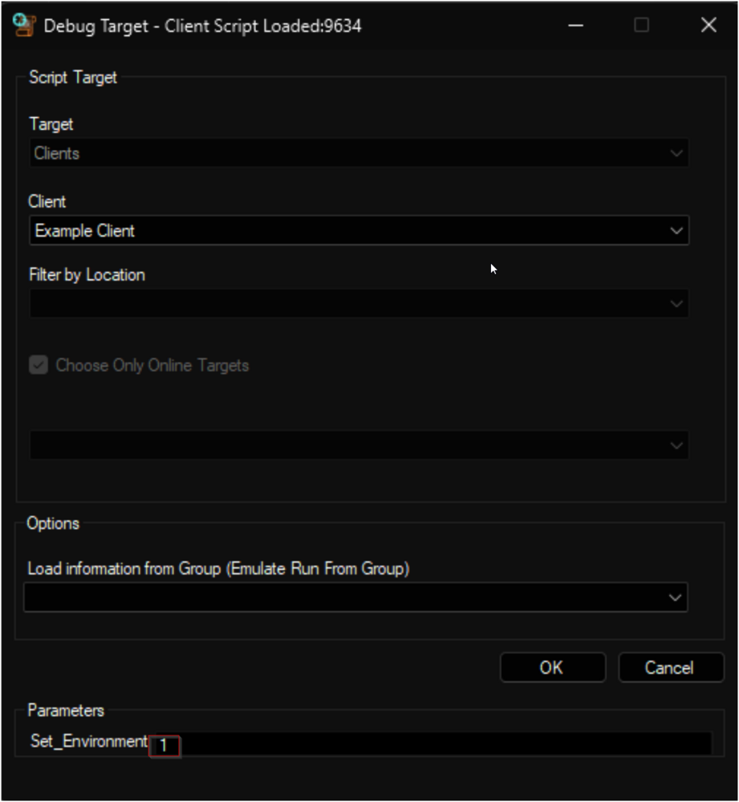  
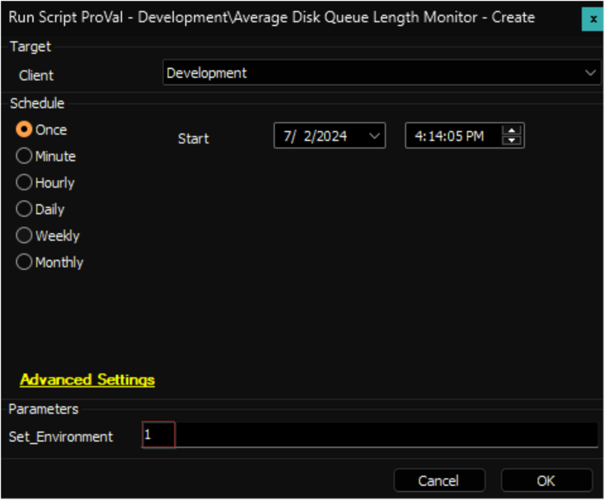

## Before You Proceed

The remote monitor created by this script utilizes the [Get-AvgDiskQueueLength](/docs/662544c5-360c-4348-9e8f-a95b5bb4efd9) agnostic script, which uses the `//PhysicalDisk(_total)//Avg. Disk Queue Length` performance counter for data collection.

### Overview

`//Local Disk//Average Disk Queue Length` is the average number of both read (Avg. Disk *Read* Queue Length) and write (Avg. Disk *Write* Queue Length) requests that were queued for the selected disk during the performance data interval. Unlike Current Disk Queue Length, Avg. Disk Queue Length is a derived value and not a direct measurement.

If the Avg. Disk Queue Length is greater than 2 per hard disk for a prolonged period of time, it may produce a bottlenecked system. If you have a RAID system with 8 disks, the Avg. Disk Queue Length should not exceed 16.

### Troubleshooting

Having an excess of files being accessed will significantly increase your Avg. Disk Queue Length, resulting in a disk bottleneck. For example, if you have 1,000 1MB files, they will take up more storage space and require more processing than a single 1GB file due to the longer time spent opening and closing all the files. To consolidate the multitude of small files, you may want to consider compressing them into an archive if possible.

However, this may be time-consuming and not the root issue. If your disk performance is poor, your options are to upgrade your disk, hard drive controller, or implement a stripe set. Use the following formula to find the Avg. Disk Queue Time: **Avg. Queue Time = Disk Queue Length x Avg. Disk sec/Transfer.** This will provide you with a relative performance measurement and should be compared with other hard disk drives in your system. The higher the number of requests waiting in the command queue, the slower the disk performance.

## Implementation

1. Import this script from the `ProSync` plugin.

2. **Run/Debug the Script**
   - Execute or debug the script against a single client, with the `Set_Environment` parameter set to `1`. This action will generate the necessary system properties and Extra Data Fields (EDFs) for managing the remote monitors.  
     
   

3. **Reload System Cache**
   - Refresh the system cache to ensure all changes are updated.  
   

4. **Configure System Properties and EDFs**
   - Navigate to **System Dashboard --> Config --> Configurations --> Properties**.
   - Find the properties beginning with `ADQL_Monitoring`.  
   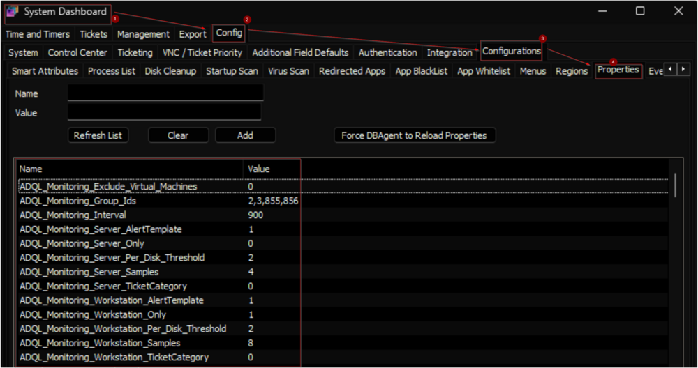  
   - The consultant should have provided you with any customizations that are required. Please read through the detailed System Properties and EDF explanations to understand how to configure any customizations.

5. **Schedule the Script**
   - Schedule the script to run once per day, preferably around midnight, from the dashboard for optimal results.  
   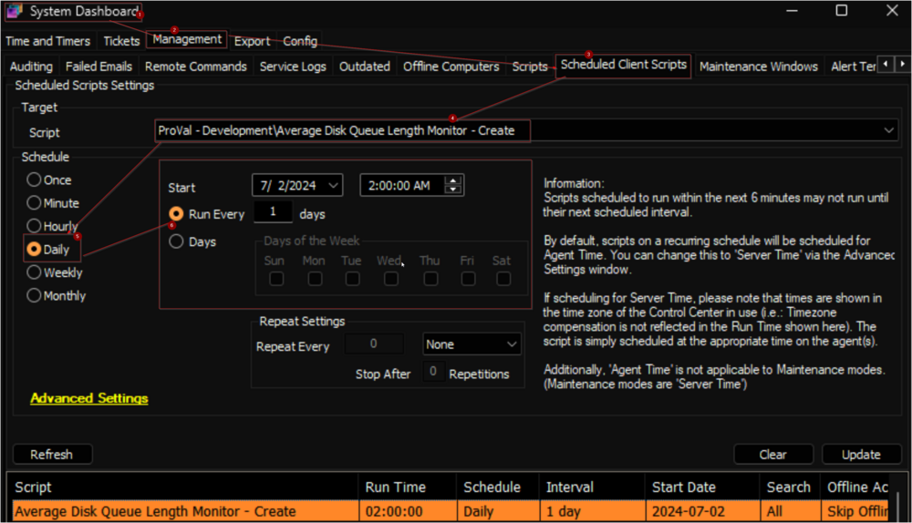

## Dependencies

[EPM - Data Collection - Agnostic Script - Get-AvgDiskQueueLength](/docs/662544c5-360c-4348-9e8f-a95b5bb4efd9)

### User Parameters

| Name                          | Example | Required                    | Description                                                                                                                                                                                                 |
|-------------------------------|---------|-----------------------------|-------------------------------------------------------------------------------------------------------------------------------------------------------------------------------------------------------------|
| Set_Environment               | 1       | True (for first run only)   | Set it to 1 during the first run of the script to generate the necessary system properties and EDFs for managing the generated remote monitors.                                                            |

### System Properties

| Name                                   | Example       | Required | Description                                                                                                                                                                                                                                                                                                                                                     |
|----------------------------------------|---------------|----------|-----------------------------------------------------------------------------------------------------------------------------------------------------------------------------------------------------------------------------------------------------------------------------------------------------------------------------------------------------------------|
| ADQL_Monitoring_Group_Ids             | 2,3,855,856   | True     | The script will create remote monitors for the machines that belong to the groups identified by the group IDs specified in this system property. The monitor set will not be associated with the groups themselves but with the individual machines. Multiple IDs can be included by separating them with a comma. The default value is ‘0’. **Note:** If this property is set to ‘0’, the monitoring will be disabled and the script will remove the existing monitor set. Therefore, the creation of the monitor set will not commence unless the group IDs are defined in the system properties. |
| ADQL_Monitoring_Server_Only           | 0             | False    | Setting this system property to '1' will limit the monitor set creation to Windows Servers only. The default value is '0'. Also, the script will remove the monitor set created for the Windows Workstations after setting this property to '1'.                                                                                              |
| ADQL_Monitoring_Workstation_Only       | 0             | False    | Setting this system property to '1' will limit the monitor set creation to Windows Workstations only. The default value is '0'. Also, the script will remove the monitor set created for the Windows Servers after setting this property to '1'.                                                                                                  |
| ADQL_Monitoring_Exclude_Virtual_Machines | 0             | False    | Setting this system property to '1' will limit the monitor set creation to Physical Windows Machines only. The default value is '0'. Also, the script will remove the monitor set created for the Virtual Machines after setting this property to '1'.                                                                                               |
| ADQL_Monitoring_Interval               | 900           | True     | Controls the generated Remote Monitor run time interval. The default is `900` seconds.                                                                                                                                                                                                                                                                         |
| ADQL_Monitoring_Server_Samples         | 4             | True     | This property determines the number of samples to calculate the average for servers. The remote monitor will perform the calculations after generating the number of samples stored in this system property. The default value is `4`. The remote monitor will produce a single sample for each run. Therefore, by setting the `Interval` to `900` and `Samples` to `4`, the monitoring will analyze the average of the readings gathered from the preceding 900 * 4 = 3600 seconds (1 hour). |
| ADQL_Monitoring_Workstation_Samples     | 8             | True     | This property determines the number of samples to calculate the average for workstations. The remote monitor will perform the calculations after generating the number of samples stored in this system property. The default value is `8`.                                                                                                                                               |
| ADQL_Monitoring_Server_Per_Disk_Threshold | 2           | True     | The allowed `Avg. Disk Queue Length` per disk for servers is stored in this property. If the average reading for `Avg. Disk Queue Length` is greater than or equal to the **Number of Disks * The value stored in this System Property**, the monitor set will trigger a failure. The default value for this System Property is `2`. **Example:** Interval = 900, Samples = 4, Per_Disk_Threshold = 2, Number of Hard Disks = 2. According to this configuration, the monitor set will be triggered if the average value of the `Avg. Disk Queue Length` for the server within an hour (900 * 4 = 3600 seconds) exceeds or equals four (2 * 2). |
| ADQL_Monitoring_Workstation_Per_Disk_Threshold | 2       | True     | The allowed `Avg. Disk Queue Length` per disk for workstations is stored in this property. If the average reading for `Avg. Disk Queue Length` is greater than or equal to the **Number of Disks * The value stored in this System Property**, the monitor set will trigger a failure. The default value for this System Property is `2`.                                                                                                                                                     |
| ADQL_Monitoring_Server_AlertTemplate   | 1             | True     | This system property stores the id of the `Alert Template` to apply to the remote monitors created for the servers. The default value is '1', i.e., `Default - Do Nothing.` Navigate to the **System Dashboard --> Management --> Alert Templates** to find the Id of the required alert template. It is suggested to use the `△ Custom - Ticket Creation - Computer` alert for better alerting. The alert template should not be running the very same script for the Warning action as well unless you want to create a ticket for the PowerShell errors too. |
| ADQL_Monitoring_Workstation_AlertTemplate | 1          | True     | This system property stores the id of the `Alert Template` to apply to the remote monitors created for the workstations. The default value is '1', i.e., `Default - Do Nothing.` It is suggested to use the `△ Custom - Ticket Creation - Computer` alert for better alerting. The alert template should not be running the very same script for the Warning action as well unless you want to create a ticket for the PowerShell errors too. |
| ADQL_Monitoring_Server_TicketCategory    | 124         | False    | This system property stores the id of the `Ticket Category` to apply to the remote monitors created for the Servers. The default value is '0', i.e., `\\<Not Specified>`. Ticket Categories are used to control the CW Manage service board of the tickets generated by Automate. Navigate to the **System Dashboard --> Config --> Information Base Categories** to find the Id of the required ticket category. |
| ADQL_Monitoring_Workstation_TicketCategory | 125       | False    | This system property stores the id of the `Ticket Category` to apply to the remote monitors created for the Workstations. The default value is '0', i.e., `\\<Not Specified>`.                                                                                                                                                                                                                                   |

## Client-Level EDF

| Name                          | Type       | Section     | Description                                                                                                                                                                                                                                                                                                                                                     |
|-------------------------------|------------|-------------|-----------------------------------------------------------------------------------------------------------------------------------------------------------------------------------------------------------------------------------------------------------------------------------------------------------------------------------------------------------------|
| ADQL Monitoring - Exclude Servers | Check Box | Exclusions  | Selecting this Extra Data Field (EDF) will exclude the servers of the client from the Average Disk Queue Length monitoring. As a result, the script will not create any remote monitors for the servers under this client. Furthermore, upon marking this EDF, the script will also remove any previously created remote monitors for the servers of this client.  |
| ADQL Monitoring - Exclude Workstations | Check Box | Exclusions  | Selecting this Extra Data Field (EDF) will exclude the workstations of the client from the Average Disk Queue Length monitoring. As a result, the script will not create any remote monitors for the workstations under this client. Furthermore, upon marking this EDF, the script will also remove any previously created remote monitors for the workstations of this client.  |

**Note:** Mark both EDFs to exclude the client from the monitoring.

## Location-Level EDF

| Name                          | Type       | Section     | Description                                                                                                                                                                                                                                                                                                                                                     |
|-------------------------------|------------|-------------|-----------------------------------------------------------------------------------------------------------------------------------------------------------------------------------------------------------------------------------------------------------------------------------------------------------------------------------------------------------------|
| ADQL Monitoring - Exclude Servers | Check Box | Exclusions  | Selecting this Extra Data Field (EDF) will exclude the servers of the client from the Average Disk Queue Length monitoring. As a result, the script will not create any remote monitors for the servers under this location. Furthermore, upon marking this EDF, the script will also remove any previously created remote monitors for the servers of this location.  |
| ADQL Monitoring - Exclude Workstations | Check Box | Exclusions  | Selecting this Extra Data Field (EDF) will exclude the workstations of the client from the Average Disk Queue Length monitoring. As a result, the script will not create any remote monitors for the workstations under this location. Furthermore, upon marking this EDF, the script will also remove any previously created remote monitors for the workstations of this location.  |

**Note:** Mark both EDFs to exclude the location from the monitoring.

## Computer-Level EDF

| Name                          | Type       | Section     | Required | Description                                                                                                                                                                                                                                                                                                                                                     |
|-------------------------------|------------|-------------|----------|-----------------------------------------------------------------------------------------------------------------------------------------------------------------------------------------------------------------------------------------------------------------------------------------------------------------------------------------------------------------|
| ADQL Monitoring - Exclude      | Check Box  | Exclusions  | False    | Selecting this Extra Data Field (EDF) will exclude the computer from the Average Disk Queue Length monitoring. As a result, the script will not create any remote monitor for this computer. Furthermore, upon marking this EDF, the script will also remove any previously created remote monitor for this computer.                                |
| ADQL - Physical Disk Count     | Text String| Default     | False    | Set the number of disks to overwrite the physical disk count in the Average Disk Queue Length Monitor for the computer.                                                                                                                                                                                                                                                                                     |

## Remote Monitor Example

**Name:** `ProVal - Production - Average Disk Queue Length Monitor`  

**Ticket Subject:** `High Average Disk Queue Length Detected on %COMPUTERNAME%`  

**Alert Message on Failure:** `This is an automated update to inform you that the high "Average Disk Queue Length" issue reported earlier has now been resolved.`  

**Alert Message on Success:** `The "Average Disk Queue Length" is high on %COMPUTERNAME% located at %CLIENTNAME%//%LOCATIONNAME%.  
If the "Average Disk Queue Length" is greater than 2 per hard disk for a prolonged period of time, it may produce a bottlenecked system. If you have a RAID system with 8 disks, the Avg. Disk Queue Length should not exceed 16. Please investigate the issue and take appropriate actions to address the root cause.  
%RESULT%`  

**Sample Ticket:** The ticket illustrated here was created by setting the samples to '2' and the allowed value for average disk queue length per disk to '0'. However, it's important to note that this example is purely for demonstration purposes.  
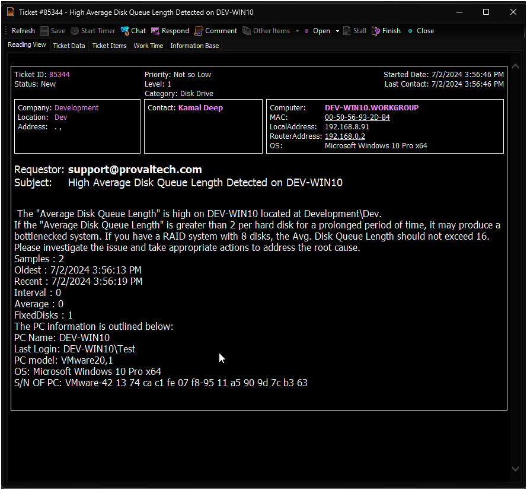  
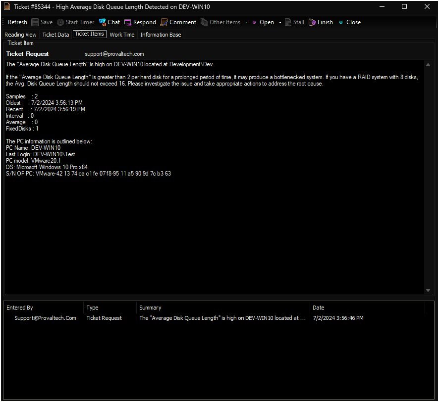  

**Sample Remote Monitor:**  
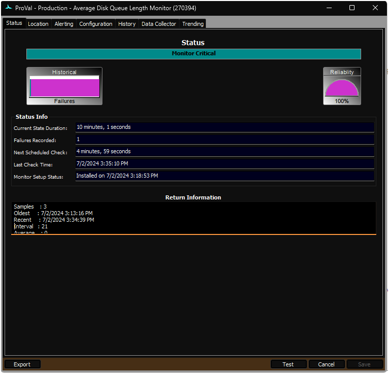  
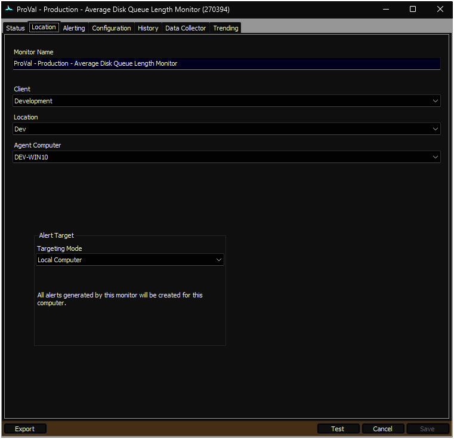  
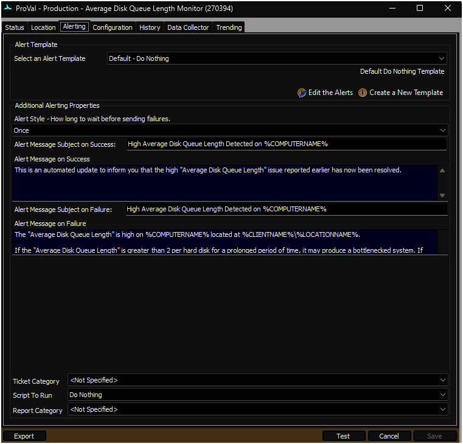  
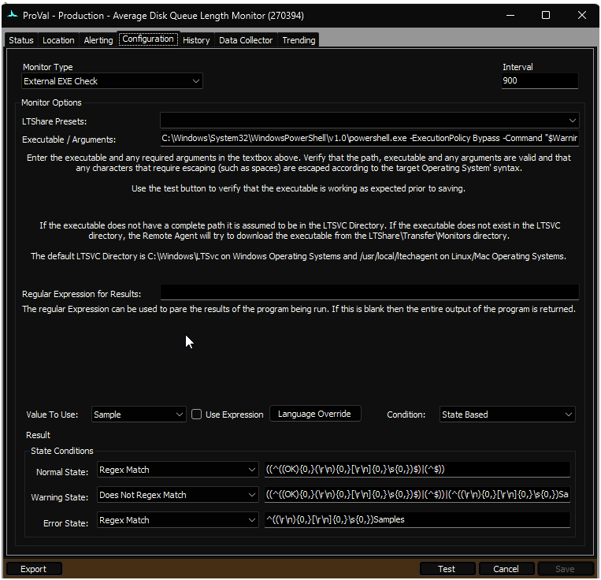  
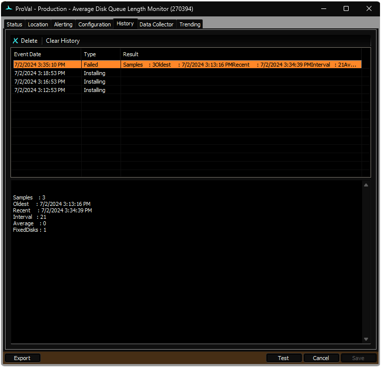  

## Output

- Remote Monitors

