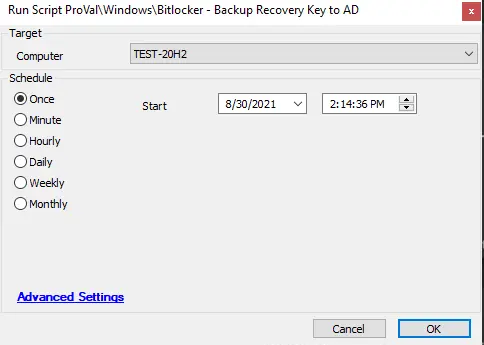

## Summary

This script backs up the existing BitLocker recovery key to the joined AD domain.

**Time Saved by Automation:** 10 Minutes

## File Hash

**File Path**: `C:\ProgramData\_Automation\script\Get-ADBitlockerStores\Get-ADBitlockerStores-loop.ps1`  
**SHA256**: `500A60B0D5223AAF9201EE0F29EBC8CE45A5BB6D5675DE20AB9FC7F5682AEFC7`  
**MD5**: `C48D3B2E7097F87459D9999F6F74CD19` 

## Sample Run

## Dependencies

[Send-BitlockerADRecovery.ps1](https://file.provaltech.com/repo/script/Send-BitlockerADRecovery.ps1)

## Variables

| Variable         | Description                                                                                     |
|------------------|-------------------------------------------------------------------------------------------------|
| BaseURL          | Contains the file server address                                                                |
| WorkingDirectory  | Contains the destination path where the file server file is kept                               |
| PS1URL           | Contains the complete file path in the file server for direct download                         |
| PS1Path          | Denotes the complete path where the file is stored on the local machine after downloading from the file server |
| PS1TempPath      | Stores the downloaded file temporarily in the local system directory.                           |
| PS1Log           | Stores the complete PowerShell execution log.                                                  |
| PS1DataLog       | Stores the PowerShell data log                                                                  |
| PS1ErrorLog      | Stores the PowerShell error log.                                                               |

## Process

The script gathers information about existing BitLocker volumes. It then loops through each volume and runs the `Backup-BitLockerKeyProtector` cmdlet against each encrypted drive. If the process fails, the `-data.txt` file will have `FAIL` written to it, and the `-error.txt` log file will be generated. Otherwise, `SUCCESS` will be written to the data log file.

The machine must be using BitLocker for encryption.

## Output

- Script log