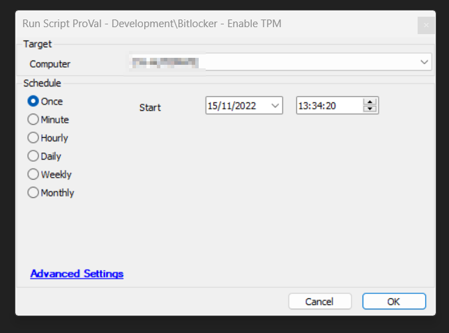

## Summary

An Automate implementation of the agnostic script [SEC - Encryption - Agnostic - Enable-TPM](/docs/cc838fb3-1ff7-4bbd-90b3-48e7fd4afd61) initializes TPM as part of the provisioning process for a Trusted Platform Module (TPM). Provisioning is the process of preparing a TPM for use. A restart may be required to initialize TPM.

## Sample Run

## Dependencies

- [SEC - Encryption - Agnostic - Enable-TPM](/docs/cc838fb3-1ff7-4bbd-90b3-48e7fd4afd61)

#### Global Parameters

| Name                     | Example          | Required | Description                                                                                                                                                       |
|--------------------------|------------------|----------|-------------------------------------------------------------------------------------------------------------------------------------------------------------------|
| AllowClear               | True or False     | True     | Set to True to pass the switch to the agnostic script; set to False to suppress. Default value is True.                                                          |
| AllowPhysicalPresence     | True or False     | True     | Set to True to pass the switch to the agnostic script; set to False to suppress. Default value is False.                                                         |
| AllowRestart             | True or False     | True     | Set to True to pass the switch to the agnostic script; set to False to suppress. Default value is False. Setting this parameter to True will reboot the computer if it's necessary to initialize TPM. |

## Process

- Executes the agnostic script and writes the informational logs in Automate.

## Output

- Script logs

