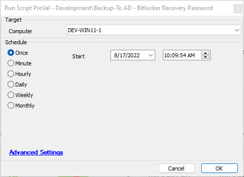
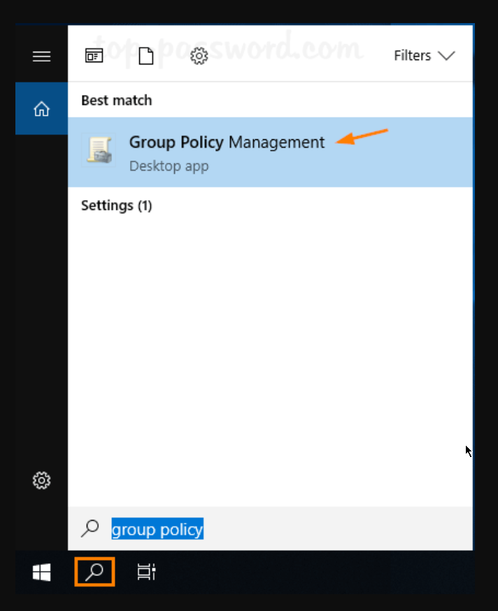
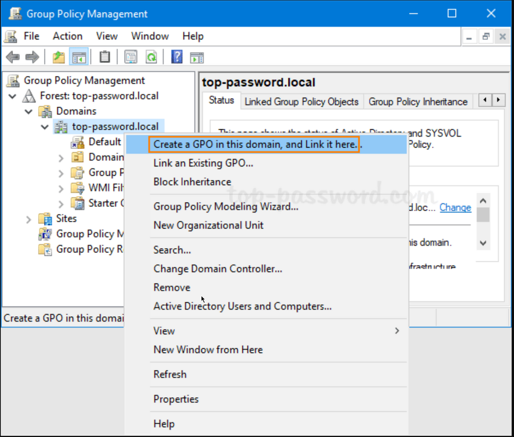
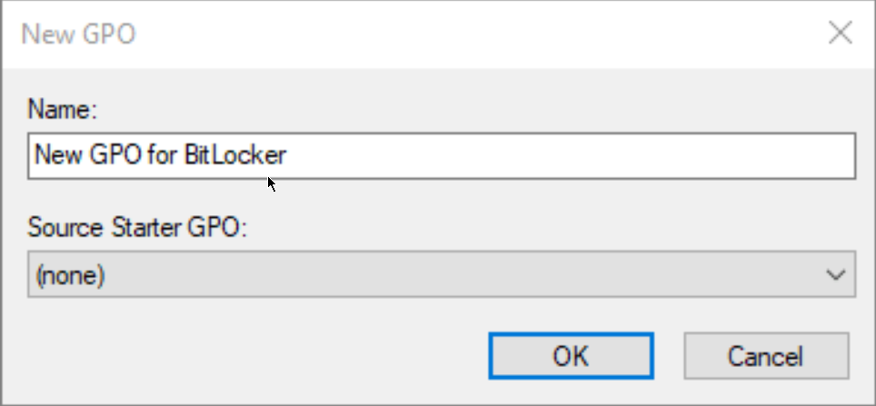
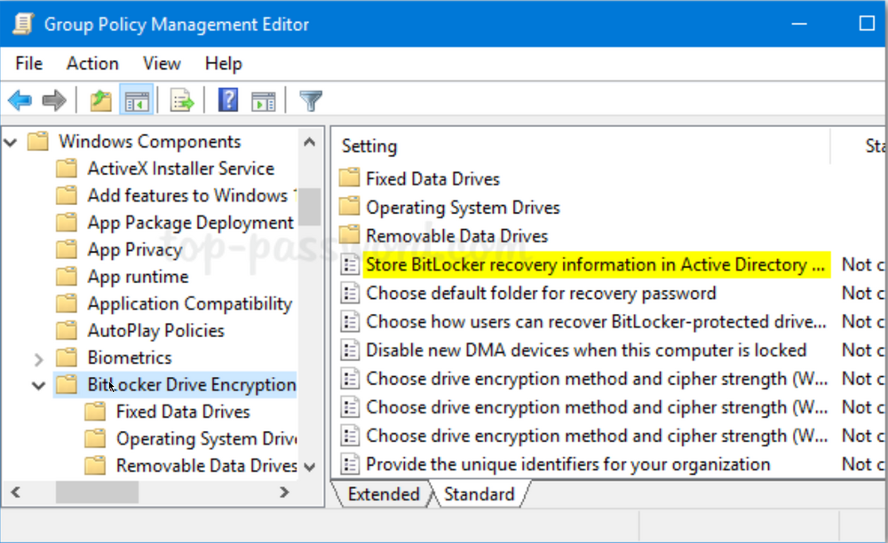
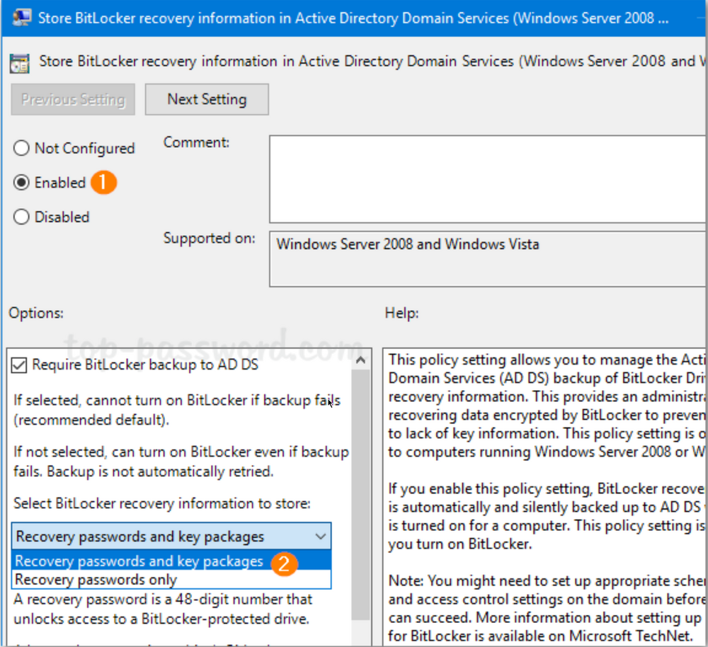
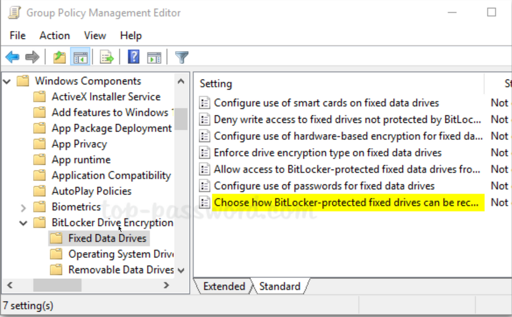
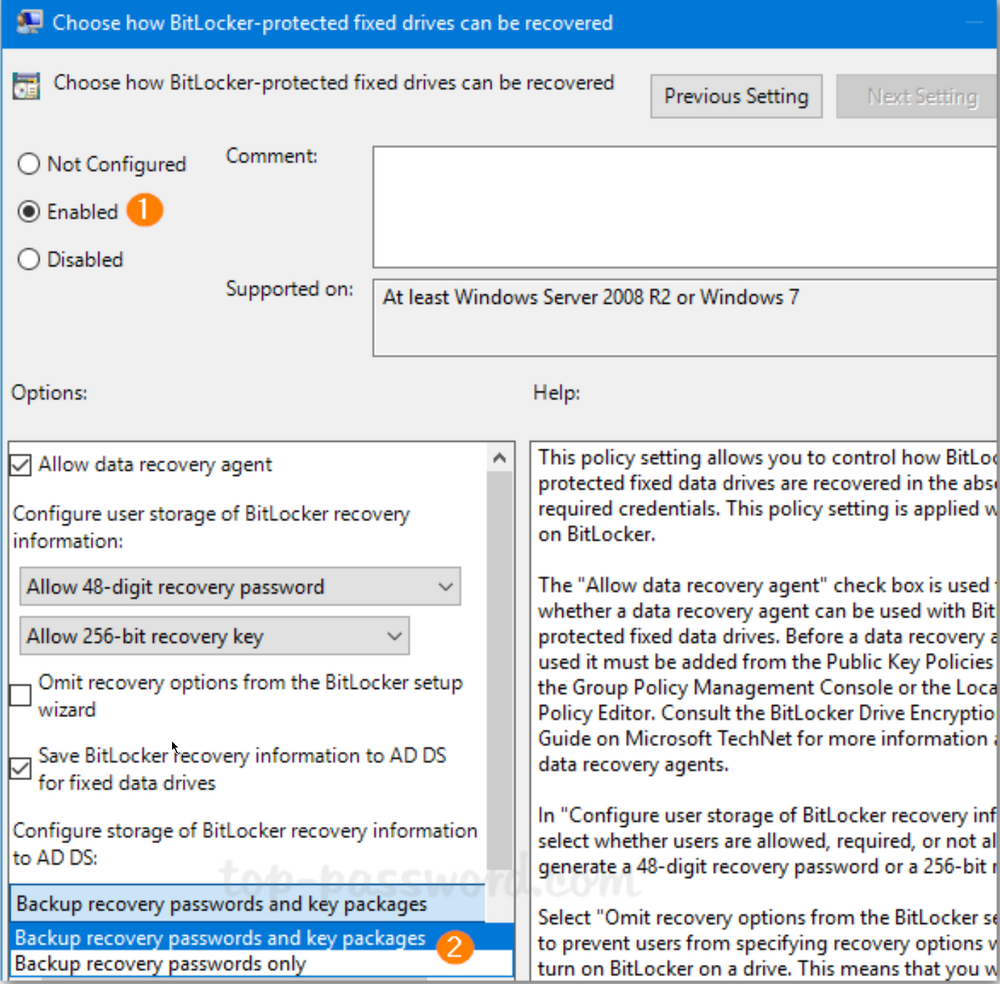

## Summary

This Automate script executes the `Backup-BitlockerRecoveryPW.ps1` agnostic script.

## Requirements

- PowerShell v5
- The target must be domain-joined
- Group policy must be properly configured on the domain controller to allow backups of BitLocker keys into Active Directory 

### Dependencies

- [SEC - Encryption - Agnostic - Backup-BitlockerRecoveryPW](/docs/7eecbf0c-2b91-4454-ba5c-e1b9605f07fc)

## Sample Run

### Output

- Script log
- Dataview

## FAQ

1. The script is failing with "Unable to find type [Microsoft.BitLocker.Structures.BitLockerVolume]."
   - Group policy must be properly configured to allow backups of BitLocker keys to Active Directory. Follow the process below:

## GPO Creation Process

1. Click the Search icon in the taskbar and type “**Group Policy**“. You can then click **Group Policy Management** to launch it.
   

2. In the left pane of Group Policy Management, right-click your AD domain and select “**Create a GPO in this domain, and Link it here…**” from the menu.
   

3. In the New GPO dialog, give the GPO a name and click **OK**.
   

### Configuration

4. Right-click the newly created GPO in the left pane and select **Edit**.
   

5. Browse to `Computer Configuration -> Policies -> Administrative Templates -> Windows Components -> BitLocker Drive Encryption`, and then double-click the policy “**Store BitLocker recovery information in Active Directory Domain Services**“.
   

6. Set the policy to **Enabled**. Ensure the “**Require BitLocker backup to AD DS**” option is checked, and select to store both recovery passwords and key packages.
   

7. Next, expand **BitLocker Drive Encryption** in the left pane. You’ll see three nodes: Fixed Data Drives, Operating System Drives, and Removable Data Drives. Select **Fixed Data Drives** and double-click the policy “**Choose how BitLocker-protected fixed drives can be recovered**“.
   

8. Set it to **Enabled**. Check the options “Save BitLocker recovery information to AD DS for fixed drives” and then click **OK**.
   

9. Go to the “Operating System Drives” node and enable the similar policy “**Choose how BitLocker-protected operating system drives can be recovered**“. Afterwards, go to the “Removable Data Drives” node and enable the policy “**Choose how BitLocker-protected removable drives can be recovered**“.

10. When any client PC retrieves the policy changes, BitLocker recovery information will be automatically and silently backed up to AD DS when BitLocker is turned on for fixed drives, OS drives, or removable drives.

