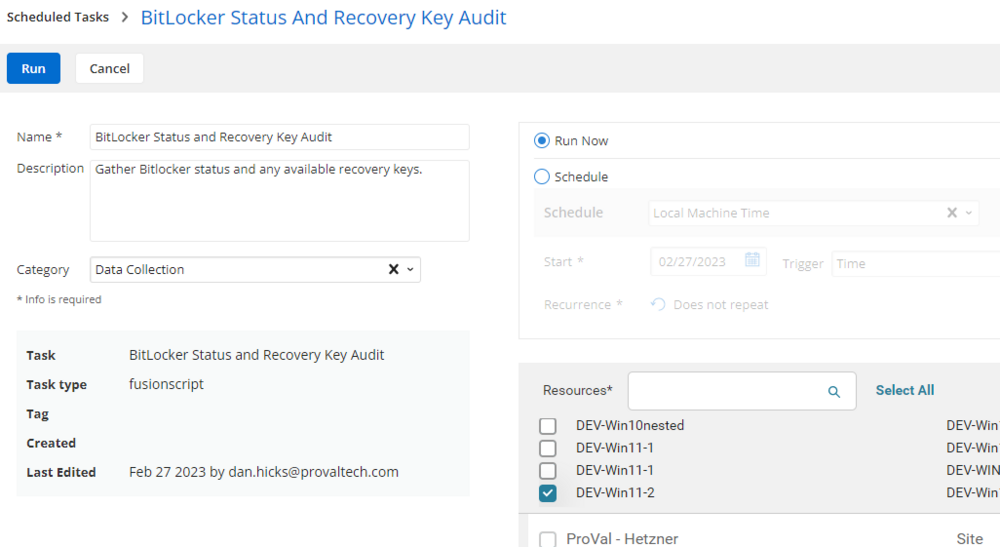

## Summary

This script will audit the endpoint and output the Drive and Recovery key, if available.

- Checks if any drives are BitLocker-enabled
- Checks to ensure encryption progress is at 100%
- Checks for any available recovery keys

## Sample Run

## Dependencies

- Custom Field: BitLocker Status and Key

## Variables

Document the various variables in the script. Delete any section that is not relevant to your script.

| Name       | Description                                                                                       |
|------------|---------------------------------------------------------------------------------------------------|
| %output%   | Standard CW RMM Output variable. Used for script log and Custom Field population                 |

## Output

- Custom Field: BitLocker Status and Key
- Script Log

Sample Output:
- BitLocker Not Enabled on Drive X:
- BitLocker Encryption in Progress on Drive X:
- BitLocker enabled on Drive X, No recovery key available
- Drive X: recovery key: dm9ij30d-k4i30jf0-moqiw4oid-oijqwoeij-0qiwjeoqiwj

