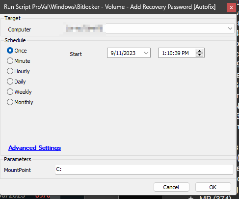

## Summary

The script is designed to add a recovery password to a drive where BitLocker is enabled but a key protector is not found. It is a copy of the [SEC - Encryption - Script - Bitlocker - Volume - Initialize](/docs/759a5a88-17ef-42e0-9145-4760aff7a3c9) script with a hardcoded parameter.

It will disable the currently applied BitLocker protection using the [SEC - Encryption - Script - Bitlocker - Remove Volume](/docs/710777f0-5c3f-4582-96e9-3beacaf085eb) script before re-enabling it with a Recovery Password protector.

The script will initialize the TPM if it is not already initialized, but it will not restart the computer. Please note that this script is not intended for manual execution. It is designed to be executed as an Autofix script from the [SEC - Encryption - Internal Monitor - Bitlocker - Missing Key Protectors](/docs/2609502c-8a9d-4e8d-98cb-e1b6f7fb2fdb) monitor set.

## Sample Run

## Dependencies

- [SEC - Encryption - Internal Monitor - Bitlocker - Missing Key Protectors](/docs/2609502c-8a9d-4e8d-98cb-e1b6f7fb2fdb)
- [SEC - Encryption - Script - Bitlocker - Audit](/docs/d7d933e3-9668-4de9-9f44-7452198ab85a)
- [SEC - Encryption - Script - Bitlocker - Remove Volume](/docs/710777f0-5c3f-4582-96e9-3beacaf085eb)

## Variables

| Name       | Description                                                         |
|------------|---------------------------------------------------------------------|
| Parameters | -RecoveryPasswordProtector -AllowTPMInit -MountPoint '@MountPoint@' -SkipHardwareTest |

## User Parameter

| Name       | Example | Required                          | Description                           |
|------------|---------|-----------------------------------|---------------------------------------|
| MountPoint | C:      | True (for manual execution only)  | Drive Letter to add BitLocker Key Protector |

## Output

- Script logs

