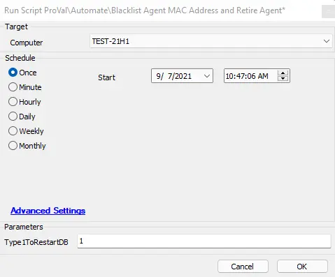

## Summary

This script will take the MAC address of the target agent and add it to the blacklist for Automate. The script will then retire the agent. The main goal of this script is to prevent a troublesome agent from checking in again in the future. 

**NOTE:** If the agent is online in Automate, please run the offboarding script, as that is the proper method for removing agents from Automate.

**Note:** This is an offline computer & maintenance script. This script can run on a machine in Maintenance Mode or even if the agent is offline. Please keep this in mind while issuing the script.

**Time Saved by Automation:** 5 Minutes

## Sample Run

## Dependencies

For the blacklist change to go into effect, the Database Agent must be restarted. Please review the User Parameter below to handle the DB agent restart.

## Variables

- `@AddToBlacklist@` - The MAC address of the target agent to be blacklisted
- `@CurrentBlacklist@` - The current MAC address blacklist
- `@Computerid@` - The computer ID of the endpoint
- `@LTRUNBYUSER@` - The user that ran the script

#### User Parameters

| Name                  | Example | Required | Description |
|-----------------------|---------|----------|-------------|
| Type1ToRestartDB      | 1       | False    | If "1" (without quotation marks, see screenshot above) is entered, that means the script will perform a DB agent restart as part of the script. If left blank or anything other than 1 is entered, the script will NOT perform a DB agent restart. **NOTE:** If running the script against multiple agents, it is NOT RECOMMENDED to issue the DB Agent restart, as that can affect the script running successfully against other devices. If you would like to do multiple machines at a time, select all but one of the devices and issue the script without a 1 in the user parameter section. Then issue the script on the final machine, but enter the 1 so it will restart the DB Agent. |

## Process

The script will first ensure that MAC signup is enabled and will set the settings as required. Then it will get the MAC address from the target endpoint and save that into the `@AddToBlacklist@` variable. The script will determine if this is the first value going into the blacklist or not. If it is the first entry, it will then add the MAC address to the blacklist. If there are other agents on the blacklist, Automate will pull those values and then add the new blacklist entry to the current entries.

Once the MAC address has been added to the blacklist, the script will move the agent to retired assets. The note used to retire the agent will mention it was blacklisted by this script. If the technician decided NOT to initiate the DB Agent restart, the script will exit. If the technician decided to initiate the restart, the script will first issue the command to restart IIS and then will issue the command to restart the DB Agent. Then the script will exit.

**Note:** If the agent never reported its MAC address to the Automate instance, the script will exit with an error stating there is no MAC address for the endpoint.

## Output

- Script log messages
- Agent MAC address blacklist
