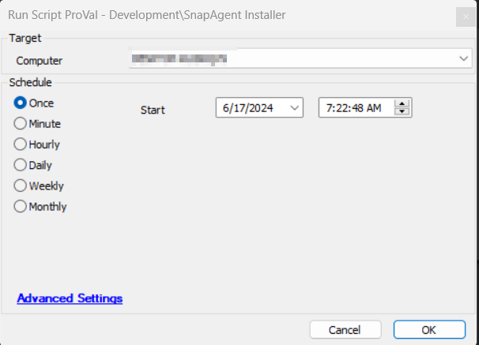
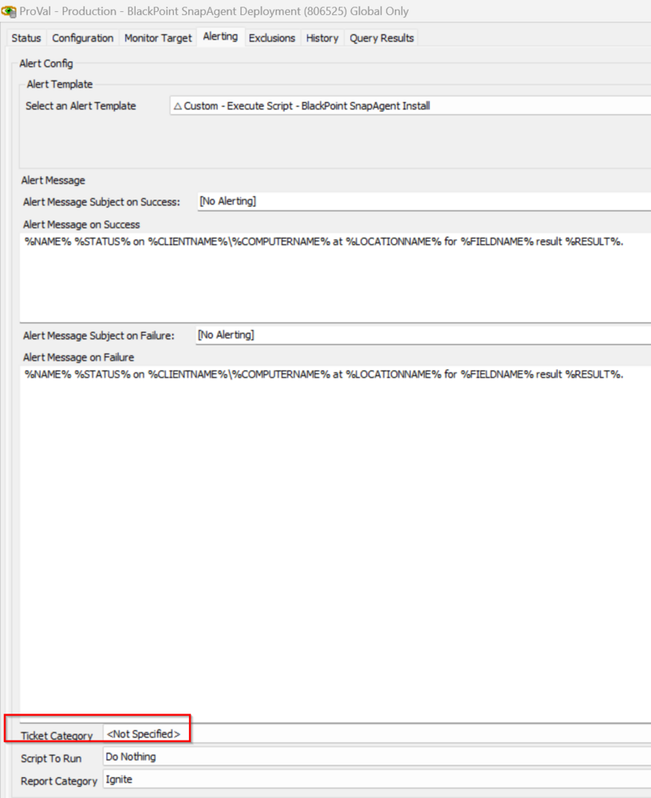

## Summary

This script is designed to install the SnapAgent on the machine.

## Sample Run

## Dependencies

[Install-SnapAgent](/docs/0cf14533-c145-4a77-8ea7-8c70476768a9)  

EDFs

| Name                             | Level   | Type       | Description                                                                                                                                                                                                                                                                                        |
|----------------------------------|---------|------------|----------------------------------------------------------------------------------------------------------------------------------------------------------------------------------------------------------------------------------------------------------------------------------------------------|
| BlackPoint SnapAgent Deploy      | Client  | Check Box  | This client-level EDF needs to be checked for the SnapAgent installation. The monitor [Monitor - BlackPoint SnapAgent Deployment](/docs/8dad86ab-7d59-43ef-b148-f4ab7df0b8f0) is directly proportional to this EDF.                                                                          |
| BlackPoint SNAP URL              | Client  | Text       | This client-level EDF must be filled with the installer package URL for downloading and installing the licensed SnapAgent application. The monitor [Monitor - BlackPoint SnapAgent Deployment](/docs/8dad86ab-7d59-43ef-b148-f4ab7df0b8f0) is directly proportional to this EDF.                   |
| BlackPoint SnapAgent Exclude     | Location| Check Box  | If this location-level EDF is checked, then all agents of the location will be excluded from the monitor for the SnapAgent deployment. The monitor [Monitor - BlackPoint SnapAgent Deployment](/docs/8dad86ab-7d59-43ef-b148-f4ab7df0b8f0) is indirectly proportional to this EDF.              |
| BlackPoint SnapAgent Exclude     | Computer| Check Box  | If this computer-level EDF is checked, then the agent will be excluded from the monitor for the SnapAgent deployment. The monitor is indirectly [Monitor - BlackPoint SnapAgent Deployment](/docs/8dad86ab-7d59-43ef-b148-f4ab7df0b8f0) proportional to this EDF.                                 |

## Variables

Document the various variables in the script. Delete any section that is not relevant to your script.

| Name               | Description                                                                                                                                                                                                                     |
|--------------------|---------------------------------------------------------------------------------------------------------------------------------------------------------------------------------------------------------------------------------|
| @ProjectName@      | This contains the agnostic PS1 name and sets that as a project and working directory to C:/ProgramData/_Automation/Script/@ProjectName@.                                                                                     |
| @URL@              | This contains the value of the URL from the client-level EDF "BlackPoint SNAP URL".                                                                                                                                           |
| @WorkingDirectory@ | This is a directory where the agnostic script downloads and its logging is stored. The directory path is "C:/ProgramData/_Automation/Script/@ProjectName@".                                                                   |
| @PS1Log@           | This stores the PowerShell informational logs for validation and saves them in the @WorkingDirectory@ folder with the name: @ProjectName@-log.txt.                                                                           |
| @PS1ErrorLog@      | This contains the PowerShell error logs for validation and saves them in the @WorkingDirectory@ folder with the name: @ProjectName@-error.txt.                                                                          |
| @ErrorLog@         | This contains the content of the error log file, i.e., @ProjectName@-error.txt.                                                                                                                                               |

## Ticketing

- To enable the ticketing feature, it is mandatory to set the ticket category at the monitor level as shown below:

- **Subject:**  
  SnapAgent Installation Failed on %computername% of %clientname%/%locationname%

- **Body:**  
  SnapAgent Installation Failed on %computername% of %clientname%/%locationname%. Refer to the logs below:  
  @ErrorLog@.

## Output

- Script log
- Local files on the computer

