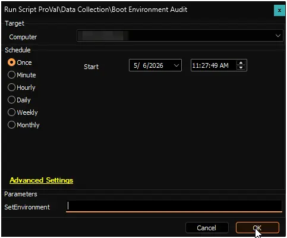

## Summary

This script audits a Windows device's boot environment and security posture, then stores the results in a custom table for reporting and compliance tracking. It checks:

- **Secure Boot Status:** Verifies Secure Boot is enabled and that the Windows UEFI CA 2023 security certificate is properly installed—essential for preventing unauthorized firmware modifications.
- **Boot Configuration:** Detects unauthorized boot loaders or network boot options that could indicate security misconfigurations.
- **Windows Recovery Environment:** Confirms WinRE is available for emergency repairs.
- **Firmware Readiness:** Compares your device's BIOS version against manufacturer minimums to ensure it supports modern security standards.
- **Available Driver Updates:** Counts pending driver updates from your device manufacturer (Dell, HP, Lenovo, or other vendors).
- **Cumulative Updates:** Identifies the latest installed Windows security patch and verifies your device has the November 2025 cumulative update or newer (required for CA 2023 Secure Boot certificate support).
- **Telemetry Configuration:** Determines if Windows diagnostic data collection is enabled or disabled.

## Dependencies

- [Get-BootEnvironmentDetails](/docs/5ecf76fb-1516-4c17-9ec9-937762c3ded6)
- [Initialize-DellCommandUpdate](/docs/aa963f3d-f149-4bfa-8fdc-30f12c21ce7f)
- [Initialize-HPImageAssistant](/docs/92b749f0-2e30-4d4d-8916-fb5f30d85bff)
- [Install-LenovoUpdates](/docs/3640e534-d089-4304-89ba-68d3bc113978)
- [Get-LatestInstalledCU](/docs/81d82975-889b-49e4-b229-36d4f162a4ff)
- [CA2023-BIOSLookup.json](https://contentrepo.net/repo/app/CA2023-BIOSLookup.json)
- [Custom Table: pvl_boot_environment_details](/docs/7b36b35a-51ab-4a6d-b129-f1057ef349b9)
- [Script: OverFlowedVariable - SQL Insert - Execute](/docs/34cee8fe-1b6b-4558-a890-2face427ceb8)
- [Solution: Boot Environment Audit](/docs/539d13a0-9444-4b40-8b09-aebf34ade1f8)

## Sample Run

### First Run

Run the script with the `SetEnvironment` parameter set to `1` after import to create the custom table [pvl_boot_environment_details](/docs/7b36b35a-51ab-4a6d-b129-f1057ef349b9).

### Regular Execution

## User Parameters

| Name     | Example | Required | Description                                                                                                                                                                                                                                         |
|----------|---------|----------|-----------------------------------------------------------------------------------------------------------------------------------------------------------------------------------------------------------------------------------------------------|
| `SetEnvironment`            | `1`               | `First Run Only`      | If set to `1` it will create the custom table [pvl_boot_environment_details](/docs/7b36b35a-51ab-4a6d-b129-f1057ef349b9).           |

## Global Variables

| Name  | Example | Required | Description |
| ----- | ------- | -------- | ----------- |
| `Debug` | <ul><li>`False`</li><li>`True`</li></ul>   | False    | When `True`, enables informational logging; when `False` (default), informational logs are suppressed to avoid adding entries to the `h_scripts` table. Set to `True` to assist with troubleshooting. |

## Output

- Script Log
- [Custom Table: pvl_boot_environment_details](/docs/7b36b35a-51ab-4a6d-b129-f1057ef349b9)
- [Dataview: Boot Environment Audit](/docs/6dae1649-e241-4259-8df9-c19f3a08033a)

## Changelog

### 2026-05-06

- Initial version of the document
