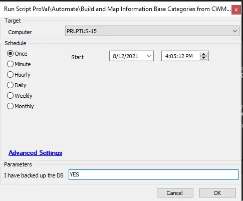

## Summary

This script will create information base categories (ticket categories) for every imported manage board.

**Time Saved by Automation:** 60 Minutes

## Sample Run

## Dependencies

The CW Manage Plugin Setup and Service Board import must be completed.

#### User Parameters

| Name                        | Example | Required | Description                                 |
|-----------------------------|---------|----------|---------------------------------------------|
| I have backed up the db     | YES     | True     | Confirm MySQL DB backup has been done       |

## Process

The script executes several SQL queries.

1. Generates a list of the insert statements based on the CW Service boards & Type / Subtype / Items.
2. Executes the insert statements to create new Information Base Categories.
3. Maps those new info base categories in the CW Manage plugin tables.

## Output

There is no script output. Please reload the cache and view the info base categories in the system dashboard. Review the CW Manage plugin Ticket category area.