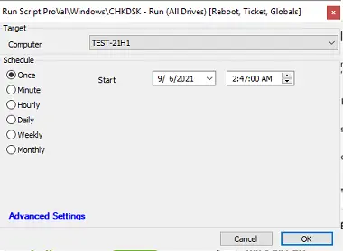

## Summary

This script will run CHKDSK for all internal drives.

**Time Saved by Automation:** 15 Minutes

## Sample Run

## Global Parameters

| **Name**                    | **Example** | **Required** | **Description**                                                                                                                                                                                                                       |
|-----------------------------|-------------|--------------|---------------------------------------------------------------------------------------------------------------------------------------------------------------------------------------------------------------------------------------|
| TicketCreationCategory      | 0           | 0 or 1      | This indicates whether tickets will be created by the script. By default, it is set to 0, which means no tickets will be created. To enable ticketing, set the value to 1.                                                          |

## Process

This script will run CHKDSK for all internal drives on a machine. It first checks for any existing tickets. The script runs a PowerShell command to check for bad sectors. If a bad sector is found, it schedules a fix and comments on the existing ticket; if no ticket exists, it creates a new one. After creating a ticket, it schedules the fix and adds comments to the ticket as well. Currently, the maintenance message and automatic reboot options are enabled in the script, but they can be disabled based on client recommendations.

## Output

- Script log
