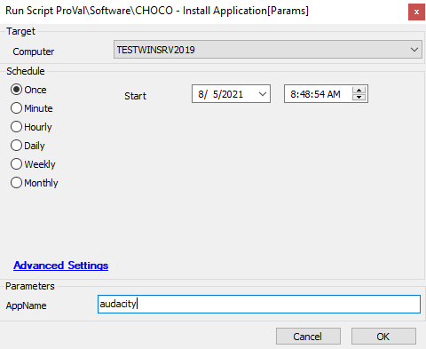

## Summary

The script will attempt to install Chocolatey and then install or upgrade the application with the name defined in the parameter. It will then check if the application was successfully installed and exit or fail depending on the status.

**Time Saved by Automation:** 8 Minutes

## Sample Run

## Dependencies

- The parameter must be a valid Choco installer command
  - [Chocolatey Community](https://community.chocolatey.org/)

## Variables

- `@chocoout@` -> Upgrades/Installs the application you specified
- `@chocolist@` -> Grabs a list of Chocolatey apps

#### User Parameters

| Name     | Example   | Required | Description                                        |
|----------|-----------|----------|----------------------------------------------------|
| AppName  | audacity  | True     | This is the Chocolatey application install string   |

## Process

1. Chocolatey is downloaded and installed on the targeted machine.
2. The 'upgrade' command is run to update or install the requested application.
3. Verifies that Chocolatey successfully installed the application.
   1. Logs success in the Automate Script logs if installed.
   2. Logs failure in the Automate Script logs if not installed.

## Output

- Script log

