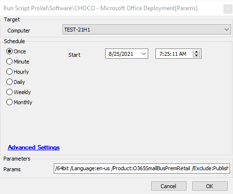

## Summary

This script can be used to install different versions of Microsoft Office using the Choco Microsoft Office Deployment package.

**Time Saved by Automation:** 20 Minutes

## Sample Run

## Dependencies

The following URL provides all the packages available in Choco that can be included in the Params and installed by this script.  
[Chocolatey Microsoft Office Deployment Packages](https://community.chocolatey.org/packages/microsoft-office-deployment#install)

#### Global Parameters

| Name   | Example                                                                 | Required | Description                                           |
|--------|-------------------------------------------------------------------------|----------|-------------------------------------------------------|
| Params | `/64bit /Language:en-us /Product:O365SmallBusPremRetail /Exclude:Publisher,PowerPoint` | True     | This parameter contains the package that needs to be installed |

## Process

This script can be used to install different versions of Microsoft Office using the Choco Microsoft Office Deployment package. It utilizes PowerShell to install the Microsoft Office version specified in the Params section.

## Output

- Script log

