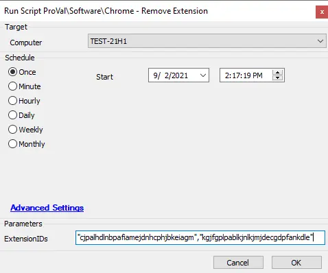

## Summary

This script is used to remove the enforcement of the installation of an extension or list of extensions in Google Chrome.  
**Time Saved by Automation:** 10 Minutes

## Sample Run



## Dependencies

- Windows 10 1703+
- Google Chrome 86+
- [Unregister-ChromeExtension](/docs/6910db0c-af2e-4b19-a262-3c3491f01b73)

## Variables

| Variable Name      | Description                                                                                     |
|--------------------|-------------------------------------------------------------------------------------------------|
| ProjectName        | The name of the project; in this case, it would be Unregister-EdgeExtension                   |
| Parameters         | This will take the ExtensionIDs.                                                                |
| BaseURL            | The base URL here will be [https://file.provaltech.com/repo](https://file.provaltech.com/repo) |
| WorkingDirectory    | C:/ProgramData/provaltech/script/@ProjectName@                                                |
| PS1URL             | @BaseURL@/script/@[ProjectName@.ps1](https://proval.itglue.com/5078775/docs/ProjectName@.ps1) |
| PS1Path            | @WorkingDirectory@/@[ProjectName@.ps1](https://proval.itglue.com/5078775/docs/ProjectName@.ps1) |
| PS1TempPath        | @WorkingDirectory@/@[ProjectName@-temp.ps1](mailto:ProjectName@-temp.ps1)                    |
| PS1Log             | @WorkingDirectory@/@[ProjectName@-log.txt](mailto:ProjectName@-log.txt)                      |
| PS1DataLog         | @WorkingDirectory@/@[ProjectName@-data.txt](mailto:ProjectName@-data.txt)                    |
| PS1ErrorLog        | @WorkingDirectory@/@[ProjectName@-errors.txt](mailto:ProjectName@-errors.txt)                |
| LogContent         | @PS1Log@                                                                                       |
| DataLogContent     | @PS1DataLog@                                                                                   |

### User Parameters

| Name          | Example                                   | Required | Description                                                        |
|---------------|-------------------------------------------|----------|--------------------------------------------------------------------|
| ExtensionIDs  | cjpalhdlnbpafiamejdnhcphjbkeiagm          | True     | The Extension ID or list of Extension IDs to remove from managed status. |

## Process

The script takes a single parameter, which is an array of Extension IDs to install that can be found on the [Chrome Web Store](https://chrome.google.com/webstore/category/extensions). The list of extensions is then cycled through, and install registry entries are removed from the policy section. Blocking entries are then added to the registry to prevent future installation. To find an extension to unmanage, navigate to the page for that extension and copy the last portion of the URL for the Extension ID.

**Example:**

```
# UBlock Origin
# Extension Page URL: https://chrome.google.com/webstore/detail/ublock-origin/cjpalhdlnbpafiamejdnhcphjbkeiagm
# ExtensionID: cjpalhdlnbpafiamejdnhcphjbkeiagm
```

## Output

- Script log  
```
./Unregister-ChromeExtension-log.txt
```