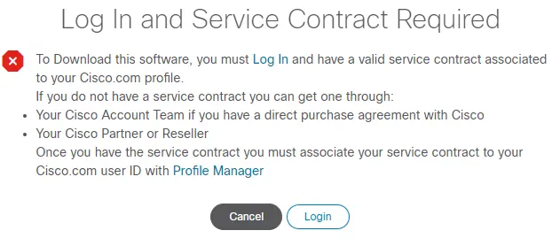
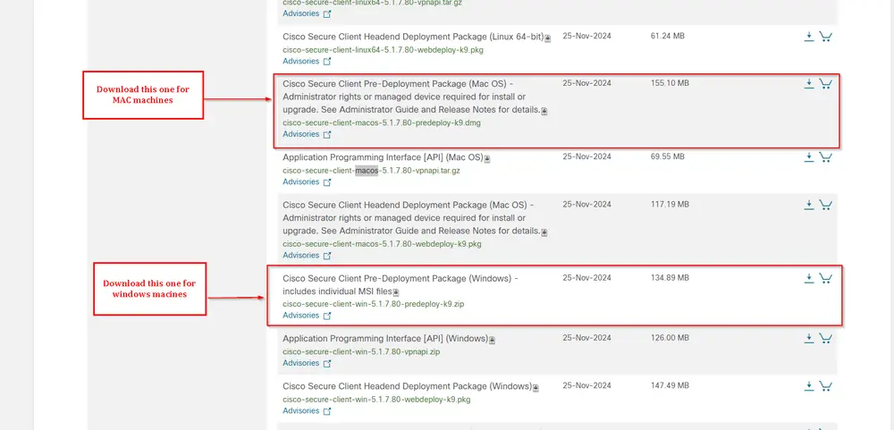
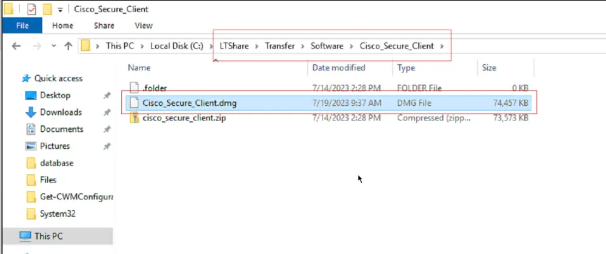
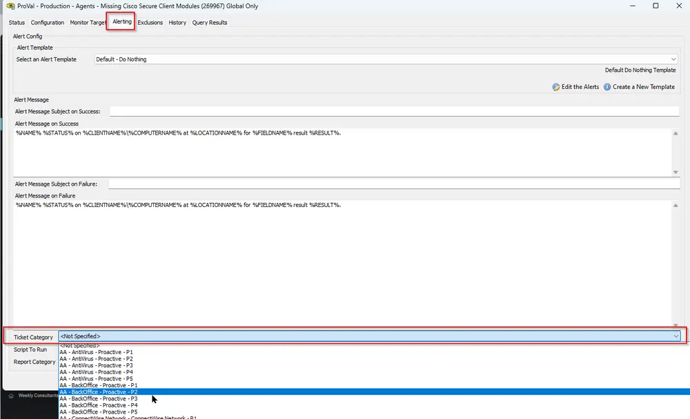
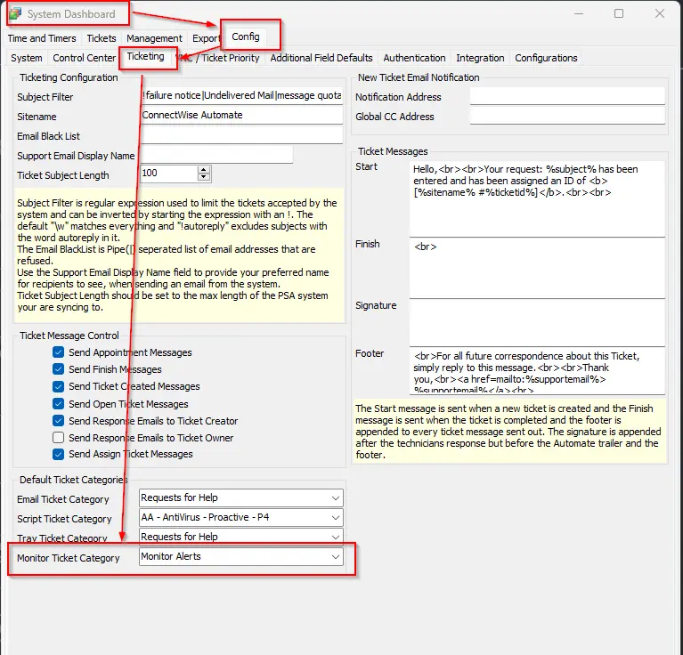
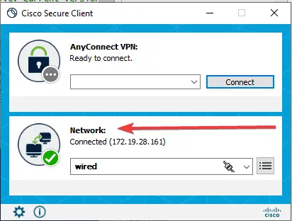
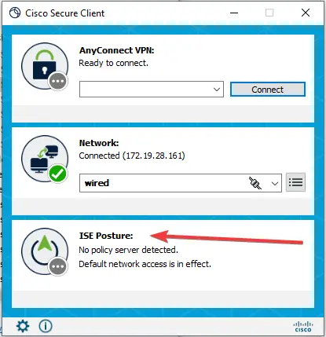

## Summary

This document provides an option to install **different Cisco Secure Client modules on Windows and MAC machines.**

**Requirement:** MySQL 8.0+

*Note:* To install the Umbrella module, it is required to install the `Core VPN module`.

## Prerequisites

**For Windows:**

Download the `Cisco Secure Client Pre-Deployment Package (Windows) - includes individual MSI files` and place it in LTShare (WebDAV for hosted partners) at `LTShare/Transfer/Software/Cisco_Secure_Client` as `Cisco_Secure_Client.zip`.

**For MAC:**

Download the `Cisco Secure Client Pre-Deployment Package (Mac OS)` and place it in LTShare (WebDAV for hosted partners) at `LTShare/Transfer/Software/Cisco_Secure_Client` as `Cisco_Secure_Client.dmg`.

**NOTE**  
To access/download these files, you will need a login to the Cisco portal. If you do not have a portal login, please create one and validate your access before attempting to download the files; otherwise, you will receive an error like this:  

The file can be downloaded from [Cisco Software Download](https://software.cisco.com/download/home/286330811/type/282364313/release/5.1.7.80). Cisco changes this download URL for each release. Prefer downloading the latest stable version of the tool.

Go to the latest release and download packages for Windows and MAC.

  

If the `Cisco_Secure_Client` directory does not exist in `LTShare/Transfer/Software`, then create the directory and place the downloaded zip file in the directory as `Cisco_Secure_Client.dmg`.  

It is mandatory to place the file in the specified directory with the specified name to use the script.

## Sample Run

It has to be executed as an autofix script with [CWA - Internal Monitor - Missing Cisco Secure Client Modules](/docs/2936aa3a-b372-4681-8957-e23d5a2631db), but it can also be executed individually.

- For the initial execution of the script, it is essential to set the user parameter `SetEnvironment` to 1. This step is necessary to create the mandatory EDFs (Extra Data Fields) required for the script's execution. It will also transfer the data from old EDFs to new EDFs. Some of the EDFs, like Fingerprint and userid, have just been transferred to the 'Cisco Secure Client' section.  

- To delete the old EDFs  

- To deploy the application:  

## Dependencies

- [Install-Anyconnect Agnostic Script](/docs/fc6bcac9-770a-46dc-902c-7176cb1d73ea)

## Global Parameters

| Name                   | Default                                                                                                            | Required | Description                                                                                                                                                                                                                      |
|------------------------|--------------------------------------------------------------------------------------------------------------------|----------|----------------------------------------------------------------------------------------------------------------------------------------------------------------------------------------------------------------------------------|
| DownloadURL_Windows    | [https://redirhostname/labtech/transfer/software/cisco_secure_client/cisco_secure_client.zip](https://redirhostname/labtech/transfer/software/cisco_secure_client/cisco_secure_client.zip) | True     | Download URL to download the `Cisco_Secure_Client.zip` file from LTShare for Windows machines. The download URL should not be changed unless the installer cannot be placed in the LTShare and another download URL is available. |
| DownloadURL_MAC        | [https://redirhostname/labtech/transfer/software/cisco_secure_client/cisco_secure_client.dmg](https://redirhostname/labtech/transfer/software/cisco_secure_client/cisco_secure_client.dmg) | True     | Download URL to download the `Cisco_Secure_Client.dmg` file from LTShare for MAC machines. The download URL should not be changed unless the installer cannot be placed in the LTShare and another download URL is available. |
| Ticket_On_Failure      | 0                                                                                                                  | False    | Set it to '1' in order to receive tickets in case the script fails to install the application                                                                                                                                   |

## User Parameters

| Name                   | Example | Required                          | Description                                                                                                                                                                                                                      |
|------------------------|---------|-----------------------------------|----------------------------------------------------------------------------------------------------------------------------------------------------------------------------------------------------------------------------------|
| SetEnvironment          | 1       | True (For First Execution Only.)  | For the initial execution of the script, it is essential to set the user parameter `SetEnvironment` to 1. This step is necessary to create the mandatory EDFs (Extra Data Fields) required for the script's execution. It will also transfer the data from old EDFs to new EDFs. |
| DeleteOldEDFs          | 1       | True (For deleting the old EDFs) | This has to be used only after ensuring the data has been successfully transferred from old EDFs to new EDFs. Setting this parameter to 1 will delete all the EDFs from the old solution.                                   |

## EDFs

| Name                               | Level  | Type      | Example                                       | Description                                                                                                                                                                                                                      |
|------------------------------------|--------|-----------|-----------------------------------------------|----------------------------------------------------------------------------------------------------------------------------------------------------------------------------------------------------------------------------------|
| Secure Client - All Modules        | Client | DropDown  | Not Selected/Deploy Mac and Windows/Deploy Windows only/Deploy Mac Only | Select `Deploy Windows only` to install all available modules on the client's Windows machines. Select `Deploy Mac Only` to install all available modules on the client's MAC machines. Select `Deploy Mac and Windows` to install all available modules on both MAC and Windows machines of the client. Select `Not Selected` or leave it blank to ignore the EDF. |
| Module - Cisco Umbrella            | Client | DropDown  | Not Selected/Deploy Mac and Windows/Deploy Windows only/Deploy Mac Only | Select `Deploy Windows only` to install the Umbrella module on the client's Windows machines. Select `Deploy Mac Only` to install the Umbrella module on the client's MAC machines. Select `Deploy Mac and Windows` to install the Umbrella module on both MAC and Windows machines of the client. Select `Not Selected` or leave it blank to disable the Module's deployment. |
| Module - Core-VPN                  | Client | DropDown  | Not Selected/Deploy Mac and Windows/Deploy Windows only/Deploy Mac Only | Select `Deploy Windows only` to install the Core-VPN module on the client's Windows machines. Select `Deploy Mac Only` to install the Core-VPN module on the client's MAC machines. Select `Deploy Mac and Windows` to install the Core-VPN module on both MAC and Windows machines of the client. Select `Not Selected` or leave it blank to disable the Module's deployment. |
| Win Only - VPN in System Tray      | Client | CheckBox  | Marked/Unmarked                             | Flag this EDF to show the Core VPN module in the system tray after installation. By default, the script installs the application without displaying it in the system tray. This setting is just for Windows machines. |
| Module - Diagnostic Tool            | Client | DropDown  | Not Selected/Deploy Mac and Windows/Deploy Windows only/Deploy Mac Only | Select `Deploy Windows only` to install the Diagnostic and Reporting Tool module on the client's Windows machines. Select `Deploy Mac Only` to install the Diagnostic and Reporting Tool module on the client's MAC machines. Select `Deploy Mac and Windows` to install the Diagnostic and Reporting Tool module on both MAC and Windows machines of the client. Select `Not Selected` or leave it blank to disable the Module's deployment. |
| Module - ISE Posture               | Client | DropDown  | Not Selected/Deploy Mac and Windows/Deploy Windows only/Deploy Mac Only | Select `Deploy Windows only` to install the ISE Posture module on the client's Windows machines. Select `Deploy Mac Only` to install the ISE Posture module on the client's MAC machines. Select `Deploy Mac and Windows` to install the ISE Posture module on both MAC and Windows machines of the client. Select `Not Selected` or leave it blank to disable the Module's deployment. |
| Win Only - NAM Module              | Client | DropDown  | Yes/No                                      | Select `Yes` to install the Network Access Manager module on the client's Windows machines. Select `No` or leave it blank to disable the Module's deployment. This setting is just for Windows machines. |
| Module - Net Visibility             | Client | DropDown  | Not Selected/Deploy Mac and Windows/Deploy Windows only/Deploy Mac Only | Select `Deploy Windows only` to install the Network Visibility module on the client's Windows machines. Select `Deploy Mac Only` to install the Network Visibility module on the client's MAC machines. Select `Deploy Mac and Windows` to install the Network Visibility module on both MAC and Windows machines of the client. Select `Not Selected` or leave it blank to disable the Module's deployment. |
| Win Only - Start on Login          | Client | DropDown  | Yes/No                                      | Select `Yes` to install the Start Before Login module on the client's Windows machines. Select `No` or leave it blank to disable the Module's deployment. This setting is just for Windows machines. |
| Win Only - VPN HostScan            | Client | DropDown  | Yes/No                                      | Select `Yes` to install the VPN Posture - HostScan Module on the client's Windows machines. Select `No` or leave it blank to disable the Module's deployment. This setting is just for Windows machines. |
| MAC Only - Fireamp                 | Client | DropDown  | Yes/No                                      | Select `Yes` to install the Fireamp module on the client's MAC machines. Select `No` or leave it blank to disable the Module's deployment. This setting is just for MAC machines. |
| MAC Only - Secure FireWall         | Client | DropDown  | Yes/No                                      | Select `Yes` to install the Cisco Secure Client Firewall Posture Module on the client's MAC machines. Select `No` or leave it blank to disable the Module's deployment. This setting is just for MAC machines. |
| Cisco Umbrella FingerPrint         | Client | TextBox   | ae4871c4fb151e23                             | To save the Cisco Umbrella FingerPrint for the client, it can be fetched from the OrgInfo.json file. The JSON file can be downloaded for each organization from the Cisco Secure Client Portal. It is mandatory to set this EDF to deploy the `Umbrella` module. |
| Cisco Umbrella OrgID               | Client | TextBox   | 15457482                                     | To save the Cisco Umbrella OrgID for the client, it can be fetched from the OrgInfo.json file. The JSON file can be downloaded for each organization from the Cisco Secure Client Portal. It is mandatory to set this EDF to deploy the `Umbrella` module. |
| Cisco Umbrella UserID              | Client | TextBox   | 1254852                                      | To save the Cisco Umbrella UserID for the client, it can be fetched from the OrgInfo.json file. The JSON file can be downloaded for each organization from the Cisco Secure Client Portal. It is mandatory to set this EDF to deploy the `Umbrella` module. |
| Exclude from Cisco Secure Client    | Computer | Checkbox | -                                             | Select it to exclude the machine from Cisco Secure Client Deployment.                                                                                                                                                          |
| Exclude from Cisco Secure Client    | Location | Checkbox | -                                             | Select it to exclude the location from Cisco Secure Client Deployment.                                                                                                                                                        |

**Sample Screenshot:**  

*Note:*  
- If you are setting any of these options for `Deploy Mac and Windows/Deploy Windows only/Deploy Mac Only` for `Secure Client - All Modules`, then the script will attempt to install all the available modules regardless of the selection for the individual module.
- It is mandatory to set the `Cisco Umbrella FingerPrint`, `Cisco Umbrella OrgID`, and `Cisco Umbrella UserID` if any of `Secure Client - All Modules` and `Module - Cisco Umbrella` is set to these options: `Deploy Mac and Windows/Deploy Windows only/Deploy Mac Only`.
- [For Windows only] Flag the `Win Only - VPN in System Tray` EDF to show the Core VPN module in the system tray after installation. By default, the script installs the application without displaying it in the system tray.
- Choosing `Module - Cisco Umbrella` will automatically install the `Core-VPN Module` since it is required to install the Umbrella module. The `Core VPN module` installation does not display in the system tray; only the essential components for installing the Umbrella module are installed unless the `Win Only - VPN in System Tray` EDF is marked at the client level.

## Output

- Script log
- Ticketing

## Ticketing

**Subject:**  `Cisco Secure Client Installation Failed on %ComputerName%(%ComputerID%)`

**Possible Ticket Summary/Comments:**

- **If the script fails to install the application:**  
  `Failed to Install Cisco Secure Client on %computername% at %clientname%. Here are the results returned from the script:  @ErrorLog@  
  The PC information is outlined below:  
  PC Name: %computername%  
  Last Login: %lastuser%  
  PC model: @biosname@  
  OS: %os%  
  S/N OF PC: @biosver@`

- **If the application installed successfully but needs reboot:**  
  `Application installed successfully, but a reboot is needed to validate the installation of some module(s).`

- **[For Windows only] If a security application interrupted the script execution:**  
  `A security application or Antivirus program is restricting the script execution.`

- **[For Windows only] If the DownloadURL is unreachable:**  
  `Please ensure placing the Cisco Secure Client in your LTShare or WebDAV folder at LTShare/Transfer/software/cisco_secure_client as cisco_secure_client.zip. If the file is placed, then ensure that there is no firewall rule or AV program restricting the computer from reaching @DownloadURL@.`

- **[For MAC only] If Automate fails to write the script on the machine:**  
  `Automate was unable to write the installation script on the computer.`

## TicketCreationCategory

The ticket category for the tickets generated by the script can be set at the following levels:

- On the global monitor set. The ticket category can be selected at the monitor set [ProVal - Production - Agents - Missing Cisco Secure Client Modules](/docs/2936aa3a-b372-4681-8957-e23d5a2631db).
  

- If the ticket category is not set on the monitor, the ticket will be generated under the default ticket category.  
  

## Module Definitions

### Core-VPN

- Core-VPN must be installed with any additional module.
- All modules require that Core-VPN be installed.
- When only installing Core-VPN you can expect to see the following:

  

### Start Before Login

- SBL stands for Start Before Login; it adds no direct user GUI, however, it does add an entry into programs and features.
- It enables the execution of the AnyConnect VPN prior to a user being logged in.

### Diagnostic and Reporting Tool

- DART stands for Diagnostics and Reporting Tool.
- When installing this, you can expect to see the following items.

  
  

### Network Access Manager

- NAM stands for Network Access Manager.
- When installing this module, you can expect to see the following items.

  

### Network Visibility Module

- NVM stands for Network Visibility Manager.
- Network Visibility Manager does not include a GUI but does the following:
- Network Visibility Manager **helps you see user and endpoint behavior both on and off premises**. It collects standard flows from endpoints (laptops, for example) along with context like user, application, device, location, and destination information.

### VPN Posture - HostScan Module

- Posture provides the Cisco AnyConnect Secure Mobility Client with the ability to assess an endpoint's compliance for things like antivirus, antispyware, and firewall software installed on the host.
- It does not provide a User GUI.

### ISE Posture

- ISE Posture provides the Cisco AnyConnect Secure Mobility Client with the ability to assess an endpoint's compliance for things like antivirus, antispyware, and firewall software installed on the host, with a user GUI interface.
- When installing this module, you can expect to see the following:

  

### Umbrella

- Umbrella installs the Cisco Umbrella module.
- When installing this module you can expect to see the following:

## Uninstalling

- When uninstalling this package, you can simply uninstall the Core-VPN module, and it will remove all embedded modules except for the DART module; that module will have to be removed separately.

## FAQ

- Will this installation update older versions of Cisco AnyConnect?
  - Yes, each requested component will be updated if run against a machine that has that component already installed. Components that are not requested will not be updated.
