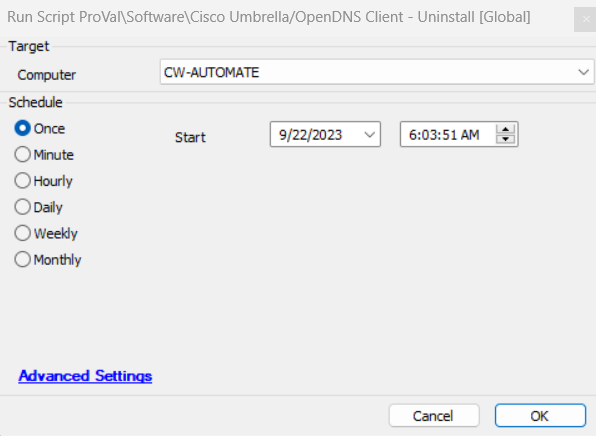

## Summary

This script can be used to silently remove the OpenDNS Umbrella Roaming Client.

## Sample Run

#### Global Parameters

| Name            | Example | Required | Description                                                                                         |
|-----------------|---------|----------|-----------------------------------------------------------------------------------------------------|
| TicketCreation   | 1       | False    | If set to 1, a ticket will be created if the script fails to uninstall the OpenDNS Umbrella Client. |

## Process

- Import the script from the plugin.
- Schedule it on the agents where the OpenDNS Umbrella Client needs to be uninstalled.

## Output

- Script log
- Ticket

