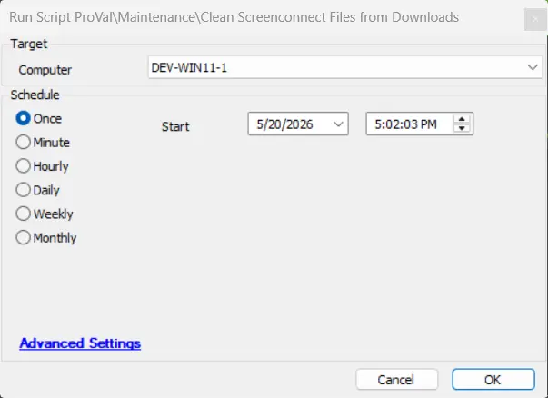
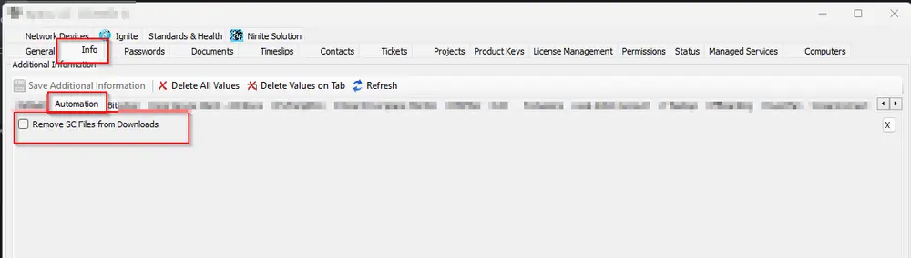

## Summary
This script deletes ScreenConnect.client setup files from the downloads folder of all the users on Windows machines.

This can be run manually or as an auto-fix from the internal monitor [Remove ScreenConnect Files from Downloads](/docs/0663b3cf-149f-4346-ba54-ed309ef8fdf5)

## Dependencies

- [Internal Monitor - Remove ScreenConnect Files from Downloads](/docs/0663b3cf-149f-4346-ba54-ed309ef8fdf5)

## Sample Run

## EDFs

| Name | Type | Level | Section | Editable | Description |
| ------------- | ------ | ------ | ----- | ----- | ------ |
|Remove SC Files from Downloads | CheckBox | Client | Automation | Yes | Select this EDF to remove ScreenConnect files from Clients machines. |

## Output

- Script Logs

## Changelog

### 2026-05-27

- Initial version of the document.
