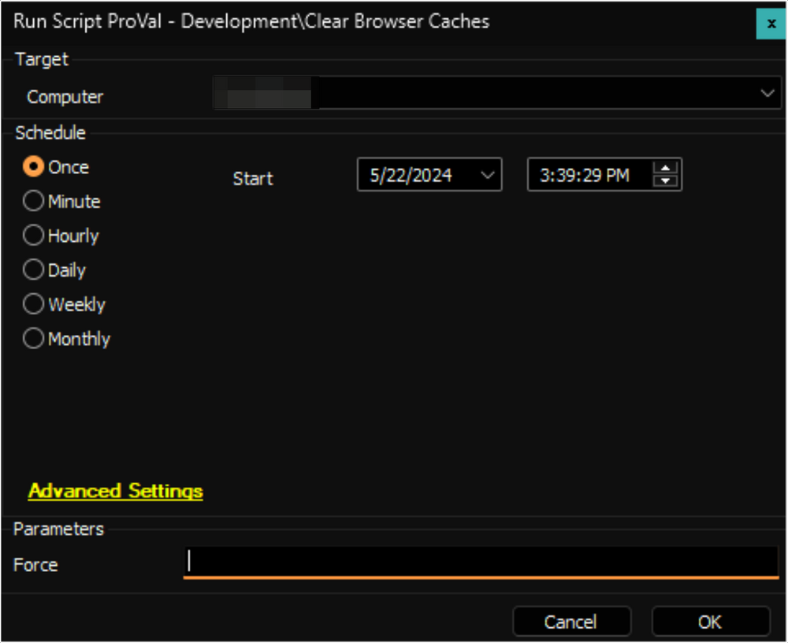

## Summary

This script will clear the caches for the following browsers:

- Google Chrome
- Microsoft Edge
- Brave Browser
- Mozilla Firefox
- Microsoft Edge (Legacy)

**Note:** This is strictly for the browser cache and will not remove the browser history.

## Sample Run

## Sub-Scripts

- [SWM - Software Configuration - Automate - Script - Chromium Caches - Clear](/docs/1edcec5e-4e2d-4edf-b670-1bb81643b4e3)
- [SWM - Software Configuration - Automate - Script - Gecko Cache - Clear](/docs/b0f8d2f8-6688-4c91-990a-041ad2e9bd3e)

#### User Parameters

| Name   | Example | Required | Description                                                                                                                                                  |
|--------|---------|----------|--------------------------------------------------------------------------------------------------------------------------------------------------------------|
| Force  | 1       | False    | Browser instances will be terminated if the `Force` parameter is set to `1` and they are holding a handle to target cache files.                           |

## Output

- Script log

