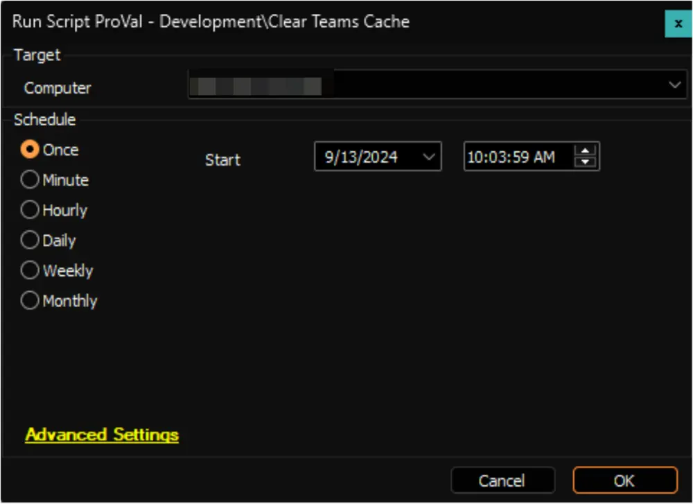

## Summary

This script clears the cache for installed Microsoft Teams on Windows machines.

**Caution:** The script will forcibly terminate Microsoft Teams if it is running, and the application must be restarted manually afterwards.

## Sample Run

## Output

- Script log

## Changelog

### 2025-04-10

- Initial version of the document
